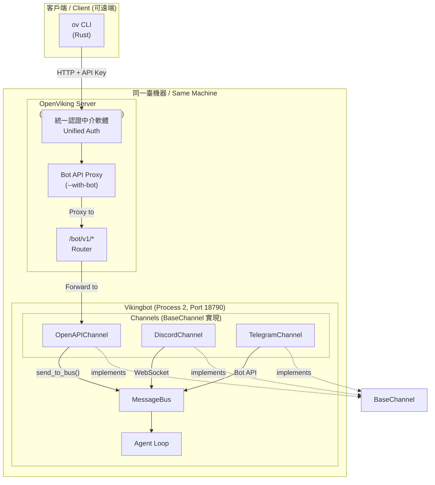
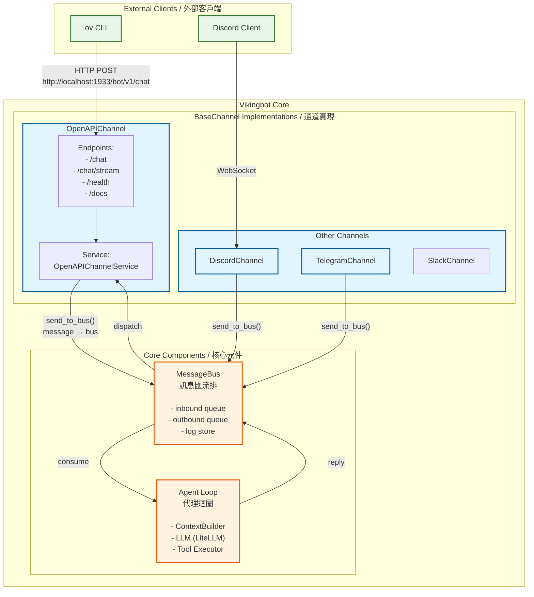

# RFC: OpenViking CLI Support for ov chat Command

**Author:** OpenViking Team
**Status:** Implemented
**Date:** 2025-03-03

---

## 1. Executive Summary / 執行摘要

This document describes the integration architecture between `ov` CLI (Rust), `openviking-server` (Python/FastAPI), and `vikingbot` (Python AI agent framework). The goal is to provide a unified chat interface where the bot service shares the same port and authentication mechanism as the OpenViking server.

本文件描述了 `ov` CLI（Rust）、`openviking-server`（Python/FastAPI）和 `vikingbot`（Python AI agent 框架）之間的整合架構。目標是提供一個統一的聊天介面，使 bot 服務與 OpenViking 伺服器共享相同的埠和認證機制。

---

## 2. Architecture Overview / 架構概覽

### 2.1 系統整體架構 / System Architecture

**部署說明 / Deployment Note:** OpenViking Server 和 Vikingbot 部署在同一臺機器上，通過本地埠通訊。



### 2.2 Channel-Bus-Agent 架構詳解

展示 Channel 與 MessageBus 的關係，以及各 Channel 如何作為 BaseChannel 實現：



---

## 3. Key Components / 關鍵元件

### 3.1 OpenViking Server (`openviking-server`)

**Role:** HTTP API Gateway with Bot API proxy / 帶 Bot API 代理的 HTTP API 閘道器

**Key Features / 主要特性：**
- Unified authentication middleware for all endpoints / 為所有端點提供統一認證中介軟體
- Bot API proxy layer (enabled via `--with-bot`) / Bot API 代理層（通過 `--with-bot` 啟用）
- Request forwarding to Vikingbot OpenAPIChannel / 請求轉發到 Vikingbot OpenAPI 通道

**Architecture Position / 架構位置：**
- Process 1 (Port 1933) / 程序1（埠 1933）
- Entry point for all external clients (CLI, etc.) / 所有外部客戶端的入口點

---

### 3.2 `ov` CLI Client (`ov chat`)

**Role:** Command-line chat interface / 命令行聊天界面

**Key Features / 主要特性：**
- Interactive mode and single-message mode / 互動模式和單訊息模式
- Configurable endpoint via environment variable / 通過環境變數配置端點
- HTTP POST with JSON request/response / 使用 JSON 請求/響應的 HTTP POST

**Architecture Position / 架構位置：**
- External client layer / 外部客戶端層
- Communicates with OpenViking Server (Port 1933) / 與 OpenViking 伺服器通訊（埠 1933）

---

### 3.3 Vikingbot OpenAPIChannel

**Role:** AI agent framework with HTTP API / 帶 HTTP API 的 AI 代理框架

**Key Features / 主要特性：**
- HTTP endpoints for chat, streaming, and health checks / 聊天、流式傳輸和健康檢查的 HTTP 端點
- Integration with MessageBus for message routing / 與 MessageBus 整合進行訊息路由
- Support for session management and context building / 支援會話管理和上下文構建

**Architecture Position / 架構位置：**
- Process 2 (Port 18790 default) / 程序2（預設埠 18790）
- Receives proxied requests from OpenViking Server / 接收來自 OpenViking 伺服器的代理請求

---

### 3.4 MessageBus and Agent Loop / 訊息匯流排與代理迴圈

**Role:** Core message routing and processing engine / 核心訊息路由和處理引擎

**Components / 元件：**
- **MessageBus / 訊息匯流排:** Inbound queue, Outbound queue, Log store / 入隊佇列、出隊佇列、日誌儲存
- **Agent Loop / 代理迴圈:** ContextBuilder, LLM (LiteLLM), Tool Executor / 上下文構建器、LLM、工具執行器

**Flow / 流程：**
```
Channel → MessageBus.inbound → Agent Loop → MessageBus.outbound → Channel
```

---

## 4. API Endpoints / API 端點

### 4.1 Bot API (via OpenViking Server)

| Method | Path | Description |
|--------|------|-------------|
| GET | `/bot/v1/health` | Health check |
| POST | `/bot/v1/chat` | Send message (non-streaming) |
| POST | `/bot/v1/chat/stream` | Send message (streaming, SSE) |

### 4.2 Response Codes

| Code | Condition |
|------|-----------|
| 200 | Success |
| 503 | `--with-bot` not enabled or bot service unavailable |
| 502 | Bot service returned an error |

---

## 5. Usage Examples / 使用示例

### 5.1 Start the services / 啟動服務

```bash
# 啟動 OpenViking Server (帶 --with-bot 會自動啟動 vikingbot gateway)
openviking-server --with-bot

# Output:
# OpenViking HTTP Server is running on 127.0.0.1:1933
# Bot API proxy enabled, forwarding to http://127.0.0.1:18790
# Starting vikingbot gateway...
```

**說明 / Note:**
- `--with-bot`: 自動在同一機器上啟動 `vikingbot gateway` 程序
- 不加 `--with-bot`: 僅啟動 OpenViking Server，不會啟動 Vikingbot

**設計意圖 / Design Rationale:**
OpenViking Server 統一代理 Vikingbot 的 CLI 請求，目的是：
1. **共享鑑權機制** - 複用 OpenViking Server 的統一認證中介軟體
2. **埠共享** - 服務端部署時可共享埠，簡化網路配置

### 5.2 Using `ov chat` CLI / 使用 `ov chat` CLI

```bash
# Interactive mode (default)
ov chat

# Single message mode
ov chat -m "Hello, bot!"

# Use custom endpoint
VIKINGBOT_ENDPOINT=http://localhost:1933/bot/v1 ov chat -m "Hello!"
```

### 5.3 Direct HTTP API usage / 直接 HTTP API 使用

```bash
# Health check
curl http://localhost:1933/bot/v1/health

# Send a message
curl -X POST http://localhost:1933/bot/v1/chat \
  -H "Content-Type: application/json" \
  -d '{
    "message": "Hello!",
    "session_id": "test-session",
    "user_id": "test-user"
  }'

# Streaming response
curl -X POST http://localhost:1933/bot/v1/chat/stream \
  -H "Content-Type: application/json" \
  -d '{
    "message": "Hello!",
    "session_id": "test-session",
    "stream": true
  }'
```

---

## 6. Configuration / 配置

### 6.1 配置共享說明 / Configuration Sharing

**重要 / Important:** Vikingbot 與 OpenViking Server 共享同一個 `ov.conf` 配置檔案，不再使用 `~/.vikingbot/config.json`。

Vikingbot 的配置項統一放在 `ov.conf` 的 `bot` 欄位下：

```json
{
  "server": {
    "host": "127.0.0.1",
    "port": 1933,
    "root_api_key": "your-api-key",
    "with_bot": true,
    "bot_api_url": "http://localhost:18790"
  },
  "bot": {
    "agents": {
      "model": "openai/gpt-4o",
      "max_tool_iterations": 50,
      "memory_window": 50
    },
    "gateway": {
      "host": "127.0.0.1",
      "port": 18790,
      "token": ""
    },
    "channels": [
      {"type": "slack", "enabled": false, "bot_token": "", "app_token": ""}
    ],
    "sandbox": {
      "backend": "direct",
      "mode": "shared"
    }
  }
}
```

**配置說明 / Configuration Notes:**
- `server.with_bot`: 啟用時自動在同一機器上啟動 Vikingbot gateway
- `bot.agents`: Agent 配置，包括 LLM 模型、最大工具迭代次數、記憶視窗
- `bot.gateway`: HTTP Gateway 監聽地址；`host` 預設 `127.0.0.1`，當繫結到非 localhost 時必須配置 `token`（用於 `X-Gateway-Token` 鑑權），否則啟動失敗
- `bot.channels`: 渠道配置列表，支持 openapi、slack 等
- `bot.sandbox`: 沙箱執行配置

### 6.2 Command-line Options

```bash
# Enable Bot API proxy
openviking-server --with-bot

# Custom bot port
openviking-server --with-bot --bot-port 8080

# With config file
openviking-server --config /path/to/ov.conf
```

---

*End of Document*
