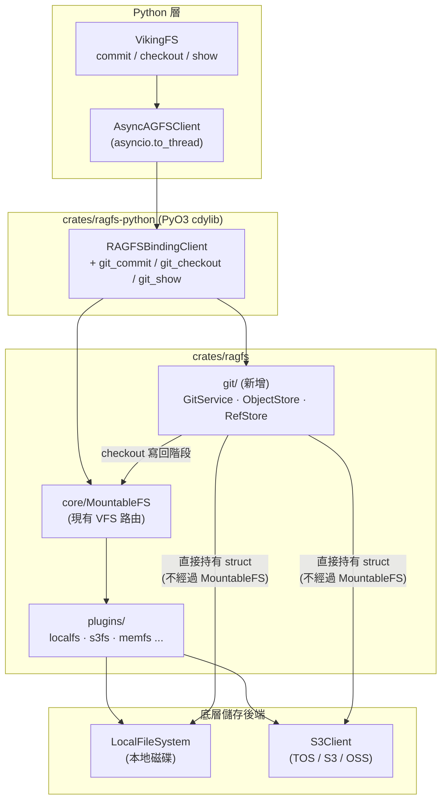
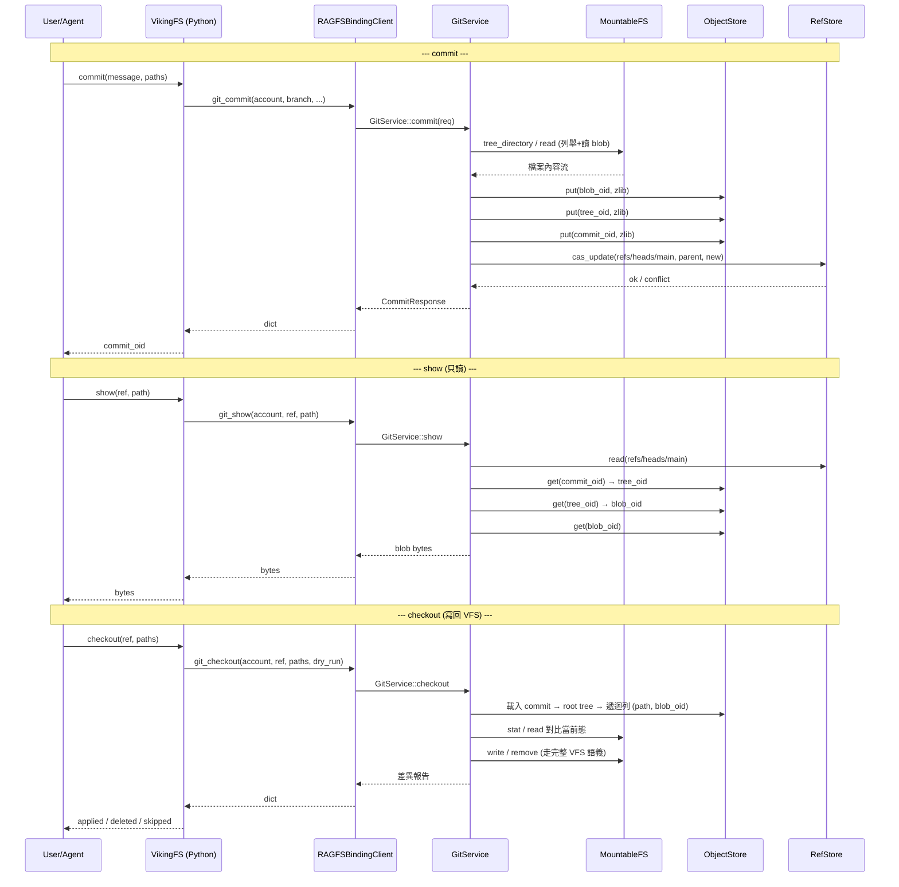
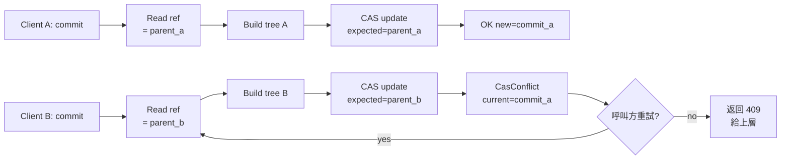

# Business Data Platform 多版本管理技術方案 — 基於 Gitoxide 的 in-process Git 整合

> 💡 **一句話摘要**：在現有 Business Data Platform 的 RAGFS Rust 實現中嵌入一套基於 `gitoxide` 的 in-process Git 服務，以 **帳號(account\_id)粒度** 提供 `commit / restore / show` 三個版本管理原語;通過 PyO3 binding 直接被 `VikingFS` Python 層呼叫,全程零 HTTP、零額外程序,Git 物件/Ref 後端複用現有 `localfs`/`s3fs` 客戶端,實現"本地或遠端"對稱配置。

# 1. 背景與目標

## 1.1 業務背景

Business Data Platform 現有儲存架構是一套以 `viking://` URI 為入口的雙層抽象:上層 `VikingFS`(Python)負責 URI 規範化、L0/L1 摘要、向量同步、租戶隔離;下層 RAGFS(Rust + PyO3 binding)提供 `FileSystem` trait 與 `MountableFS` radix-trie 路由,實際資料落到 `localfs`、`s3fs`、`memfs` 等外掛後端。

在持續執行過程中,使用者/Agent 對 `viking://resources/`、`viking://agent/skills/` 等名稱空間的寫入是連續且不可逆的——出錯後無法回滾,跨多個檔案的"邏輯事務"難以原子化捕獲,實驗性改動需要手動備份。這些場景的本質需求都是一套**面向帳號的多版本快照機制**,語義與 Git 的 commit/restore/show 高度同構。

## 1.2 設計目標

- **顯式版本化**：使用者/Agent 通過 API 顯式觸發 commit/restore/show,不引入隱式 hook,避免影響現有寫鏈路的延遲與一致性語義
- **帳號粒度倉庫**：每個 `account_id` 一個邏輯 Git 倉庫,跨 scope (resources/agent/user/session) 共享同一棵 root tree,支援跨 scope 的原子快照
- **多後端對稱**：Git objects / refs 的實際儲存型別與 resources 目錄一致,可在配置中切換本地(local)或遠端(s3),運維心智零增量
- **零程序膨脹**：Git 服務以 in-process binding 形式嵌入現有 RAGFS,共享 Tokio runtime 與配置載入鏈路,不引入新 HTTP server
- **對現有程式碼侵入最小**：不修改 `content_write.py`、`viking_fs.write/rm/mv` 等核心寫鏈路,僅在 `VikingFS` 上增加 3 個新方法
- **定向恢復 (restore)**：支援以 **(project\_dir, commit\_id)** 為輸入，將指定 project 目錄恢復到目標 commit 的快照狀態，並以 HEAD 為父節點*正向生成一個新 commit*。非目標 project 目錄保持當前最新狀態不動。

## 1.3 非目標 (Out of Scope)

- 不實現自動 commit hook (首版純主動 API 觸發)
- 不實現分支 merge / rebase / cherry-pick / push/pull (首版只覆蓋快照 + 回滾 + 檢視)
- 不暴露 Git 資料到 `viking://` 使用者名稱空間 (避免被使用者誤刪/誤改)
- 不支援向量索引資料的版本化 (向量索引由 watcher 非同步重建, restore 後需觸發重建;L0/L1 派生檔案已納入版本管理)
- 不支援 ref 回退式 checkout：本方案不提供 "把 main / HEAD 指標直接移動到舊 commit" 的能力。所有恢復操作都通過正向新增 commit 實現，保證 HEAD 單調前進、commit 鏈完整可審計。如需檢視舊版本，使用 **show** 介面的只讀路徑。

***

# 2. 核心設計決策

| 決策                             | 設計含義                                                                                                                        | 替代方案被淘汰的原因                                                               |
| ------------------------------ | --------------------------------------------------------------------------------------------------------------------------- | ------------------------------------------------------------------------ |
| **單 Repo per account\_id**     | 同一帳號下的 `resources/`、`agent/`、`user/`、`session/` 全部在一棵 root tree 之下;一次 commit 可覆蓋任意 scope 的子集                                | per-resource repo 會產生 N×帳號數量的索引資料,跨 resource 的"事務性快照"需要協調多 repo,複雜度高     |
| **純 API 觸發,不接 hook**           | `content_write.py` / `viking_fs.write/rm/mv` 完全不動;Git 僅通過 `VikingFS.commit/restore/show` 三個新方法被顯式呼叫                         | hook 模式會讓每次小寫入都觸發 Git 寫入,放大延遲、放大沖突視窗、放大 ref CAS 失敗率;首版優先簡單               |
| **Git 儲存後端與 resources 同構**     | 定義 `ObjectStore` / `RefStore` trait,提供 local 與 s3 兩種實現,直接複用 `plugins::localfs::LocalFileSystem` 和 `plugins::s3fs::S3Client` | 獨立實現 Git 儲存後端會重複造輪子;走 `MountableFS` 又會讓 Git 資料進入使用者名稱空間                   |
| **嵌入為 crates/ragfs 子模組**       | 新增 `crates/ragfs/src/git/` 模組,與 `core/`、`plugins/`、`server/` 平級;PyO3 binding 在 `RAGFSBindingClient` 上加 3 個方法                | 獨立 crate 會引入額外配置、額外 runtime、額外鑑權;`ServicePlugin` 又無法表達 commit 這種非檔案操作的語義 |
| **暴露方式 = PyO3 binding,非 HTTP** | 三個新方法掛在現有 `RAGFSBindingClient` 上,通過 `AsyncAGFSClient.run` 由 `VikingFS` 呼叫,與 `ls/read/write` 一致                              | HTTP server 路徑在 Business Data Platform 當前架構中已是 legacy,生產路徑是 in-process binding       |

***

# 3. 整體架構

## 3.1 分層與依賴關係



## 3.2 資料流(三個核心命令)



## 3.3 關鍵設計原則

> 💡 **Git 資料不進 viking 名稱空間**
>
> Git 模組直接持有 `LocalFileSystem`/`S3Client` 例項,**不**通過 `MountableFS` 路由。Git 資料存到 `git/{account}/objects/...`,使用者在 `viking://` 下看不到、也改不到。

> 💡 **LocalObjectStore 和 S3ObjectStore 直接呼叫 tokio::fs 和 Arc\<aws\_sdk\_s3::Client>, 不復用 LocalFileSystem/S3Client**
>
> LocalFileSystem/S3Client 是面向"使用者檔案樹"的抽象,而 Git 後端是面向"內容定址物件庫"的儲存,兩者的語義需求不重疊。強行復用會導致更復雜的膠水程式碼。

***

# 4. Repo 邊界與 Tree 佈局

## 4.1 Tree 映象 VikingFS 名稱空間

由於 `viking_fs._uri_to_path` 已經定義了 `viking://X → /local/{account_id}/X` 的對映規則,我們讓 Git 的 root tree 完全映象 `/local/{account_id}/` 下的子目錄結構。這樣 tree path 與 viking URI 字尾一一對應,語義直觀、無歧義。

## 4.2 路徑剪枝(自動排除)

剪枝規則集中實現在 `crates/ragfs/src/git/enumerate.rs::prune_path`,在 `commit` 入口對 `paths=Some(...)` 與 `paths=None`(全量列舉)兩條路徑都生效:

| 類別            | 規則                                                      | 理由                                                              |
| ------------- | ------------------------------------------------------- | --------------------------------------------------------------- |
| 內部 scope / 目錄 | 第一段命中 `_system` / `tasks` / `temp` / `queue` / `upload` | 與 `VikingFS._INTERNAL_NAMES` / `INTERNAL_SCOPES` 一致,均為執行時鎖/系統狀態 |
| 執行時鎖檔案        | 任意段以 `.path.ovlock` 開頭                                  | VFS 內部鎖,不應納入版本                                                  |
| 向量快取目錄        | 任意非葉段等於 `embedding_cache`                               | embedding 快取為派生資料                                               |
| 向量索引檔案        | 葉子檔案以 `.faiss` 或 `.index` 結尾                            | 純計算產物,體積大且可重建                                                   |

L0/L1 派生檔案(`.abstract.md`、`.overview.md`)未命中任一剪枝規則,**會**納入主線 commit。restore 時隨原始檔一起回滾,無需重新生成;Python 層在 `restore` 完成後按 `(written_paths, deleted_paths)` 精確觸發 L0/L1/DETAIL 向量非同步重建。

此外,版本管理支援帳號級 `.ovgitignore` 控制檔案,物理路徑為 `/local/{account_id}/.ovgitignore`,Git tree path 為 `.ovgitignore`。該檔案使用帳號根相對的 glob 子集規則,在 `commit` 列舉當前 VFS 檔案和掃描上一版 tree 時共同生效;匹配的檔案不會進入新的 snapshot commit,即使它們曾存在於歷史 commit 中。`.ovgitignore` 檔案自身始終進入版本管理,規則無法把它排除。

## 4.3 單庫多名稱空間的優勢

1. **原子跨 scope 快照**：一次 commit 可同時覆蓋 `resources/docs` 和 `agent/skills`,對應"Agent 一次任務的所有產出"這種邏輯事務
2. **定向回滾**：restore 時可指定 `paths=["resources/docs/auth.md"]`,只回滾單個檔案
3. **索引資料線性**：objects/refs 數量隨帳號線性,不隨 resource 數量指數膨脹
4. **許可權邊界清晰**：account\_id 已經是天然的隔離單位,Git 倉庫邊界與現有許可權模型完全對齊

***

# 5. 物理佈局

## 5.1 Crate 目錄結構

Git 模組作為 `crates/ragfs` 的子模組,與 `core/`、`plugins/`、`server/` 平級。新增檔案全部位於 `crates/ragfs/src/git/` 下,Python binding 僅在 `crates/ragfs-python/src/lib.rs` 上追加方法,無新 crate。

```
crates/ragfs/src/
├── core/                       # 既有(不動)
├── plugins/                    # 既有(不動)
├── server/                     # 既有(不動)
└── git/                        # 新增
    ├── mod.rs                  # 模組入口 + 重匯出
    ├── service.rs              # GitService(commit/restore/show 主流程,均在此文件)
    ├── object_store.rs         # ObjectStore trait
    ├── ref_store.rs            # RefStore trait
    ├── tree_builder.rs         # TreeEditor + flatten/lookup 工具
    ├── commit.rs               # write_commit / Actor / 時間戳
    ├── enumerate.rs            # 從 MountableFS 列舉 + prune_path 剪枝
    ├── util.rs                 # zlib 壓縮/解壓、ref 名校驗、loose object 讀寫
    ├── types.rs                # 請求/響應 DTO
    ├── error.rs                # GitError / ObjectStoreError / RefStoreError(thiserror)
    ├── config.rs               # GitConfig(serde)
    └── backends/
        ├── mod.rs
        ├── local.rs            # LocalObjectStore / LocalRefStore(直接使用 tokio::fs)
        └── s3.rs               # S3ObjectStore / S3RefStore(直接使用 aws_sdk_s3 + If-Match)

crates/ragfs-python/src/
└── lib.rs                      # 追加 git_commit / git_restore / git_show 方法

openviking/openviking/storage/
└── viking_fs.py                # 追加 commit / restore / show / log + URI↔tree-path 工具
```

## 5.2 依賴增量

僅引入 gitoxide 中實現 commit/restore/show MVP 所需的最小子 crate 集合,通過 `crates/ragfs/Cargo.toml` 增量宣告:

```toml
[dependencies]
# === Git (gitoxide) ===
gix-hash       = "0.14"   # ObjectId / Hash 抽象
gix-object     = "0.42"   # Blob/Tree/Commit 編解碼 + tree::Editor
gix-actor      = "0.31"   # 作者/提交者簽名(name  ts tz)
gix-date       = "0.8"    # 時間戳格式化

# === Zlib 壓縮 ===
flate2         = "1"      # loose object zlib 編解碼

# === S3 後端 ===
aws-sdk-s3     = ...      # S3 API client(直接依賴,不復用 plugins/s3fs 內部封裝)
aws-config     = ...

[dev-dependencies]
tempfile       = "3"
```

> 💡 **說明:** 不引入 `gitoxide` 頂層 crate,只挑選 commit/restore/show MVP 必需的子 crate;不引入 `gix-pack`(MVP 只用 loose object 格式)、不引入 `gix-protocol`(無 push/pull 需求)、不引入 `gix-worktree`(restore 通過 VFS 完成)。
>
> - 實際實現使用 `flate2` 直接做 zlib 編解碼,而非 `gix-features`,以減少 gitoxide 依賴面。
> - ref 名校驗由 `crates/ragfs/src/git/util.rs` 中自實現的 `validate_ref_name` 完成,未引入 `gix-validate`。
> - 併發模型測試(`loom`)與 fuzz 測試(`proptest`)在 MVP 階段未引入,以單測 + 整合測試覆蓋。

***

# 6. 核心 Trait 設計

## 6.1 ObjectStore

`ObjectStore` 是 Git 內容定址儲存的抽象,提供 blob/tree/commit 三類物件的存取。所有寫入按 SHA-1 內容定址,天然冪等(同樣的位元組 → 同樣的 oid)。trait 必須 `Send + Sync + 'static`,以便在 Tokio 多執行緒執行時中跨任務共享。

```rust
// crates/ragfs/src/git/object_store.rs
use async_trait::async_trait;
use bytes::Bytes;
use gix_hash::ObjectId;

/// 內容定址的 Git 物件儲存抽象
/// put 必須冪等;get 不存在返回 NotFound;exists 不讀取內容
#[async_trait]
pub trait ObjectStore: Send + Sync + 'static {
    /// 寫入一個已 zlib 壓縮的 loose object
    /// oid 必須等於 SHA-1(未壓縮 header + payload)
    async fn put(
        &self,
        account: &str,
        oid: &ObjectId,
        zlib_body: Bytes,
    ) -> Result<(), ObjectStoreError>;

    /// 讀取並 zlib 解壓(返回 header + payload 的原始位元組)
    async fn get(
        &self,
        account: &str,
        oid: &ObjectId,
    ) -> Result<Bytes, ObjectStoreError>;

    /// 僅檢查存在性(HEAD/stat 最佳化,跳過內容傳輸)
    async fn exists(
        &self,
        account: &str,
        oid: &ObjectId,
    ) -> Result<bool, ObjectStoreError>;
}

#[derive(Debug, thiserror::Error)]
pub enum ObjectStoreError {
    #[error("object not found: {0}")]
    NotFound(ObjectId),
    #[error("backend io: {0}")]
    Io(#[from] std::io::Error),
    #[error("zlib decode: {0}")]
    Zlib(String),
    #[error("oid mismatch: expected {expected}, got {actual}")]
    OidMismatch { expected: ObjectId, actual: ObjectId },
    #[error("backend error: {0}")]
    Backend(String),
}
```

> ℹ️ **說明:** 物理路徑佈局由各實現自行決定(local 走 fanout 目錄,s3 走 key prefix),trait 層不暴露物理路徑,只暴露邏輯定址。

## 6.2 RefStore

`RefStore` 是分支/標籤的命名引用儲存,核心是 **CAS(Compare-And-Swap)** 更新原語 — 這是 Git 一致性的基石。CAS 保證"兩個併發 commit 先到先得,後到的看到 `Conflict` 並需要重試或 rebase",避免靜默覆蓋。

```rust
// crates/ragfs/src/git/ref_store.rs
use async_trait::async_trait;
use gix_hash::ObjectId;

#[async_trait]
pub trait RefStore: Send + Sync + 'static {
    /// 讀取 ref 的當前值;不存在返回 NotFound
    async fn read(
        &self,
        account: &str,
        ref_name: &str,
    ) -> Result<ObjectId, RefStoreError>;

    /// Compare-And-Swap 更新:僅噹噹前值 == expected 時才寫入 new
    /// expected = None 表示"僅當 ref 不存在時建立"
    async fn cas_update(
        &self,
        account: &str,
        ref_name: &str,
        expected: Option<ObjectId>,
        new: ObjectId,
    ) -> Result<(), RefStoreError>;

    /// 列出 account 下的所有 refs(用於 log / branch 列表)
    async fn list(
        &self,
        account: &str,
        prefix: &str,
    ) -> Result<Vec<(String, ObjectId)>, RefStoreError>;
}

#[derive(Debug, thiserror::Error)]
pub enum RefStoreError {
    #[error("ref not found: {0}")]
    NotFound(String),
    #[error("CAS conflict: expected {expected:?}, actual {actual:?}")]
    Conflict {
        expected: Option<ObjectId>,
        actual: Option<ObjectId>,
    },
    #[error("invalid ref name: {0}")]
    InvalidName(String),
    #[error("backend io: {0}")]
    Io(#[from] std::io::Error),
    #[error("backend: {0}")]
    Backend(String),
}
```

> ⚠️ **注意:** ref 名必須經 `crate::git::util::validate_ref_name(...)` 校驗,拒絕 `..`、空字元、特殊保留字等,避免路徑穿越和注入(實現位於 `git/util.rs`,未引入 `gix-validate`)。

## 6.3 命名約定

| 類別          | 路徑模板                                    | 說明                                                       |
| ----------- | --------------------------------------- | -------------------------------------------------------- |
| Object      | `{root}/{account}/objects/{aa}/{bb...}` | Git 標準 fanout(前 2 hex 為目錄,後 38 hex 為檔名),便於分散式儲存 list 最佳化 |
| Ref (heads) | `{root}/{account}/refs/heads/{branch}`  | 檔案內容 = 40 hex 字元 + `\n`                                  |
| HEAD        | `{root}/{account}/HEAD`                 | 內容 = `ref: refs/heads/main\n`                            |
| Packed-refs | (不實現)                                   | MVP 全部 loose,後續如 ref 數量爆炸再補 pack                         |

***

# 7. 後端實現

## 7.1 LocalObjectStore / LocalRefStore

**LocalObjectStore** 直接呼叫 `tokio::fs`(不經 MountableFS、也不復用 `LocalFileSystem`),把 Git 物件寫入本地磁碟的 `{base_dir}/{account}/objects/{aa}/{bb...}`。**LocalRefStore** 使用程序內的 `DashMap<(account, ref_name), Arc<Mutex<()>>>` 序列化同 ref 的 CAS,疊加 `tempfile + rename(2)` 的原子重新命名,覆蓋同進程併發場景。

> **當前實現限制:** MVP 僅做了程序內 Mutex,**未疊加** `flock` 跨程序鎖。生產部署若存在同 host 多程序同時寫同一帳號的場景,需要在後續版本補 `flock`。

```rust
// crates/ragfs/src/git/backends/local.rs (節選)
pub struct LocalObjectStore {
    base_dir: PathBuf,            // e.g. /data/openviking/git
}

#[async_trait]
impl ObjectStore for LocalObjectStore {
    async fn put(&self, account: &str, oid: &ObjectId, body: Bytes) -> Result<()> {
        let hex = oid.to_hex().to_string();
        let path = self.base_dir
            .join(account).join("objects")
            .join(&hex[..2]).join(&hex[2..]);
        // 內容定址 → 已存在則跳過(冪等)
        if tokio::fs::try_exists(&path).await? { return Ok(()); }
        tokio::fs::create_dir_all(path.parent().unwrap()).await?;
        // 寫臨時檔案 + rename 保證原子性
        let tmp = path.with_extension("tmp");
        tokio::fs::write(&tmp, &body).await?;
        tokio::fs::rename(&tmp, &path).await?;
        Ok(())
    }
    // get / exists 略
}

pub struct LocalRefStore {
    base_dir: PathBuf,
    // 程序內序列化 CAS,key = (account, ref_name)
    locks: dashmap::DashMap<(String, String), Arc<Mutex<()>>>,
}

#[async_trait]
impl RefStore for LocalRefStore {
    async fn cas_update(
        &self,
        account: &str,
        name: &str,
        expected: Option<ObjectId>,
        new: ObjectId,
    ) -> Result<()> {
        validate_ref_name(name)?;          // util.rs 自實現
        let lock = self.locks
            .entry((account.into(), name.into()))
            .or_default().clone();
        let _guard = lock.lock().await;
        let path = self.ref_path(account, name);
        let actual = read_ref_opt(&path).await?;
        if actual != expected {
            return Err(RefStoreError::Conflict { expected, actual });
        }
        let tmp = path.with_extension("tmp");
        tokio::fs::write(&tmp, format!("{}\n", new.to_hex())).await?;
        // rename 保證 crash-consistency
        tokio::fs::rename(&tmp, &path).await?;
        Ok(())
    }
}
```

## 7.2 S3ObjectStore / S3RefStore

**S3ObjectStore** 直接持有一個 `Arc<aws_sdk_s3::Client>`(MVP 不復用 `plugins::s3fs::S3Client`,以解耦 git 模組與 plugin 體系),將 object 存為 `{prefix}/{account}/objects/{aa}/{bb...}`。由於內容定址,`put` 用 `If-None-Match: *` 頭實現冪等"僅首次寫入"。**S3RefStore** 用 `If-Match: "{etag}"` 實現 CAS,先 `GET` 拿當前值與 ETag,再用 `PUT` 條件寫。

> **CAS 模式:** `CasMode::Native` 已實現並預設啟用;`CasMode::RedisLock` 僅作為列舉佔位,**實際尚未實現**,呼叫會直接返回 `RefStoreError::Backend("RedisLock CAS mode not yet implemented")`。

```rust
// crates/ragfs/src/git/backends/s3.rs (節選)
pub struct S3RefStore {
    client: Arc<aws_sdk_s3::Client>,
    bucket: String,
    prefix: String,
    cas_mode: CasMode,    // Native | RedisLock(佔位,未實現)
}

#[async_trait]
impl RefStore for S3RefStore {
    async fn cas_update(
        &self,
        account: &str,
        name: &str,
        expected: Option<ObjectId>,
        new: ObjectId,
    ) -> Result<()> {
        validate_ref_name(name)?;
        match self.cas_mode {
            CasMode::Native => {
                // 1. GET 當前 body 與 ETag
                let current = self.read_ref_opt(account, name).await?;
                let (current_oid, current_etag) = match current {
                    Some((oid, etag)) => (Some(oid), etag),
                    None => (None, None),
                };
                if current_oid != expected {
                    return Err(RefStoreError::Conflict {
                        expected, actual: current_oid,
                    });
                }
                // 2. 條件 PUT
                let body = format!("{}\n", new.to_hex());
                let put = self.client.put_object()
                    .bucket(&self.bucket).key(&self.ref_key(account, name))
                    .body(body.into_bytes().into());
                let put = match (current_etag, expected) {
                    (Some(etag), Some(_)) => put.if_match(etag),
                    (None, None)          => put.if_none_match("*"),
                    _ => return Err(RefStoreError::Conflict {
                        expected, actual: current_oid,
                    }),
                };
                // 412 → Conflict;其他 → Backend
                map_precondition_failed(put.send().await, expected, current_oid)
            }
            CasMode::RedisLock => Err(RefStoreError::Backend(
                "RedisLock CAS mode not yet implemented".into(),
            )),
        }
    }
}
```

> ⚠️ **S3 CAS 相容性提示:** AWS S3 自 2024 年起支援 `If-Match` / `If-None-Match` 條件寫;TOS / OSS 實現情況需在選型時驗證。若某後端不支援原生 CAS,需退化為"分散式鎖 + GET-then-PUT"模式;`RedisLock` 模式已在配置/列舉中預留,但實現待補。

***

# 8. GitService 主流程

## 8.1 commit 完整實現

commit 主流程:**列舉 → 讀 blob → 構建 tree → 構建 commit → CAS 更新 ref**。所有 ObjectStore 寫入按帳號粒度冪等(同 oid 多次 put 安全),tree 寫入由 `TreeEditor` 自底向上完成。tree 未變 → 不建立空 commit(no-op 最佳化)。絕大多數 commit 場景下，被呼叫方宣告為 "改動" 的檔案裡仍有大量未真正修改，需要通過三級 fast path 層層過濾，保證只有真正變化的位元組才進入 streaming hash 與 blob 寫入。

| 層級                             | 觸發條件                                    | 節省的開銷                                  | 實現位置                                                                                                                                                                                 |
| ------------------------------ | --------------------------------------- | -------------------------------------- | ------------------------------------------------------------------------------------------------------------------------------------------------------------------------------------ |
| **Fast Path 1**: Stat 索引複用 oid | 檔案 (size, mtime\_ns) 與 prev\_index 完全一致 | 跳過 `vfs.read` + sha1 hash              | **已實現**（`IndexStore` trait + `LocalIndexStore`/`S3IndexStore`,`CommitIndex` 與 `parent_oid` 繫結,索引 miss/decode 錯誤/parent 不匹配 → 靜默回退 slow path;通過 `git.tuning.commit_index_enabled` 關閉） |
| **Fast Path 2**: Tree 子樹原樣保留   | 子樹下所有路徑都沒 upsert/remove                 | 跳過子樹重 hash + 新 tree object 寫入          | **已實現**（`TreeEditor::from_tree` 惰性載入 root，未被 upsert/remove/upsert\_subtree 觸及的子樹連讀取+zlib 解壓都省掉，由 `write_subtree` 的 `None` 分支原樣複用其 OID）                                               |
| **Fast Path 3**: Blob CAS 去重   | 算出的 oid 在 object\_store 已存在             | 跳過 zlib 壓縮 + put\_blob (本地寫盤 / S3 PUT) | **已實現**（slow path 寫 blob 前在 service 層呼叫 `object_store.exists` 預檢，命中則跳過 zlib 壓縮與 `put`；範圍嚴格限定 blob，tree/commit 不預檢；通過 `git.tuning.blob_exists_precheck_enabled` 關閉）                   |

```rust
// crates/ragfs/src/git/service.rs ::commit (節選)
pub async fn commit(&self, req: CommitRequest) -> Result<CommitResponse> {
    let CommitRequest {
        account, branch, message, paths, author_name, author_email,
    } = req;

    // 1. 解析當前 HEAD,載入 prev_tree(若 ref 不存在則空 tree)
    let prev_head = self.resolve_ref(&account, &branch).await.ok();
    let prev_tree = match prev_head {
        Some(oid) => self.load_commit(&account, &oid).await?.tree,
        None      => empty_tree_oid(),
    };
    let mut editor = TreeEditor::from_tree(
        &self.object_store, &account, prev_tree,
    ).await?;
    let mut changed = 0usize;

    // 2. 候選路徑:paths=Some → 經 prune_path 過濾後的清單;paths=None → enumerate::collect_all 全量
    let candidates = match &paths {
        Some(ps) => ps.iter().filter_map(prune_path).collect(),
        None     => enumerate::collect_all(&self.vfs, &account).await?,
    };

    for path in candidates {
        match self.vfs.stat(&account_path(&account, &path)).await {
            Ok(_) => {
                // 讀全量 + streaming hash + 寫 blob(無 Fast Path 1/3)
                let bytes = self.vfs.read(&account_path(&account, &path)).await?;
                let oid   = sha1_blob_streaming(&bytes);
                self.write_object(&account, &oid, &bytes).await?;  // 冪等
                editor.upsert(&path, oid)?;
                changed += 1;
            }
            Err(e) if is_not_found(&e) => {
                // 檔案被刪 → 從 tree 中移除
                editor.remove(&path)?;
                changed += 1;
            }
            Err(e) => return Err(e.into()),
        }
    }

    // 3. 無任何變化 → noop
    if changed == 0 {
        return Ok(CommitResponse::Noop {
            commit_oid: prev_head.unwrap_or_default(),
        });
    }

    // 4. 寫 tree + commit
    let new_tree   = editor.write(&self.object_store, &account).await?;
    let commit_oid = write_commit(&self.object_store, &account, CommitObject {
        tree: new_tree,
        parents: prev_head.into_iter().collect(),
        author: Actor::now(&author_name, &author_email),
        committer: Actor::now(&author_name, &author_email),
        message: message.into(),
    }).await?;

    // 5. CAS 更新 ref;失敗 → ConcurrentCommit 直接上拋
    //    注意:當前實現中 commit() 內部不做 retry,由呼叫方決定如何處理衝突。
    self.ref_store.cas_update(
        &account, &format!("refs/heads/{}", branch),
        prev_head, commit_oid,
    ).await?;

    Ok(CommitResponse::Created { commit_oid, changed })
}
```

> **關於 retry:** 當前實現中 `commit()` 內部 **不包含 CAS 重試迴圈**(程式碼中明確註釋 `// There is intentionally no retry loop inside commit().`)。衝突直接以 `ConcurrentCommit` 上拋,由 Python 層或上游業務決定重試策略;這與 §11.3 舊版描述的"內部最多重試 3 次"不一致,以本節為準。

## 8.2 restore 完整實現

restore 主流程:**解析目標 commit → 提取該 commit 中 project\_dir 子樹 → 與當前 HEAD 中同路徑子樹 diff → 通過 MountableFS.write/rm 回寫 → 刪除回寫後空目錄 → 以當前 HEAD 為 parent 生成新 commit → CAS 更新 ref → 把受影響路徑返回給呼叫方**。`dry_run` 模式只計算差異不寫,用於預檢。

> **`.ovgitignore` 與 restore:** `.ovgitignore` 隻影響 `commit`,不影響 `restore` / `show` / `log`。restore 的輸入是 source commit 與當前 HEAD 的 Git tree diff,不能用當前工作區 `.ovgitignore` 過濾,否則會導致歷史 commit 中已經被跟蹤的檔案無法恢復。全帳號 restore 時 `.ovgitignore` 作為普通已跟蹤檔案隨 source commit 恢復;子目錄 restore 預設不觸碰帳號根 `.ovgitignore`。

向量索引重建在 service 層**不直接觸發**,而是通過把 `written_paths` / `deleted_paths` 放到 `RestoreResponse::Applied` 中返回,Python 層(`VikingFS.restore`)再排程 `ReindexExecutor`。

關鍵差異:與 git checkout 不同,本介面**不移動分支指標到舊 commit**,而是把"舊內容"作為新 commit 的工作樹內容,正向寫入。新 commit 的 parent 是當前 HEAD,不是目標 commit,這保證了:(1) HEAD 單調前進;(2) 非 `project_dir` 路徑自動保留 HEAD 的最新內容,無需特殊處理;(3) restore 本身可以被再次 restore (因為它就是一個普通 commit)。

```rust
pub async fn restore(&self, req: RestoreRequest) -> Result<RestoreResponse> {
    let RestoreRequest {
        account, branch, project_dir, source_commit, dry_run, message,
        author_name, author_email,
    } = req;

    // 0. 校驗 project_dir(非空、不含 ..、不命中 prune 規則)
    validate_project_dir(&project_dir)?;

    // 1. 解析兩端 commit
    let source_oid = self.resolve_ref(&account, &source_commit).await?;
    let source     = self.load_commit(&account, &source_oid).await?;
    let head_oid   = self.resolve_ref(&account, &branch).await?;  // 必須已有 HEAD
    let head       = self.load_commit(&account, &head_oid).await?;

    // 2. 在兩棵 tree 中分別"擷取" project_dir 子樹
    //    source 沒有該子目錄 → 視為空樹(等價於把整個目錄刪掉)
    let source_subtree = tree_builder::subtree(...).await?
        .unwrap_or(empty_tree_oid());
    let head_subtree   = tree_builder::subtree(...).await?
        .unwrap_or(empty_tree_oid());

    // 3. 子樹之間 diff,得到三類操作(只限 project_dir 範圍內)
    let target_entries  = flatten(&self.object_store, &account, source_subtree).await?;
    let current_entries = flatten(&self.object_store, &account, head_subtree).await?;
    let diff = compute_subtree_diff(&target_entries, &current_entries);

    if dry_run {
        return Ok(RestoreResponse::DryRun { diff, source_oid, head_oid });
    }
    if diff.is_empty() {
        return Ok(RestoreResponse::Noop { head: head_oid, source: source_oid });
    }

    // 4. 併發回寫 VFS:路徑要帶上 project_dir 字首
    //    走完整 viking_fs.write/rm,觸發現有 lock、加密
    let prefixed = |p: &str| format!("{}/{}", project_dir.trim_end_matches('/'), p);
    let written_paths: Vec<String> = stream::iter(diff.to_write)
        .map(|(path, blob_oid)| async move {
            let body = self.read_blob(&account, &blob_oid).await?;
            self.vfs.write(&account_path(&account, &prefixed(&path)), body).await?;
            Ok::<_, GitError>(prefixed(&path))
        })
        .buffer_unordered(32)        // 當前實現硬編碼 32
        .try_collect().await?;
    let deleted_paths: Vec<String> = stream::iter(diff.to_delete)
        .map(|path| {
            let p = prefixed(&path);
            async move {
                // 冪等刪除:NotFound 視為成功,允許 restore 在已被併發刪除的路徑上完成
                match self.vfs.rm(&account_path(&account, &p)).await {
                    Ok(()) => Ok(p),
                    Err(e) if is_not_found(&e) => Ok(p),
                    Err(e) => Err(e.into()),
                }
            }
        })
        .buffer_unordered(32)
        .try_collect().await?;

    // 6b. 刪除空目錄:沿被刪路徑的祖先鏈向上 rmdir,直到第一個非空目錄或 project_dir 邊界
    //     (gix tree 不存空目錄,而 VFS 寫到本地後會留下空 dir,造成 ls 不一致)
    self.prune_empty_dirs(&account, &project_dir, &deleted_paths).await?;

    // 5. 在 head.tree 之上做增量編輯:
    //    把 project_dir 子樹整體替換為 source_subtree。
    //    非 project_dir 路徑原樣保留 head 中的 tree_oid。
    let mut editor = TreeEditor::from_tree(&self.object_store, &account, head.tree).await?;
    editor.upsert_subtree(&project_dir, source_subtree)?;
    let new_tree = editor.write(&self.object_store, &account).await?;

    // 6. 構造新 commit:parent = 當前 HEAD(不是 source_oid!)
    let new_commit_oid = write_commit(&self.object_store, &account, CommitObject {
        tree: new_tree,
        parents: vec![head_oid],                       // ← 關鍵:HEAD 單向前進
        author: Actor::now(&author_name, &author_email),
        committer: Actor::now(&author_name, &author_email),
        message: message.unwrap_or_else(|| format!(
            "restore {} from {}", project_dir, &source_oid.to_hex()[..12],
        )),
    }).await?;

    // 7. CAS 更新 ref:expect=head_oid, new=new_commit_oid
    //    若期間有別的 commit 進入 → ConcurrentCommit,呼叫方按提示重試
    self.ref_store.cas_update(
        &account, &format!("refs/heads/{}", branch),
        Some(head_oid), new_commit_oid,
    ).await?;

    Ok(RestoreResponse::Applied {
        new_commit_oid,
        source_commit: source_oid,
        parent_commit: head_oid,
        // 計數 + 受影響路徑(供上層精確觸發向量重建)
        written: written_paths.len(),
        deleted: deleted_paths.len(),
        unchanged: diff.unchanged.len(),
        written_paths,
        deleted_paths,
    })
}
```

> 當前實現相對早期設計的差異
>
> - **空目錄清理(步驟 6b)**：刪除完檔案後會沿祖先鏈 rmdir 至 `project_dir` 或第一個非空目錄,避免 VFS 殘留空目錄。
> - **冪等刪除**：`vfs.rm` 返回 NotFound 視為成功,使 restore 可以在已被併發清理的路徑上繼續推進。
> - **written\_paths / deleted\_paths**：`Applied` 響應除了 `written/deleted` 計數外,還返回**全量受影響路徑(已加 project\_dir 字首)**;Python 層按 marker / 原始檔分類,精確觸發 L0/L1/DETAIL 向量更新,不再依賴廣義的 `_trigger_vector_rebuild(paths)`。
> - **沒有 commit\_index 重新整理**：對應 §8.1 的 Fast Path 1 未實現,restore 末尾也無須重新整理 index。
> - **回寫併發度**：當前硬編碼 `buffer_unordered(32)`，尚未提供配置項。
>
> ✅ **推薦:** 生產環境呼叫前先以 `dry_run=true` 跑一遍取得差異列表,再讓使用者確認,避免誤覆蓋未提交的本地變更。

## 8.3 show 完整實現

show 是**純讀路徑**,無任何 VFS 寫入或 ref 變更,易於實現與驗證。支援兩種模式:`path=None` 返回 commit 元資訊(用於 log 列表);`path=Some(p)` 返回該 path 的 blob 位元組(零複製 `Bytes` 切片)。

```rust
pub async fn show(&self, req: ShowRequest) -> Result<ShowResponse> {
    let ShowRequest { account, target_ref, path } = req;

    // 1. ref 解析:依次嘗試
    //    a. 40-hex commit_oid    → 直接解析
    //    b. 4..=39 hex 的縮寫 oid → 沿 HEAD 父鏈回溯,找到唯一字首匹配的 commit
    //                              (歧義返回 AmbiguousOid;無匹配返回 OidPrefixNotFound)
    //    c. branch 名(如 "main")  → 加字首 refs/heads/{branch}
    //    d. 全路徑 refs/heads/xxx → 透傳
    let commit_oid = self.resolve_ref(&account, &target_ref).await?;
    let commit = self.load_commit(&account, &commit_oid).await?;

    match path {
        // 模式 A:返回 commit 元信息(log 用)
        None => Ok(ShowResponse::Commit {
            oid:       commit_oid,
            tree:      commit.tree,
            parents:   commit.parents,
            author:    commit.author.into(),
            committer: commit.committer.into(),
            message:   commit.message.to_string(),
        }),

        // 模式 B:返回該 path 的 blob 位元組
        Some(p) => {
            // 按 / 拆分,在 tree 上逐層遞迴;
            //   - path 命中目錄    → PathIsDirectory(p)
            //   - path 完全無對應  → PathNotFound(p)
            let blob_oid = tree_builder::lookup(
                &self.object_store, &account, commit.tree, &p,
            ).await?;

            let blob_full = self.load_blob(&account, &blob_oid).await?;
            // 去掉 "blob {len}\0" header,使用 Bytes::slice 零複製返回 payload
            let payload = strip_object_header(blob_full)?;
            Ok(ShowResponse::Blob {
                oid:   blob_oid,
                size:  payload.len() as u64,
                bytes: payload,
            })
        }
    }
}
```

***

# 9. Python Binding 與 VikingFS 整合

## 9.1 PyO3 binding 新增方法

在現有 `RAGFSBindingClient`(`crates/ragfs-python/src/lib.rs`)上追加三個 `#[pymethods]`。模式與 `ls/read/write` 一致:用 `py_detach_blocking` 釋放 GIL,在 Tokio runtime 內調 `GitService`,返回結果序列化為 `PyDict`。

```rust
// crates/ragfs-python/src/lib.rs (追加)
#[pymethods]
impl RAGFSBindingClient {
    /// 提交一次快照
    /// kwargs: account, branch, message, paths(Option<Vec<String>>),
    ///         author_name, author_email
    /// returns: {"commit_oid": str, "result": "created" | "noop"}
    fn git_commit(&self, py: Python<'_>, kwargs: &PyDict) -> PyResult<PyObject> {
        let req = parse_commit_request(kwargs)?;
        let svc = self.git_service()?;     // FeatureDisabled 時返回 PyErr
        py_detach_blocking(py, || {
            self.runtime.block_on(svc.commit(req))
                .map_err(map_git_error)
        }).map(|r| commit_response_to_pydict(py, r))
    }

    /// 定向恢復某個 project 目錄,正向生成新 commit
    /// kwargs: account, branch(預設 "main"), project_dir, source_commit,
    ///         dry_run(bool=false), message(Option<String>),
    ///         author_name, author_email
    /// returns:
    ///   Applied: {"new_commit_oid": str, "source_commit": str, "parent_commit": str,
    ///             "written": int, "deleted": int, "unchanged": int}
    ///   Noop:    {"noop": true, "head": str, "source": str}
    ///   DryRun:  {"dry_run": true, "diff": {...}, "head": str, "source": str}
    fn git_restore(&self, py: Python<'_>, kwargs: &PyDict) -> PyResult<PyObject> {
        let req = parse_restore_request(kwargs)?;
        let svc = self.git_service()?;
        py_detach_blocking(py, || self.runtime.block_on(svc.restore(req))
            .map_err(map_git_error))
            .map(|r| restore_response_to_pydict(py, r))
    }

    /// 讀取 ref / commit / blob
    /// kwargs: account, target_ref, path(Option)
    /// returns:
    ///   path=None: {"oid","tree","parents","author","committer","message"}
    ///   path=str:  {"oid","size","bytes": PyBytes}
    fn git_show(&self, py: Python<'_>, kwargs: &PyDict) -> PyResult<PyObject> {
        let req = parse_show_request(kwargs)?;
        let svc = self.git_service()?;
        py_detach_blocking(py, || {
            self.runtime.block_on(svc.show(req))
                .map_err(map_git_error)
        }).map(|r| show_response_to_pydict(py, r))
    }
}

/// GitError → Python 異常對映(在 openviking 側定義對應異常類)
fn map_git_error(e: GitError) -> PyErr {
    match e {
        GitError::FeatureDisabled    => PyRuntimeError::new_err("git feature disabled"),
        GitError::ConcurrentCommit   => PyValueError::new_err("concurrent commit conflict"),
        GitError::PathNotFound(p)    => PyFileNotFoundError::new_err(p),
        GitError::RefNotFound(r)     => PyFileNotFoundError::new_err(r),
        other                        => PyRuntimeError::new_err(other.to_string()),
    }
}
```

## 9.2 Python 側 VikingFS 新增方法

在 `openviking/openviking/storage/viking_fs.py` 的 `VikingFS` 類上追加 4 個公開方法。Python 呼叫方使用 `viking://` URI,內部經 `_uri_to_tree_path` 轉換為帳號內 tree 路徑後再傳給 binding。

```python
# openviking/storage/viking_fs.py (追加)
class VikingFS:
    # 已有: read / write / rm / ls / mv / mkdir ...

    async def commit(
        self,
        *,
        message: str,
        paths: list[str] | None = None,        # viking://... URIs
        branch: str = "main",
        author_name: str | None = None,
        author_email: str | None = None,
    ) -> dict:
        """提交一次跨 scope 快照。返回 {commit_oid, result}."""
        account = self._current_account()
        tree_paths = [self._uri_to_tree_path(p) for p in (paths or [])]
        return await self._async_client.run(
            "git_commit",
            account=account,
            branch=branch,
            message=message,
            paths=tree_paths or None,
            author_name=author_name or self._default_author_name(),
            author_email=author_email or self._default_author_email(),
        )

    async def get_gitignore(self, ctx: RequestContext | None = None) -> str:
        """讀取帳號級 .ovgitignore;不存在時返回空字串。"""

    async def set_gitignore(
        self,
        content: str,
        ctx: RequestContext | None = None,
    ) -> None:
        """寫入帳號級 .ovgitignore,不觸發語義索引。"""

    async def delete_gitignore(self, ctx: RequestContext | None = None) -> None:
        """刪除帳號級 .ovgitignore;不存在視為成功。"""

    async def restore(
        self,
        *,
        project_dir: str,                    # viking://resources/proj_a/ 或 "resources/proj_a"
        source_commit: str,                  # 40-hex / branch / tag
        branch: str = "main",
        dry_run: bool = False,
        message: str | None = None,
        author_name: str | None = None,
        author_email: str | None = None,
    ) -> dict:
        """將 project_dir 恢復到 source_commit 狀態,生成一個新 commit。

        語義等價於 git restore --source=<source_commit> --worktree --staged
        <project_dir>/ && git commit。HEAD 單調前進,不會回退。
        """
        account = self._current_account()
        tree_dir = self._uri_to_tree_path(project_dir).rstrip("/")
        result = await self._async_client.run(
            "git_restore",
            account=account, branch=branch,
            project_dir=tree_dir, source_commit=source_commit,
            dry_run=dry_run, message=message,
            author_name=author_name or self._default_author_name(),
            author_email=author_email or self._default_author_email(),
        )
        if dry_run or result.get("noop"):
            return result

        # 增量向量更新:只對受影響的原始檔,逐個 vectors_only 重算。
        # L0/L1 派生檔案已隨原始檔一起從 git 回寫到 VFS,不需要重新生成。
        from openviking.service.reindex_executor import ReindexExecutor
        executor = ReindexExecutor()
        ctx = self._current_request_context()
        for affected_path in result.get("affected_files", []):
            affected_uri = self._tree_path_to_uri(affected_path)
            if self._is_derived_file(affected_uri):
                continue
            asyncio.create_task(executor.execute(
                uri=affected_uri, mode="vectors_only",
                wait=False, ctx=ctx,
            ))
        return result

    async def show(
        self,
        target_ref: str,
        *,
        path: str | None = None,
    ) -> dict | bytes:
        """path=None → commit 元資訊;path=str → blob 位元組。"""
        account = self._current_account()
        tree_path = self._uri_to_tree_path(path) if path else None
        resp = await self._async_client.run(
            "git_show",
            account=account,
            target_ref=target_ref,
            path=tree_path,
        )
        if "bytes" in resp:
            return resp["bytes"]
        return resp

    async def log(
        self,
        *,
        branch: str = "main",
        limit: int = 20,
    ) -> list[dict]:
        """便捷封裝:沿 parent 鏈反向遍歷 commit。"""
        account = self._current_account()
        head = await self._async_client.run(
            "git_show", account=account, target_ref=branch, path=None,
        )
        result, current = [head], head.get("parents", [])
        while current and len(result) < limit:
            parent_oid = current[0]
            commit = await self._async_client.run(
                "git_show", account=account, target_ref=parent_oid, path=None,
            )
            result.append(commit)
            current = commit.get("parents", [])
        return result

    # --- 工具方法 ---
    def _uri_to_tree_path(self, uri: str) -> str:
        """viking://resources/a.md → 'resources/a.md'
        (去掉 viking:// 字首,保留 scope 段作為 tree 一級目錄)"""
        parsed = VikingURI.parse(uri)
        if parsed.scope in INTERNAL_SCOPES:
            raise ValueError(f"internal scope not versioned: {parsed.scope}")
        return f"{parsed.scope}/{parsed.relative_path}"

    async def _trigger_vector_rebuild(
        self, account: str, paths: list[str]
    ) -> None:
        """restore 後非同步觸發向量索引重建。
        實現可對接現有的 watcher / 任務佇列;失敗不影響 restore 結果。"""
        try:
            await self._vector_service.rebuild(account, paths)
        except Exception:
            logger.exception("vector rebuild failed for %s", account)
```

***

# 10. 配置規範

## 10.1 與 resources 對稱的配置佈局

配置位於現有 RAGFS 配置檔案的 `[git]` 段,佈局與 `[plugins.localfs_resources]` / `[plugins.s3fs_resources]` 完全對稱,便於運維心智複用。`enabled = false` 時 binding 方法返回 `FeatureDisabled`,不影響現有 VFS。

```toml
# ragfs.toml 新增 [git] 段
[git]
enabled        = true
backend        = "local"          # "local" | "s3"
default_branch = "main"
author_name    = "openviking-bot" # commit 預設作者
author_email   = "openviking-bot@system.local"

# 本地後端
[git.local]
base_dir = "/data/openviking/git" # objects/refs 儲存根

# 遠端後端(與 plugins.s3fs_resources 配置同構)
[git.s3]
bucket            = "openviking-prod"
prefix            = ".ovgit"       # 全部 key = {prefix}/{account}/...
region            = "us-east-1"
endpoint          = "https://s3.amazonaws.com"
access_key_env    = "OV_S3_AK"     # 從環境變數讀
secret_key_env    = "OV_S3_SK"
cas_mode          = "native"       # "native"(If-Match):當前唯一支援的模式
use_path_style    = true           # path-style addressing(MinIO/LocalStack/TOS 預設開)

# 進階調優
[git.tuning]
commit_index_enabled = true        # Fast Path 1 總開關(預設 true);關閉後強制走 slow path,適合測試 / mtime 不可靠環境
blob_exists_precheck_enabled = true # Fast Path 3 總開關(預設 true)
```

## 10.2 切換本地↔遠端

| 維度         | local → s3 改動                                         |
| ---------- | ----------------------------------------------------- |
| 配置檔案       | `backend = "local"` → `backend = "s3"`;填 `[git.s3]` 塊 |
| Service 程式碼 | 無                                                     |
| Python 呼叫方 | 無                                                     |
| 資料遷移       | 一次性指令碼:本地 `{base_dir}` 全量上傳至 S3 key prefix(保持目錄結構)     |

> 💡 從本地切到遠端的全部成本 = 修改 `backend = "local"` → `backend = "s3"` + 填 `[git.s3]` 塊。Service 程式碼、Python 呼叫方完全無感。這與 resources 目錄"`plugins.localfs_resources` ↔ `plugins.s3fs_resources`"的切換體驗完全對稱。

***

# 11. 併發與一致性

## 11.1 寫併發模型

| 層次        | 併發原語                     | 說明                               |
| --------- | ------------------------ | -------------------------------- |
| Blob 上傳   | 逐檔案序列                    | slow path 逐個讀取並寫入 blob；內容定址保證同 oid 重複 put 安全 |
| Tree 寫入   | 序列(`Editor::write` 自底向上) | 同 oid 冪等,但順序必須自底向上               |
| Commit 寫入 | 序列,最後一步                  | 同 oid 冪等                         |
| Ref 更新    | CAS                      | 本地: 程序鎖 + rename(2);S3: If-Match |

## 11.2 併發衝突處理



## 11.3 重試策略

- **冪等部分(blob/tree/commit 寫)**: 同 oid 多次 put 安全;後端層面通過 `If-None-Match: *`(S3)與 `try_exists`(local)短路重複寫;service 層不額外做 retry。
- **CAS 衝突**: **當前實現** GitService::commit/restore **內部不做自動重試,直接以 GitError::ConcurrentCommit 上拋給 Python 層,由呼叫方決定是否 re-read parent 重建 tree 重新提交。後續若實現內部重試，再增加對應調優配置。
- **跨帳號**: 不同 account\_id 的 ref 路徑不同,天然無衝突,可完全並行

***

# 12. 安全與隔離

## 12.1 帳號隔離

- Git 資料路徑全部以 `{account_id}` 為頂層字首,與現有 `/local/{account_id}/` 隔離模型完全一致
- `GitService` 所有方法的第一個引數都是 `account_id`,binding 層從 `RequestContext.account_id` 注入,不允許跨帳號訪問
- Path 解析時必須經過 `validate_account_id`（白名單字元集與結構規則），防止 `../` 注入

## 12.2 加密

> 💡 **重要:** 現有 `viking_fs.write` 在寫入前會調 `_encrypt_content`。**commit 時不應再次加密**——blob 內容 = 當前 VFS 已加密內容,Git 是對密文做版本管理。restore 寫回時走 `viking_fs.write`,會再次"加密"——這裡需要繞過(或保持密文不變):restore 路徑走 `MountableFS.write` 而非 `viking_fs.write`,避免雙重加密;或為 `viking_fs.write` 增加 `raw=True` 引數,restore 呼叫時傳入。

## 12.3 資源限制

| 維度           | 限制                               | 措施                                   | 當前狀態                                             |
| ------------ | -------------------------------- | ------------------------------------ | ------------------------------------------------ |
| 單 blob 大小    | ≤ 100MB                          | commit 前 stat 檢查,超限報錯                | **未實現**：commit 和普通 show 均無 100MB 全侷限制；`show_with_limit` 僅在呼叫方顯式傳入上限時生效 |
| 單 commit 檔案數 | ≤ 50000                          | enumerate 階段提前拒絕                     | **未實現**(`GitError::TooManyFiles` 已定義,但無執行時檢查)    |
| 帳號 Git 容量    | 由 quota 系統單獨管控                   | 放在 `[git.quota]`,首版預設 10GB           | **未實現**(配置塊未引入)                                  |
| restore 併發   | 同子樹序列,同一 account\_id 全量 restore 互斥 | `VikingFS.restore` 用 `LockContext` 樹鎖包裹 writeback:scoped restore 鎖 `project_dir`,全量 restore 鎖帳號根;防止 VFS 寫競態 | **已實現**(寫回階段加鎖;後臺 reindex 在鎖釋放後排程,衝突對映為 `ResourceBusyError`) |
| 帳號 ID 校驗     | 白名單字元集,防 `../` 注入                 | `validate_account_id` 在 service 公開入口拒絕 | **已實現**，覆蓋 commit/show/log/restore 等入口並有 Rust/Python binding 測試 |

***

# 13. 錯誤處理

## 13.1 錯誤分類

頂層錯誤型別為 `GitError`(`crates/ragfs/src/git/error.rs`),按可恢復性與歸屬分組:

| 類別        | Variant                                                                                     | 說明                                          |
| --------- | ------------------------------------------------------------------------------------------- | ------------------------------------------- |
| 後端透傳      | `ObjectStore(ObjectStoreError)`、`RefStore(RefStoreError)`、`Vfs(...)`                        | 來自儲存後端 / VFS                                |
| 路徑校驗      | `PathNotFound(String)`、`PathIsDirectory(String)`、`InvalidProjectDir(String)`、`InvalidAccountId(String)` | show / restore / 帳號入參校驗                    |
| Tree 內容缺失 | `SubtreeNotFoundInCommit { commit, path }`                                                  | restore 時 source 中缺失目標子樹(已通過空樹語義包裝,正常路徑不丟擲) |
| Ref 解析    | `OidPrefixNotFound(String)`、`AmbiguousOid { prefix, candidates }`                           | 縮寫 OID 解析失敗                                 |
| 併發        | `ConcurrentCommit`                                                                          | CAS 失敗(由 ref\_store conflict 上拋)            |
| 資源限制      | `BlobTooLarge { size, limit }`、`TooManyFiles { count, limit }`                              | 可選的受限 show 會觸發 `BlobTooLarge`；全域 blob 大小和 commit 檔案數限制尚未實現，詳見 §12.3 |
| 其他        | `FeatureDisabled`、`CorruptedObject(...)`、`Other(String)`                                    | binding 關閉、物件腐爛、兜底                          |

## 13.2 Python 異常對映

| Rust Error                                                           | Python Exception            | 語義          |
| -------------------------------------------------------------------- | --------------------------- | ----------- |
| `FeatureDisabled`                                                    | `AGFSNotSupportedError`     | git 模組未啟用   |
| `ConcurrentCommit`                                                   | `GitConcurrentCommitError`  | 需要上層重試或人工介入 |
| `PathNotFound` / `OidPrefixNotFound` / 後端 NotFound                   | `AGFSNotFoundError`         | 404 語義      |
| `PathIsDirectory` / `TooManyFiles` / `AmbiguousOid`                  | `AGFSInvalidOperationError` | 入參或資源錯誤     |
| `BlobTooLarge`                                                       | `AGFSResourceExhaustedError` | 呼叫方指定的 blob 讀取上限被觸發 |
| `InvalidAccountId` / `InvalidProjectDir`                             | `AGFSInvalidPathError`      | 路徑/帳號 ID 非法 |
| `CorruptedObject` / `Other` / `Vfs`                                  | `AGFSInternalError`         | 底層異常        |

***

# 14. 可觀測性

> **當前狀態:** §14.1/§14.2 中描述的 tracing span / metrics **MVP 尚未接入**;§14.3 健康檢查僅暴露 `git_enabled` / `git_backend` 兩個欄位。下面保留為目標態,未帶狀態標註的均為待實現項。

## 14.1 Tracing/日誌關鍵欄位(目標態)

- **span 名**: `git.commit`, `git.restore`, `git.show`
- **tag**: `account_id`, `branch`, `parent_oid`, `commit_oid`, `backend`
- **event**: `git.blob.put`(`oid`, `size`), `git.tree.write`, `git.ref.cas`(`expected`, `new`, `result`), `git.cas.conflict`

## 14.2 Metrics(目標態)

| 指標                                 | 型別        | 維度                           |
| ---------------------------------- | --------- | ---------------------------- |
| `git_commit_total`                 | counter   | account\_id, branch, result  |
| `git_commit_duration_seconds`      | histogram | backend                      |
| `git_commit_files`                 | histogram | —                            |
| `git_commit_bytes`                 | histogram | backend                      |
| `git_cas_conflict_total`           | counter   | account\_id, branch          |
| `git_object_store_latency_seconds` | histogram | op (put/get/exists), backend |
| `git_ref_store_latency_seconds`    | histogram | op (read/cas), backend       |

## 14.3 健康檢查

- **當前實現**: `RAGFSBindingClient.health()` 在原有欄位上追加 `git_enabled: bool` 和 `git_backend: Option<String>`(關閉時為 None)。
- **目標態(未實現)**: 增加 `git` 子結構,返回 `{"backend", "writable", "last_commit_age_sec"}`;每分鐘後臺心跳對 `refs/heads/main` 做一次 read,失敗則標記 degraded。

***

# 15. 測試策略

## 15.1 測試層次

| 層級               | 範圍                                                                                                                       |
| ---------------- | ------------------------------------------------------------------------------------------------------------------------ |
| **單元測試 (Rust)**  | ObjectStore 各操作的冪等性;RefStore CAS 在併發下的正確性(MVP 用普通併發測,未引入 loom);tree\_builder 的 upsert/remove/write;錯誤對映                  |
| **整合測試 (Rust)**  | LocalObjectStore 跑全套場景(MVP 暫未引入 MemObjectStore);commit → show 路徑 → bytes 一致;commit → restore → 檔案一致;併發 commit 的 CAS 衝突處理 |
| **端到端 (Python)** | VikingFS.commit → restore 全流程;跨 scope 原子快照;派生檔案被正確納入 commit 並隨 restore 回滾;向量索引在 restore 後被精確重建;多帳號併發隔離                   |

## 15.2 關鍵測試用例清單

1. **冪等性**: 同一 commit\_req 呼叫兩次,第二次應快速返回(blob exists 跳過 + ref 未變 → no-op 或 same oid)
2. **跨 scope 原子性**: 一次 commit 同時改 `resources/a.md` 和 `agent/skills/b.py`,restore 父 commit 後兩者都應回滾
3. **派生檔案納入**: 建立 `resources/x.md` 與 `resources/x.md.abstract.md`,commit 後 `show` 兩者均可見;restore 父 commit 後兩者都應回滾;向量索引檔案不被 commit
4. **CAS 衝突**: 兩個併發 commit,後到的必須看到 `ConcurrentCommit` 錯誤而非默默覆蓋
5. **dry\_run 不寫**: restore dry\_run 後再 ls,VFS 狀態不變
6. **帳號隔離**: A 帳號的 commit\_oid 在 B 帳號下 show 必須返回 not found
7. **後端等價性**: LocalObjectStore 與 S3ObjectStore (LocalStack/MinIO) 跑同一組用例輸出一致
8. **大檔案**: 單 blob 80MB 可正確 commit / show / restore
9. **雙重加密**: restore 寫回後 VFS read 內容與原始明文一致

***

# 16. 實施計劃 (MVP)

| 階段    | 工作內容                                                                                                                  | 交付物                    | 預估   |
| ----- | --------------------------------------------------------------------------------------------------------------------- | ---------------------- | ---- |
| D1-D2 | 新建 `crates/ragfs/src/git/`,定義 trait + LocalObjectStore/LocalRefStore + S3ObjectStore/S3RefStore (含 If-Match CAS) + 單測 | 裸 Git 儲存跑通 put/get/CAS | 2d   |
| D3    | 接入 `gix_object::tree::Editor`,實現 `GitService::commit`                                                                 | commit 流程單測綠           | 1d   |
| D4    | 實現 `GitService::show` (純讀路徑,易驗證)                                                                                      | commit + show 閉環       | 1d   |
| D5    | 實現 `GitService::restore`,dry\_run 優先,驗證冪等                                                                             | commit + restore 閉環    | 1d   |
| D6    | PyO3 binding: `RAGFSBindingClient` 三個新方法 + 錯誤對映                                                                       | Python 端可調             | 1d   |
| D7    | `VikingFS.commit/restore/show/log` + URI ↔ tree path 轉換                                                               | Python 端到端             | 1d   |
| D9    | tracing/metrics 接入 + health check                                                                                     | 可觀測性完備                 | 0.5d |
| D10   | 文件 + 灰度釋出                                                                                                             | 上線 Phase 1             | 0.5d |

> 💡 **總工期**: \~10 人日 (MVP, 單人); 雙後端等價測試與 S3 CAS 相容性驗證可能引入額外 2-3 天。

***

# 17. 當前實現進度與未實現項

下面彙總文件中已寫出但當前**尚未實現**的部分,供後續階段補齊:

### Rust 側

- **commit / restore 內部 CAS 重試迴圈** —— 文件 §11.3 舊版描述。當前 `commit()` 明確不做 retry,`ConcurrentCommit` 直接上拋。
- **可配置併發度與 CAS 重試** —— restore 回寫併發度當前硬編碼 32，commit blob 上傳為序列，commit 內部不做 retry；待實現行為時再增加對應配置項。
- **S3 RedisLock CAS 模式** —— 文件 §7.2。`CasMode::RedisLock` 僅作為列舉佔位,實際呼叫返回 "not yet implemented" 錯誤。
- **commit 資源限制實際生效** —— 文件 §12.3。100MB blob 限制、commit 檔案數限制與 `[git.quota]` 配置塊尚未實現；`show_with_limit` 只提供呼叫方指定的讀取上限，當前 snapshot diff 使用 10MiB，不代表普通 show 存在全域上限。同帳號 restore 寫競態防護已通過 `VikingFS.restore` 的 `LockContext` 樹鎖實現(見 §12.3)。
- **本地 ref 跨程序鎖** —— 文件 §7.1。`LocalRefStore` 僅有程序內 `DashMap<Mutex>`,未疊加 `flock`。
- **觀測性 (tracing / metrics)** —— 文件 §14.1 / §14.2。span / event / 各類 counter / histogram 均未接入。
- **健康檢查增強** —— 文件 §14.3。當前僅 `git_enabled` / `git_backend`,未接入 `writable` / `last_commit_age_sec` / 心跳。
- **GC / pack file / branch & tag 管理 / diff API** —— 文件 §19。屬後續 Phase。
- **loom 併發模型測試 + proptest fuzz** —— 文件 §5.2。MVP 未引入。
- **帳號級 `.ovgitignore`** —— 已實現。支援帳號根 `.ovgitignore` glob 子集規則，規則僅在 `commit` 時生效；`.ovgitignore` 自身進入版本管理，不進入向量索引；`restore` 不應用當前 ignore 過濾。

### Python 側

- **VikingFS.commit / restore / show / log 已實現**(`openviking/storage/viking_fs.py`),`_uri_to_tree_path` / `_tree_path_to_uri` / `_classify_restore_path` / `_schedule_vector_rebuild` / `_run_vector_rebuild` 均已實現,精確按 marker / source-file 排程 `ReindexExecutor`。
- **VikingFS.\_trigger\_vector\_rebuild(account, paths)(早期設計)** 已被更精確的 `_schedule_vector_rebuild(written, deleted)` 替代,**不會**再實現舊 API。

***

# 18. 風險與緩解

| 風險                                     | 影響 | 緩解                                                                                  |
| -------------------------------------- | -- | ----------------------------------------------------------------------------------- |
| S3/TOS CAS 相容性差異                       | 高  | POC 階段驗證目標後端的 If-Match 條件寫支援;不支援時該後端不可用於 git ref 儲存                                       |
| 大帳號 commit 時 enumerate 慢               | 中  | `paths` 引數限定 scope;後續引入增量 diff(基於 mtime + parent tree)                              |
| 雙重加密導致 restore 後內容損壞                   | 高  | restore 路徑繞過 `viking_fs.write` 加密,直接走 `MountableFS`;整合測試覆蓋                          |
| L0/L1 派生檔案納入版本歷史,模型非同步重建導致 commit 間差異增加 | 中  | 使用者主動控制 commit 時機,不自動觸發;L0/L1 檔案通常較小(< 10KB),儲存成本可控;如需降頻可配置 commit 時忽略 mtime-only 變更 |
| 同一帳號多 Agent 高併發 commit                 | 中  | CAS 衝突直接返回呼叫方，由呼叫方決定是否重試；長期可引入"基於佇列的序列化提交器"                                      |
| Git 資料無 GC,長期膨脹                        | 中  | 首版不做 GC,運維側定期 dump + 壓縮;後續接入 reachability-based GC                                  |
| loose object 數量爆炸,本地 inode 緊張          | 低  | Phase 4 引入 pack file;Git fanout 已經緩解一半                                              |

***

# 19. 後續演進方向

1. **Pack file 支援**: 引入 `gix-pack`,對歷史 commit 做 delta 壓縮,降低儲存成本 80%+
2. **Auto-commit hook**: 在 `content_write.ContentWriteCoordinator` 末尾追加可選 hook,實現"每次寫自動 commit"模式(Phase 2 重新評估)
3. **Branch / Tag 管理**: 暴露 `branch_create / branch_delete / tag` API
4. **Diff API**: `diff(ref_a, ref_b)` 返回結構化差異,供 UI 渲染
5. **跨帳號映象**: 支援帳號間的 commit 分享(類似 GitHub fork)
6. **向量索引版本化(可選)**: 若後續需要向量索引的快照回滾能力,可引入輕量 manifest 記錄 index 版本與對應 commit\_oid 的對映,避免全量儲存向量資料
7. **外部 Git 工具相容**: 輸出標準 Git 倉庫格式,允許通過 `git clone file://...` 檢視

***

# 20. 附錄

## 20.1 術語表

| 術語           | 含義                                                                                               |
| ------------ | ------------------------------------------------------------------------------------------------ |
| VFS          | Virtual File System,本文特指 Business Data Platform 的 `MountableFS` + plugin 體系                                  |
| Loose Object | Git 的基礎儲存單元,zlib 壓縮,按 SHA 定址的單檔案                                                                 |
| CAS          | Compare-And-Swap,本文特指 ref 更新時"僅噹噹前值 = 期望值才寫入"                                                    |
| Root Tree    | commit 物件指向的最頂層 tree 物件,代表整個倉庫快照                                                                 |
| Tree Editor  | `gix_object::tree::Editor`,gitoxide 提供的記憶體中 tree 構建器,支援 upsert/remove/write                       |
| 派生檔案         | `.abstract.md` / `.overview.md`,由 Business Data Platform 模型非同步生成的 L0/L1 摘要檔案,已納入 Git 版本管理 |

## 20.2 參考資料

- [GitoxideLabs/gitoxide](https://github.com/GitoxideLabs/gitoxide)
- [volcengine/OpenViking](https://github.com/volcengine/OpenViking)
- [Business Data Platform 儲存架構文件](../zh/concepts/05-storage.md)
- [Git Pack Format (後續 Phase 參考)](https://git-scm.com/docs/gitformat-pack)

> 💡 **文件完成**。如需對某一章節細化(如某後端實現細節、某測試用例程式碼、遷移指令碼),請告知具體目標。
