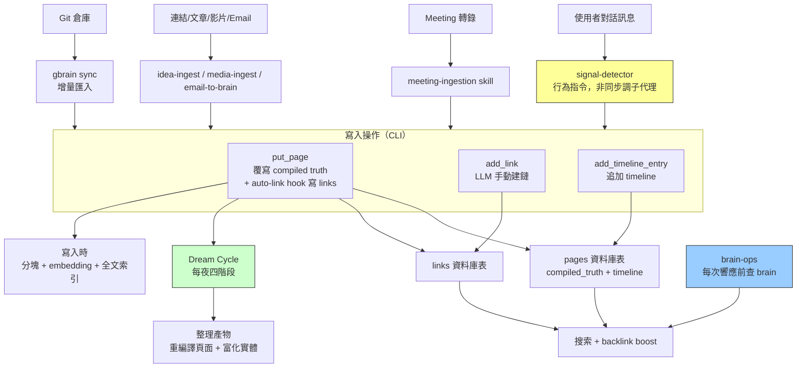
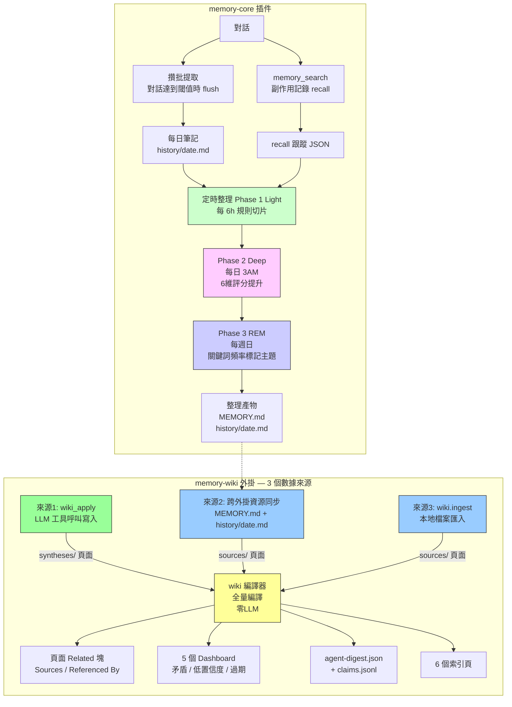
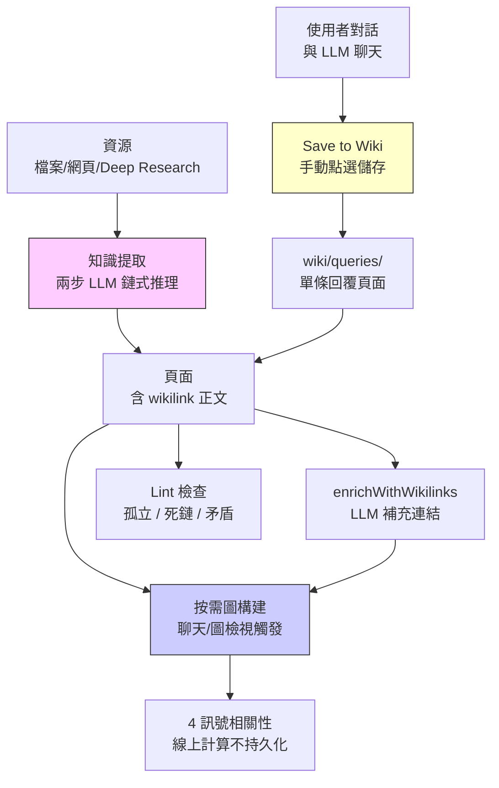
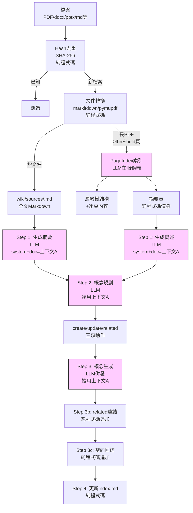
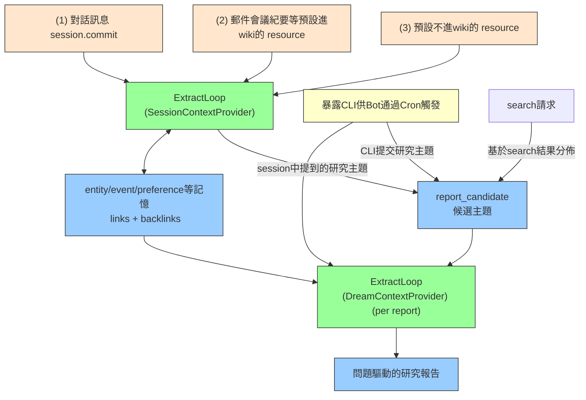

# Memory Link 設計文件

> 日期: 2026-04-23
> 狀態: Draft
> 分支: feat/memory_isolation

## 1. 概述

Memory Link 是在現有記憶體系（profile/preferences/entities/events 等）之上建立的統一關係層，將分散的記憶檔案通過有向連結互聯。

**核心目標：**
- 實體關係與連結：記憶之間建立有向、帶型別、帶權重的連結，支援雙向回鏈
- 主題整合：外部 Bot T+1 觸發整理，從已有記憶中發現問題，生成問題驅動的研究報告

**設計原則：**
- 記憶型別擴充連結能力 — 擴充現有 MemoryTypeSchema，所有記憶檔案自帶連結能力
- 儲存載體：VikingFS 檔案，與現有記憶體系一致
- 連結儲存在記憶檔案的 `MEMORY_FIELDS` 後設資料中，content 保持純淨，檢索時按需渲染
- Memory Link 是 memory 內部 links/backlinks 機制，不依賴已廢棄的 resource relation 邊

## 2. 競品實現分析

### 2.1 GBrain

**定位：** 個人知識大腦，AI agent 在每次響應前讀取、對話後寫入的持久化知識庫。

**Skill 執行模型：** GBrain = CLI 工具（TypeScript，確定性操作如 search/put/sync/embed）+ Skillpack（29 個 fat markdown 指令檔案）。Skill 是指令不是程式碼——告訴宿主 agent 什麼時候調什麼 CLI、什麼條件下調 LLM，但不含執行時，沒有 hook。

`gbrain skillpack install --all` 將 skill 檔案複製到執行時 workspace。




#### 輸入寫入

**輸入源：**

| 輸入 | 機制 | 負責 Skill |
|------|------|------------|
| 對話訊息 | CLAUDE.md / RESOLVER.md 寫入"signal-detector on every inbound message"，使用者每條訊息觸發子代理非同步執行：①檢測原創想法→`brain/originals/`（原文逐字記錄）②`gbrain search`檢測實體引用→已有頁面追加 timeline / 無頁面則建立③回鏈鐵律：實體頁面補寫回鏈④`gbrain sync` | `signal-detector` |
| Meeting 轉錄 | 拉取完整轉錄（非 AI 摘要），建立會議頁，傳播到所有參會者/公司的 timeline，雙向建鏈 | `meeting-ingestion` |
| 連結/文章/Tweet | 使用者分享連結 → 建立頁面 + 作者人物頁 + 交叉連結 | `idea-ingest` |
| 影片/音訊/PDF | 轉錄 → 實體提取 → 回鏈傳播 | `media-ingest` |
| Email | 確定性指令碼拉取郵件 → LLM 判斷實體/行動項 → 更新 brain 頁面 | `email-to-brain` recipe |
| Git 倉庫 | `gbrain sync` 增量匯入變更檔案，逐檔案走 put_page | CLI |

**對話讀取機制**（brain-ops，行為指令）：每次響應前先查 brain（`gbrain search` / `gbrain get`），形成 read-enrich-write 迴圈。同樣是 LLM 行為指令，非程式級 hook。


**資料模型：** `pages` 表儲存頁面，每個頁面由 `---` 分隔為兩部分：

```markdown
---
title: Pedro Franceschi
type: person
tags: [ceo, brex]
---

Pedro is CEO of Brex. Previously co-founded Cognito.
---

- 2026-04-10 | Presented Q1 numbers [Source: board meeting, 2026-04-10]
- 2026-04-05 | Met for coffee, discussed Series D [Source: conversation, 2026-04-05]
```

- **Compiled Truth**（`---` 上方）：agent 對該實體的當前認知摘要，每次更新**整體覆寫**。類似維基條目的當前版本
- **Timeline**（`---` 下方）：帶日期 + source attribution 的證據鏈，**只追加不覆寫**。類似 git log，記錄"誰在什麼時候說了什麼"

#### compile機制

**核心事實（基於 GBrain v0.12 原始碼分析）：**
- compiled_truth 和 timeline 是兩個獨立儲存，**沒有自動從 timeline 編譯到 compiled_truth 的程式碼邏輯**
- compiled_truth 更新**完全依賴 LLM agent** 主動呼叫 `put_page` 覆寫
- timeline 只追加不覆寫，通過 `add_timeline_entry` 寫入

**更新路徑：**

| 路徑 | 觸發 | 計算方式 | 說明 |
|------|------|----------|------|
| 1. 即時更新 | 使用者對話中 agent 主動呼叫 | LLM | agent 讀取現有 compiled_truth + timeline，重新生成新 compiled_truth，呼叫 `put_page` 覆寫 |
| 2. stale 頁面更新 | Dream Cycle 未實現 | LLM（未實現） | 設計文件提到的 "T+1 compile" 概念，程式碼中未實現 |

**stale-link reconciliation：**
- auto-link post-hook 在 `put_page` 時自動移除不再存在的連結（基於內容重新提取）
- 但 slug 改名問題仍存在：指向舊 slug 的 Markdown 連結不會自動更新，讀取端用 pg_trgm 模糊匹配緩解

#### 連結系統

**寫入方式**（兩條路徑，都會寫 `links` 表）：

**路徑 A：put_page 內 auto-link hook**（`runAutoLink`，零 LLM，每次 `put_page` 自動執行，`gbrain sync` 也會觸發）：

1. **Entity-ref 提取**：從 compiled_truth 中提取 Markdown 連結（`[張三](../people/zhangsan.md)`）和裸 slug 引用（`people/zhangsan`），自動剝離 code fence 避免程式碼塊誤提取
2. **型別推斷級聯**：對 compiled_truth 做正則匹配 + 頁面後設資料啟發式，推斷 link_type（零 LLM）。從強到弱級聯，同一對頁面（from_slug, to_slug）只保留一條邊、優先順序最高的型別：

   | 內容模式 | link_type | 示例 |
   |----------|-----------|------|
   | `"founded"/"co-founded"` | `founded` | `"Alice founded Acme AI"` → `founded` |
   | `"invested in"` | `invested_in` | `"Bob invested in Acme AI"` → `invested_in` |
   | `"advises"/"advisor"` | `advises` | `"Carol advises Acme AI"` → `advises` |
   | `"CEO of"/"CTO of"` 等 | `works_at` | `"Alice, CEO of Acme AI"` → `works_at` |
   | 會議頁（type=meeting）+ 人物引用 | `attended` | 會議頁提到 `[Alice](people/alice)` → `attended` |
   | partner-bio 語言 | `invested_in` | VC 機構人物頁提到某公司 → `invested_in` |

3. **Within-page 去重**：同一頁面內指向同一目標的多個引用只保留一條連結


**路徑 B：LLM agent 手動呼叫 `add_link`**：meeting-ingestion 等 skill 指令調 `add_link` CLI。兩頁面間只有一條邊，重複呼叫覆蓋


#### 核心路徑

| # | 路徑 | 觸發 | 處理摘要 |
|---|------|------|----------|
| 1 | **put_page** | CLI / MCP / Agent | 解析 frontmatter → SHA256 去重 → 分塊(300詞) → embedding → 舊值快照 → 覆寫 pages → 對帳 tags → **runAutoLink**（auto-link hook，寫 links 表 + stale-link reconciliation） |
| 2 | **gbrain sync** | CLI / cron / `--watch` | `git pull` → `git diff` → 按 A/M/D/R 分類 → 逐檔案走 put_page |
| 3 | **add_link** | LLM agent 按 skill 指令呼叫 | `INSERT ON CONFLICT DO UPDATE`（兩頁面間一條邊） |
| 4 | **add_timeline_entry** | LLM agent 按 skill 指令呼叫 | 引數：slug + date（YYYY-MM-DD，嚴格校驗）+ summary + detail（可選）+ source（可選）→ 追加單條 timeline_entries 記錄，不動 compiled_truth；DB trigger 自動重新整理 search_vector（timeline 內容參與全文搜尋）和 updated_at |
| 5 | **extract links** | 首次啟用 / 版本升級 | 遍歷所有頁面 → 提取實體引用 → 型別推斷級聯 → 寫入 links。支援 `--since` 增量、`--dry-run` |
| 6 | **check-backlinks** | CLI / maintain skill | 正則掃描正文 Markdown 連結 → `check` 報告缺失 / `fix` 補寫 timeline |

#### 定時整理

Dream Cycle，通過 cron + skills 實現的 6 階段維護管道（從 GBrain v0.12 原始碼分析得出）：

| 階段 | 輸入 | 計算方式 | 輸出 |
|------|------|----------|------|
| Phase 1: Lint | 所有頁面 | CLI（無 LLM） | lint 報告，檢查缺失欄位等結構問題 |
| Phase 2: Backlinks | 所有頁面 | CLI（無 LLM） | 檢查回鏈完整性，呼叫 `check-backlinks fix` |
| Phase 3: Sync | Git 倉庫 | CLI（無 LLM） | `gbrain sync` 拉取並匯入變更 |
| Phase 4: Extract | 新增/變更頁面 | CLI + auto-link post-hook（零 LLM） | 呼叫 `gbrain extract links` 批次提取連結 |
| Phase 5: Embed | 嵌入過期的頁面 | CLI（無 LLM） | `gbrain embed --stale` 重新計算向量 |
| Phase 6: Orphans | 孤立實體 | CLI（無 LLM） | 識別無入邊的實體頁面 |

**核心事實：**
- Dream Cycle 是**維護管道**，全部 6 個階段均為 CLI 確定性操作，零 LLM 呼叫
- auto-link post-hook 已在 `put_page` 時自動執行，Extract 階段用於批量回填歷史頁面
- Orphans 階段只統計孤立頁面數量（>20 則狀態 warn），不自動處理


#### 搜尋管線（讀路徑）

```
1. Query → 意圖分類器（entity/temporal/event/general）
2. 多查詢擴充（llm 生成 2 個query + 原始query 共3路）
3. 向量搜尋（HNSW cosine）+ 關鍵詞搜尋（tsvector）→ RRF 融合
4. compiled truth boost: compiled_truth 權重是timeline的兩倍
5. backlink boost: r.score *= (1.0 + 0.05 * Math.log(1 + count)) 被更多頁面連結的實體分數更高（P@5 +5.4pts，Recall@5 +11.5pts）
6. cosine 重評分: const blended = 0.7 * normRrf + 0.3 * cosine
7. 去重邏輯：
（1）同一頁面只保留top3 chunks
（2）Jaccard相似度大於 0.85 trunk去重。
（3）同一頁面型別不超過結果60% （比如 person）
（4）同一頁面只保留top2 chunks
```

**Backlink boost**：被更多頁面連結的實體排名更高。BrainBench v1（240 頁）：P@5 +5.4pts，Recall@5 +11.5pts。

#### 圖遍歷
```
  基於連結提供了圖遍歷的CLI供模型呼叫（基於postgresql實現）
  例 1：誰在 Acme 工作？（入邊 + 型別過濾）
  gbrain graph-query companies/acme --type works_at --direction in

  例 2：誰投資了 Acme？（入邊 + 不同型別）
  gbrain graph-query companies/acme --type invested_in --direction in

  例 3：兩跳關係——Alice 通過會議間接見過誰？
  gbrain graph-query people/alice --type attended --depth 2
```

#### 關鍵取捨

- 建鏈依賴 LLM 行為指令（skill markdown），沒有程式碼級 hook 保證執行——agent 可能跳過建鏈
- backlink boost 是簡單排序加分，不做圖傳播，無法發現種子檔案多跳之外的關聯
- auto-link post-hook 基於正則提取，無法驗證目標頁面是否存在（可能產生懸空連結）
- 正文 Markdown 連結不會隨 slug 改名自動更新，stale-link reconciliation 修復內容修改引起的失效，但 slug rename 場景未完全解決

#### 評測

提供了BrainBench 用於評測
https://github.com/garrytan/gbrain-evals

### 2.2 OpenClaw

**定位：** 開源自託管 AI 個人助理平臺，外掛架構，memory 是一個特殊 plugin slot。

**輸入源：** 對話（memory-core 和 memory-wiki 分別消費對話）。

**memory-wiki** 為獨立於**memory-core**的記憶加工與儲存模組

**memory-core 線上寫入（攢批提取）：** 對話達到閾值時 LLM flush 寫入，生成每日筆記 history/date.md。SQLite 索引做搜尋。

**memory-wiki 線上寫入（工具呼叫寫入）：** LLM 在對話中呼叫 `wiki_apply` 工具，寫入帶 Claims 的 wiki 頁面（YAML frontmatter）。memory-wiki 是獨立子系統，通過跨外掛資源同步從 memory-core 匯入整理產物（MEMORY.md、history/date.md）作為資源輸入。

#### Claims — 結構化知識可信度管理

OpenClaw 最核心的設計是 Claims 體系，將頁面中的事實宣告結構化，支援可信度評估和矛盾檢測。

**Claim 結構：** 每個頁面可包含多個 claim，每個 claim 有：
- `text`：宣告內容（如 "Alpha uses PostgreSQL"）
- `status`：supported / contested / contradicted / refuted / superseded
- `confidence`：0~1 可信度
- `evidence`：證據陣列，每條證據指向源頁面 + 行號範圍 + 權重

**三層連結機制：**
1. **Claim ID 跨頁引用**：相同 claim `id` 出現在不同頁面時，自動聚類檢測矛盾
2. **sourceIds 頁面溯源**：頁面級指向源頁面，編譯時生成 Sources / Referenced By / Related Pages 三類關聯
3. **Evidence 證據溯源**：每條證據指向具體源頁面的行號，比頁面級溯源更精細

**矛盾檢測與健康評估：** 按 claim ID 聚類檢測矛盾，按更新時間計算 freshness（fresh < 30天 / aging 30-89天 / stale ≥ 90天）。Dashboard 展示 Open Questions、Contradictions、Low Confidence 等報告。




**memory core部分**

**Phase 1 Light Sleep 規則切片示例**：

輸入 `history/2026-04-05.md`：
```markdown
## 運維
- 重啟了閘道器，auth 偏移導致的。
- Token 現在對齊了。

## 小王
- 她喜歡直接定時間，不喜歡"改天再說"。
- 最好給一個具體時間段。
```

切片產出（寫入 short-term-recall.json）：

| chunk | 行號 | snippet | 分數 |
|-------|------|---------|------|
| 1 | 2-3 | `運維: 重啟了閘道器，auth 偏移導致的。; Token 現在對齊了。` | 0.62（硬編碼） |
| 2 | 6-7 | `小王: 她喜歡直接定時間，不喜歡"改天再說"。; 最好給一個具體時間段。` | 0.62（硬編碼） |

切片規則：按 `## heading` 分組 → 列表項用 `; ` 拼接 → 每組最多 4 行/280 字元 → 不調 LLM → 分數硬編碼（daily=0.62, session=0.58）

**Phase 2 Deep Sleep 評分提升示例**：

假設"小王"這條 snippet 在接下來幾天被搜尋召回了 4 次，跨 3 天、2 個不同 query：

| 維度 | 權重 | 值 | 加權 |
|------|------|------|------|
| frequency | 0.24 | log1p(4)/log1p(10) = 0.66 | 0.158 |
| relevance | 0.30 | avgScore = 0.78 | 0.234 |
| diversity | 0.15 | max(2,3)/5 = 0.60 | 0.090 |
| recency | 0.15 | exp(-ln2/14 × 2) = 0.91 | 0.137 |
| consolidation | 0.10 | max(spread=0.55, grounded=0) = 0.55 | 0.055 |
| conceptual | 0.06 | 2tags/6 = 0.33 | 0.020 |
| **總分** | | | **0.694** |

門控條件：signalCount(4) ≥ 3 ✓ | diversity(3) ≥ 3 ✓ | score(0.694) < 0.8 ✗ → **未通過，不提升**

若後續又被召回 2 次（共 6 次），分數升至 0.86，則通過門控，追加到 MEMORY.md：
```markdown
## Promoted From Short-Term Memory (2026-04-08)
<!-- openclaw-memory-promotion:memory:memory/2026-04-05.md:6:7:a1b2c3d4e5f6 -->
- 小王: 她喜歡直接定時間，不喜歡"改天再說"。; 最好給一個具體時間段。
  [score=0.86 recalls=6 avg=0.80 source=memory/2026-04-05.md:6-7]
```

**Phase 3 REM Sleep 關鍵詞頻率標記主題示例**：

關鍵詞來源：對每個 snippet 做規則分詞（詞表匹配 + 複合 token 正則 + Intl.Segmenter 分詞），過濾停用詞和太短的詞，最多 8 個關鍵詞。不調 LLM。

假設 short-term-recall.json 中有 20 條 snippet，關鍵詞頻率統計：

| 關鍵詞 | 出現次數 | 總條目數 | strength | 標記主題? |
|--------|----------|----------|----------|----------|
| 閘道器 | 3 | 20 | min(1, 3/20×2) = 0.30 | ✗ (< 0.75) |
| 定時間 | 12 | 20 | min(1, 12/20×2) = 1.0 | ✓ |

超過閾值(0.75)的關鍵詞輸出為標記主題：
```markdown
### 標記主題
- Theme: `定時間` kept surfacing across 12 memories.
  - confidence: 1.0
  - evidence: memory/2026-04-05.md:6-7, memory/2026-04-06.md:2-3, ...

### Possible Lasting Truths
- 小王: 她喜歡直接定時間。[confidence=0.72 evidence=memory/2026-04-05.md:6-7]
```

標記主題不直接提升記憶，只是發現高頻關鍵詞；candidate truths 列出的條目會被 REM 寫入 phase-signals.json（remHits += 1），後續 Deep Sleep 評分時通過 phaseBoost（0.09 × remStrength × remRecency）間接加分，仍需通過 6 維評分門控才能提升到 MEMORY.md。注意這不是關鍵詞共現分析，只是單個關鍵詞的頻率統計。

memory core最終輸出的為MEMORY.md及history/2026-04-26.md 

**memory-wiki 部分 — 3 個數據來源，寫入後均觸發全量編譯**

**來源1: wiki_apply（LLM 工具呼叫寫入）**
- **觸發**：LLM 在對話中呼叫 `wiki_apply` 工具
- **輸入**：JSON，包含 op + title + body + sourceIds + claims + contradictions + questions
- **處理**：寫入 wiki 頁面（YAML frontmatter + markdown body）→ 觸發全量編譯
- **輸出**：wiki 頁面 .md 檔案 + 編譯產物

  wiki_apply 只支援兩種操作：`create_synthesis`（寫入 `syntheses/xxx.md`）和 `update_metadata`（更新已有頁面 frontmatter）。不支援建立 entity/concept 頁面。sourceIds 和 claims 均由 LLM 填寫，編譯器只做被動 Map 查詢。

  **輸入示例**（LLM 傳送的工具呼叫）：
  ```json
  {
    "op": "create_synthesis",
    "title": "小王運維手冊",
    "body": "小王負責生產環境 Kubernetes 叢集的日常運維，包括滾動升級和故障排查。",
    "sourceIds": ["source.小王週報", "source.oncall-log"],
    "claims": [
      {
        "id": "claim.小王.k8s",
        "text": "小王是生產環境 K8s 叢集的一線運維負責人",
        "status": "supported",
        "confidence": 0.92,
        "evidence": [{"sourceId": "source.小王週報", "lines": "3-7", "weight": 0.9}]
      }
    ],
    "contradictions": ["與舊版值班表衝突"],
    "questions": ["小王是否還負責測試環境?"],
    "confidence": 0.8
  }
  ```

  **輸出示例**（寫入 `syntheses/小王運維手冊.md`）：
  ```markdown
  ---
  pageType: synthesis
  id: synthesis.小王運維手冊
  title: 小王運維手冊
  sourceIds:
    - source.小王週報
    - source.oncall-log
  claims:
    - id: claim.小王.k8s
      text: 小王是生產環境 K8s 叢集的一線運維負責人
      status: supported
      confidence: 0.92
      evidence:
        - sourceId: source.小王週報
          lines: 3-7
          weight: 0.9
  contradictions:
    - 與舊版值班表衝突
  questions:
    - 小王是否還負責測試環境?
  confidence: 0.8
  updatedAt: "2026-04-26T10:00:00.000Z"
  ---

  # 小王運維手冊

  ## Summary
  <!-- openclaw:wiki:generated:start -->
  小王負責生產環境 Kubernetes 叢集的日常運維，包括滾動升級和故障排查。
  <!-- openclaw:wiki:generated:end -->

  ## Notes
  <!-- openclaw:human:start -->
  <!-- openclaw:human:end -->
  ```

  頁面結構：YAML frontmatter 存結構化資料（claims/contradictions/questions/confidence/sourceIds），正文分 Summary（編譯器管理）和 Notes（人類可編輯）兩個 managed block。

**來源2: 跨外掛資源同步（memory-core → memory-wiki）**
- **觸發**：幾乎每次 wiki 操作前先跑
- **輸入**：memory-core 的整理產物（MEMORY.md、history/date.md）
- **處理**：按 mtime + size 做增量跳過 → 寫入 sources/ 頁面 → 判斷是否需要編譯
- **輸出**：sources/*.md 頁面 + 可能觸發全量編譯

  同步是純檔案搬運，不對內容做任何提取或加工。原始內容整體放入 `## Content` 程式碼塊，frontmatter 記錄元資訊。

  **同步示例**：

  輸入：memory-core 的 `MEMORY.md`（mtime 或 size 變化）

  產出：寫入 `sources/bridge-workspace-a1b2c3d4-memory-ef567890.md`：
  ```yaml
  ---
  pageType: source
  id: source.bridge.workspace-a1b2c3d4.memory-ef567890
  title: "Memory Bridge (main): memory / MEMORY"
  sourceType: memory-bridge
  sourcePath: /absolute/path/to/workspace/MEMORY.md
  bridgeRelativePath: MEMORY.md
  bridgeWorkspaceDir: /absolute/path/to/workspace
  bridgeAgentIds:
    - main
  updatedAt: "2026-04-26T12:00:00.000Z"
  ---

  # Memory Bridge (main): memory / MEMORY

  ## Bridge Source
  - Workspace: `/absolute/path/to/workspace`
  - Relative path: `MEMORY.md`
  - Updated: 2026-04-26T12:00:00.000Z

  ## Content
  ```markdown
  <MEMORY.md 的原始內容>
  ```

  ## Notes
  <!-- openclaw:human:start -->
  <!-- openclaw:human:end -->
  ```

  增量跳過邏輯：讀取 `.openclaw-wiki/source-sync.json`，比對 mtime + size + renderFingerprint，三項都沒變則跳過寫入。

**來源3: wiki.ingest（本地檔案匯入）**
- **觸發**：CLI / gateway 呼叫
- **輸入**：本地檔案路徑 + 可選 title
- **處理**：讀取檔案 → 斷言 UTF-8 文本 → slug 化標題 → 寫入 sources/ 頁面 → 觸發全量編譯
- **輸出**：sources/*.md 頁面

  純檔案搬運，不對內容做任何提取或 LLM 呼叫。產出格式與 bridge 類似，但 frontmatter 用 `sourceType: local-file`，正文用 `## Source` 塊記錄檔案元資訊 + `## Content` 塊放原始內容。

**全量編譯 compileMemoryWikiVault（全程零 LLM）**
- **觸發**：每次寫入後自動觸發 / CLI 命令 / gateway 呼叫
- **輸入**：所有 wiki 頁面
- **處理**：全量讀所有頁面 → 計算每個頁面的 Related 塊 → 矛盾檢測 + freshness 評估 → 生成 5 個 Dashboard → 生成 agent-digest.json + claims.jsonl → 生成索引頁
- **輸出**：頁面 `## Related` 塊 + 5 個 Dashboard 頁面 + agent-digest.json + claims.jsonl + index.md + 分組 index.md

  **編譯示例**（3 個頁面）：

  輸入頁面：
  | 頁面 | kind | sourceIds | claims |
  |------|------|-----------|--------|
  | `sources/小王週報.md` | source | — | — |
  | `syntheses/小王運維手冊.md` | synthesis | source.小王週報 | claim.小王.k8s: "小王是 K8s 一線運維" (supported, 0.92) |
  | `syntheses/運維排班.md` | synthesis | source.小王週報 | claim.小王.k8s: "小王已不負責 K8s，轉交小李" (contested, 0.6) |

  編譯產出 1 — Related 塊（注入各頁面）：

  `syntheses/小王運維手冊.md` 獲得：
  ```markdown
  ## Related
  <!-- openclaw:wiki:related:start -->
  ### Sources
  - [小王週報](sources/小王週報.md)

  ### Related Pages
  - [運維排班](syntheses/運維排班.md)
  <!-- openclaw:wiki:related:end -->
  ```

  `sources/小王週報.md` 獲得：
  ```markdown
  ## Related
  <!-- openclaw:wiki:related:start -->
  ### Referenced By
  - [小王運維手冊](syntheses/小王運維手冊.md)
  - [運維排班](syntheses/運維排班.md)
  <!-- openclaw:wiki:related:end -->
  ```

  Related 塊計算邏輯：Sources = 當前頁 sourceIds 指向的頁面（Map 查詢）；Referenced By = sourceIds 包含當前頁 id 的頁面 + `[[wikilink]]` 指向當前頁的頁面；Related Pages = 共享 sourceIds 但不在前兩者中的頁面。全量遍歷，非增量。

  編譯產出 2 — 矛盾檢測（按 claim ID 聚類）：

  同一 claim ID `claim.小王.k8s` 出現在 2 個頁面，且文本不同 + 狀態不同 → 形成矛盾聚類：
  ```
  key: "claim.小王.k8s"
  entries: [運維排班(contested, stale), 小王運維手冊(supported, fresh)]
  ```

  矛盾檢測全部依賴 LLM 填寫的 claim id 和 contradictions 欄位：claim 級矛盾按 claim.id 分組（同一 id 在 ≥2 頁且 text/status 不同），頁面級矛盾按 contradictions 文本歸一化分組。編譯器只做被動聚類，不調 LLM。

  編譯產出 3 — freshness 評估（按 updatedAt 天數）：

  | 頁面 | updatedAt | 天數 | level |
  |------|-----------|------|-------|
  | 小王運維手冊 | 2026-04-26 | 0 | fresh |
  | 運維排班 | 2026-01-05 | 111 | stale (≥90) |

  編譯產出 4 — Dashboard 頁面：

  `reports/contradictions.md`：
  ```markdown
  # Contradictions
  - Competing claim clusters: 1
  ### Claim Clusters
  - `claim.小王.k8s`: 運維排班 -> contested, stale | 小王運維手冊 -> supported, fresh
  ```

  `reports/stale-pages.md`：
  ```markdown
  # Stale Pages
  - [運維排班](syntheses/運維排班.md): stale (2026-01-05)
  ```

  編譯產出 5 — agent-digest.json（後設資料摘要）：

  `.openclaw-wiki/cache/agent-digest.json`：
  ```json
  {
    "generatedAt": "2026-04-26T10:30:00.000Z",
    "stats": {
      "totalPages": 3,
      "sources": 1,
      "syntheses": 2,
      "entities": 0,
      "concepts": 0,
      "totalClaims": 2,
      "contradictionClusters": 1,
      "openQuestions": 1
    },
    "pages": [
      {
        "path": "syntheses/小王運維手冊.md",
        "title": "小王運維手冊",
        "kind": "synthesis",
        "id": "synthesis.小王運維手冊",
        "updatedAt": "2026-04-26T08:00:00.000Z",
        "freshness": "fresh",
        "claimCount": 1,
        "questionCount": 1,
        "contradictionCount": 1,
        "sourceIds": ["source.小王週報.2026w17"],
        "topClaims": [
          {
            "id": "claim.小王.k8s",
            "text": "小王是 K8s 一線運維負責人",
            "status": "supported",
            "confidence": 0.92
          }
        ]
      },
      {
        "path": "syntheses/運維排班.md",
        "title": "運維排班",
        "kind": "synthesis",
        "id": "synthesis.運維排班",
        "updatedAt": "2026-01-05T14:00:00.000Z",
        "freshness": "stale",
        "claimCount": 1,
        "questionCount": 0,
        "contradictionCount": 1,
        "sourceIds": ["source.小王週報.2026w17"],
        "topClaims": [
          {
            "id": "claim.小王.k8s",
            "text": "小王主要負責測試環境維護",
            "status": "contested",
            "confidence": 0.65
          }
        ]
      },
      {
        "path": "sources/小王週報.md",
        "title": "小王週報",
        "kind": "source",
        "id": "source.小王週報.2026w17",
        "updatedAt": "2026-04-22T18:00:00.000Z",
        "freshness": "aging",
        "claimCount": 0,
        "questionCount": 0,
        "contradictionCount": 0,
        "sourceIds": [],
        "topClaims": []
      }
    ],
    "claimHealth": {
      "contradictionClusters": [
        {
          "key": "claim.小王.k8s",
          "type": "claim-id",
          "entries": [
            {
              "path": "syntheses/運維排班.md",
              "status": "contested",
              "freshness": "stale"
            },
            {
              "path": "syntheses/小王運維手冊.md",
              "status": "supported",
              "freshness": "fresh"
            }
          ]
        }
      ]
    }
  }
  ```

**讀路徑（全程零 LLM）**

**wiki_search（wiki 內搜尋）**
- **觸發**：LLM 呼叫 `wiki_search` 工具 / CLI / gateway
- **輸入**：query 字串 + corpus（wiki/memory/all）
- **處理**：先讀 agent-digest.json 做後設資料預篩選 → 對候選頁面全文本搜尋評分
- **輸出**：排序結果列表

  評分規則（純數值，不調 LLM）：

  | 匹配位置 | 加分 |
  |----------|------|
  | title 精確匹配 | +50 |
  | title 包含 | +20 |
  | claim text 包含 | +25 |
  | sourceId 包含 | +12 |
  | 正文出現（每次） | +1（上限 10） |
  | claim confidence | +0~10 |
  | freshness | fresh +8 / aging +4 / stale -2 |

  搜尋結果示例：
  ```json
  {
    "corpus": "wiki",
    "path": "syntheses/小王運維手冊.md",
    "title": "小王運維手冊",
    "kind": "synthesis",
    "score": 53,
    "snippet": "小王是 K8s 一線運維負責人",
    "id": "synthesis.小王運維手冊",
    "updatedAt": "2026-04-26T08:00:00.000Z"
  }
  ```

**wiki_lint（結構檢查）**
- **觸發**：CLI / gateway / tool 呼叫
- **輸入**：所有 wiki 頁面
- **處理**：編譯先跑一遍 → 然後逐頁檢查 16 種問題
- **輸出**：`reports/lint.md`

  16 種檢查全部是純欄位過濾，不調 LLM：

  | 類別 | 程式碼 | 嚴重度 | 檢測什麼 |
  |------|------|--------|----------|
  | 結構 | missing-id / duplicate-id / missing-page-type / page-type-mismatch / missing-title | error | frontmatter 完整性和一致性 |
  | 溯源 | missing-source-ids / missing-import-provenance / claim-missing-evidence | warning | 頁面和 claim 的來源可追溯性 |
  | 連結 | broken-wikilink | warning | [[wikilink]] 目標不存在 |
  | 矛盾 | contradiction-present / claim-conflict | warning | 頁面級矛盾宣告 + claim ID 聚類衝突 |
  | 問題 | open-question | warning | 頁面有未解決問題 |
  | 質量 | low-confidence / claim-low-confidence / stale-page / stale-claim | warning | 低置信度 + 過時（stale ≥ 90天） |

  產出示例（`reports/lint.md`）：
  ```markdown
  # Lint Report
  - Errors: 0
  - Warnings: 3

  ### Contradictions
  - `syntheses/小王運維手冊.md`: Claim cluster `claim.小王.k8s` has competing variants across 2 pages.

  ### Quality Follow-Up
  - `syntheses/運維排班.md`: Claim `claim.小王.k8s` is missing structured evidence.
  - `syntheses/運維排班.md`: Page freshness is stale (2026-01-05).
  ```

**Prompt Section（agent digest 注入 LLM 上下文）**
- **觸發**：每次 LLM 呼叫前構建 prompt 時（需 `includeCompiledDigestPrompt=true`，預設關閉）
- **輸入**：`.openclaw-wiki/cache/agent-digest.json`
- **處理**：按 claim/question/contradiction 數量對頁面排序 → 取 top 4 頁面 → 每頁取 top 2 claims → 拼接摘要
- **輸出**：注入 LLM system prompt 的 wiki 概要

  LLM 看到的內容：
  ```markdown
  ## Compiled Wiki
  Use the wiki when the answer depends on accumulated project knowledge.
  Workflow: wiki_search first, then wiki_get for the exact page.

  ## Compiled Wiki Snapshot
  Compiled wiki currently tracks 2 claims across 1 high-signal pages.
  Contradiction clusters: 1.
  - 小王運維手冊: synthesis, 1 claims, 1 open questions, 1 contradiction notes
    - 小王是 K8s 一線運維負責人 (status supported, confidence 0.92, freshness fresh)
    - 小王是否還負責測試環境? (open question)
  ```

  本質：把編譯產物的摘要注入 LLM 上下文，讓 LLM 知道 wiki 裡有什麼，決定是否調 wiki_search/wiki_get 獲取詳情。

**關鍵取捨：**
- Claims 三層連結提供了結構化的知識可信度管理，但增加了寫作負擔
- 矛盾檢測依賴 claim `id` 的一致性（無 id 的 claim 無法跨頁關聯），而 claim id 由 LLM 填寫，一致性無保證
- 編譯器全程零 LLM，所有關係計算依賴 LLM 在 wiki_apply 時填寫的 sourceIds、claims、contradictions 欄位

### 2.3 nashsu_llm_wiki

**定位：** 桌面應用（Tauri + React），實現 Karpathy LLM Wiki 模式——LLM 增量構建並維護持久化 wiki，而非每次查詢重新推導。

**架構：** 原始素材（不可變）→ wiki（LLM 生成的頁面）→ schema（配置 wiki 結構）

**輸入源：** 兩種方式並存：
1. **檔案匯入（主要）**：檔案/網頁剪藏/Deep Research → 自動觸發知識提取 → 生成完整 wiki 頁面
2. **Save to Wiki（對話）**：使用者與 LLM 對話 → 手動點選 "Save to Wiki" → 僅儲存單條助手回覆為 `wiki/queries/` 頁面



**1. 知識提取（兩步 LLM）**
- **第一步分析**：讀取源內容 + wiki/index.md + wiki/purpose.md，輸出結構化分析（關鍵實體/關鍵概念/核心論點/矛盾/建議）
- **第二步生成**：把第一步分析作為上下文（不解析，直接傳文本），輸出的是**純文本**，格式是多個塊依次拼接：
  1. 每個要寫入的頁面對應一個 `---FILE: wiki/path/to/page.md---` 開頭、`---END FILE---` 結尾的塊，中間是完整的 Markdown 內容（含 frontmatter）
  2. 所有頁面塊之後，可選輸出 `---REVIEW: type | Title---` 開頭、`---END REVIEW---` 結尾的塊，標註需要人工確認的項
- 生成的頁面通常包括：sources/（源摘要）+ entities/（實體頁）+ concepts/（概念頁）+ index.md（索引）+ log.md（日誌）+ overview.md（概覽）
- SHA256 快取去重，不變的素材不重複處理

  **具體例子**：

  假設匯入一份 `acme-k8s-migration.pdf`（Acme 公司的 Kubernetes 遷移報告）：

  - **第一步分析輸出**：
    ```
    ## 關鍵實體
    - Alice Smith (人物，核心，技術負責人)
    - Acme Corp (組織，核心，遷移實施方)
    - Kubernetes (產品，邊緣，已有頁面可能存在)

    ## 關鍵概念
    - 微服務架構：將應用拆分為獨立服務的方法，本報告核心
    - CI/CD 流水線：自動化構建測試部署流程

    ## 核心論點
    - Acme Corp 從單體應用遷移到微服務，使用 Kubernetes
    - 部署時間減少 70%
    - 證據：報告中提供的遷移前後部署指標對比

    ## 矛盾
    - 無外部矛盾
    - 內部張力：部署變快但運維複雜度上升

    ## 建議
    - 建立 Alice Smith 和 Acme Corp 的實體頁
    - 建立微服務架構概念頁（如果不存在）
    - 更新 overview 加入這個遷移案例
    ```

  - **第二步生成輸出**：
    ```
    ---FILE: wiki/sources/acme-k8s-migration.md---
    ---
    type: source
    title: "Source: Acme K8s Migration Report"
    created: 2026-04-28
    updated: 2026-04-28
    tags: [migration, kubernetes]
    sources: ["acme-k8s-migration.pdf"]
    ---
    # Source: Acme K8s Migration Report

    ## 摘要
    Acme Corp 成功從單體應用遷移到基於 Kubernetes 的微服務架構，由 Alice Smith 主導。

    ## 關鍵發現
    - 部署時間減少 70%
    - 運維複雜度有所上升
    ---END FILE---

    ---FILE: wiki/entities/alice-smith.md---
    ---
    type: entity
    title: "Alice Smith"
    created: 2026-04-28
    updated: 2026-04-28
    tags: [engineer, migration-lead]
    related: [[acme-corp]]
    sources: ["acme-k8s-migration.pdf"]
    ---
    # Alice Smith

    ## 角色
    Acme Corp 技術負責人，主導微服務遷移。

    ## 背景
    推動 Acme Corp 從單體遷移到 Kubernetes 的核心人物。
    [[acme-corp]]
    ---END FILE---

    ---FILE: wiki/entities/acme-corp.md---
    ---
    type: entity
    title: "Acme Corp"
    created: 2026-04-28
    updated: 2026-04-28
    tags: [company, technology]
    related: [[alice-smith]]
    sources: ["acme-k8s-migration.pdf"]
    ---
    # Acme Corp

    ## 簡介
    一家最近完成微服務遷移的科技公司。

    ## 關鍵行動
    - 2026: 從單體遷移到 Kubernetes 微服務
    [[alice-smith]]
    ---END FILE---

    ---FILE: wiki/concepts/microservices-architecture.md---
    ---
    type: concept
    title: "微服務架構"
    created: 2026-04-28
    updated: 2026-04-28
    tags: [architecture, cloud]
    related: [[kubernetes]]
    sources: ["acme-k8s-migration.pdf"]
    ---
    # 微服務架構

    ## 定義
    將應用開發為一組小型獨立服務，通過 API 通訊。

    ## 權衡
    - 部署更快
    - 運維複雜度上升
    ---END FILE---

    ---FILE: wiki/index.md---
    ---
    type: overview
    title: "Wiki Index"
    created: 2026-04-01
    updated: 2026-04-28
    ---
    # Wiki Index

    ## 實體
    - [[alice-smith]]
    - [[acme-corp]]

    ## 概念
    - [[microservices-architecture]]
    ---END FILE---

    ---REVIEW: duplicate | Kubernetes 可能已存在---
    分析提到 Kubernetes，但不確定是否已有頁面，建議檢查後再決定是否建立。
    OPTIONS: Create Page | Skip
    SEARCH: kubernetes 容器編排 | 微服務 kubernetes 部署
    ---END REVIEW---
    ```

**2. enrichWithWikilinks（連結補充）**
- LLM 判斷哪些術語應連結到已有頁面 → 在正文插入 `[[wikilink]]`

**3. 按需圖構建**
- 讀所有 .md 檔案 → 正則提取 `[[wikilink]]` → 構建圖結構 → 快取在記憶體（模組級變數）
- 使用時：如果 `cachedGraph.dataVersion === 當前 dataVersion` 則直接用快取，否則重新構建
- 需要相關性分數時：呼叫 `calculateRelevance` 函式**線上即時計算**（不快取）

4 訊號相關性：

| 訊號 | 權重 | 來源 |
|------|------|------|
| 直接連結 | 3.0 | `[[wikilink]]` 語法 |
| 原始檔重疊 | 4.0 | frontmatter `sources: []` 共享 |
| Adamic-Adar | 1.5 | 共同鄰居，按 1/log(度) 加權 |
| 型別親和 | 1.0 | 同類型頁面加分 |


**4. 檢索**
- 分詞搜尋 + 向量搜尋（LanceDB，可選）→ RRF 融合 → 排序結果（最多 20 條）：

| 步驟 | 說明 |
|------|------|
| 分詞搜尋 | 本地檔案掃描，分數計算：檔名精確匹配（+200）> 標題包含短語（+50）> 正文包含短語（每次+20，最多10次）> 標題token匹配（每個+5）> 正文token匹配（每個+1） |
| 向量搜尋 | 可選（LanceDB），返回 top10 語義相似結果 |
| RRF 融合 | `fused(p) = 1/(60 + token_rank) + 1/(60 + vector_rank) |
| 去重排序 | 按 RRF 分數降序，同分按路徑字母順序，取前 20 條 |


**5. Lint 檢查**
- 結構檢查（孤立/死鏈）+ 語義檢查（LLM 檢測矛盾/過期）

**無定時整理**：所有知識產出依賴知識提取時一次性完成，沒有後續的矛盾發現、過時更新或跨頁面整合

**關鍵取捨：**
- 連結存正文（`[[wikilink]]`），slug 變更時連結失效
- 沒有連結型別、沒有權重，關係計算靠原始檔重疊和圖拓撲
- 4 訊號相關性模型比純 PPR 更豐富，但權重硬編碼

### 2.4 OpenKB

**定位：** 開源 CLI 工具，將原始文件編譯成結構化、相互連結的 wiki 風格知識庫。受 Andrej Karpathy "LLM Wiki" 想法啟發——LLM 自動生成摘要、概念頁和交叉引用，讓知識隨時間積累，而非每次查詢重新推導（傳統 RAG 的做法）。

**輸入源：** 檔案匯入（PDF、docx、pptx、md 等），或檔案系統監控（watchdog 自動處理 `raw/` 目錄新增檔案）。

**架構：** 文件 → 轉換 → 編譯（多步 LLM 管線）→ wiki 頁面（summaries + concepts + index）



#### 文件轉換（純程式碼，零 LLM）

| 檔案型別 | 轉換方式 | 輸出 |
|----------|----------|------|
| `.md` | 直接讀取 + 複製相對路徑圖片並改寫連結 | `wiki/sources/{name}.md` |
| `.pdf`（短，< threshold 頁） | pymupdf dict-mode 逐頁遍歷 text/image block → Markdown + 內聯圖片 | `wiki/sources/{name}.md` + `wiki/sources/images/{name}/*.png` |
| `.pdf`（長，≥ threshold 頁） | 僅標記 `is_long_doc=True`，不轉換，交給 PageIndex | 返回標記 |
| 其他（docx/pptx/xlsx/html/txt/csv） | markitdown 庫轉換 → 解碼 base64 圖片儲存磁碟並改寫連結 | `wiki/sources/{name}.md` + `wiki/sources/images/{name}/*.png` |

額外操作：原始檔案複製到 `raw/` 目錄存檔，SHA-256 雜湊註冊到 `hashes.json`。

#### PageIndex 索引（僅長 PDF，LLM 在服務端）

| 子步驟 | 輸入 | 計算 | LLM | 輸出檔案 |
|--------|------|------|-----|----------|
| 索引 | PDF 檔案 | `PageIndexClient.collection().add(pdf)` — 上傳 PDF 到 PageIndex 服務，服務端用 LLM 解析文件結構 | 是（PageIndex 內部） | `doc_id`, `doc_description`, `structure`（層級樹） |
| 獲取頁面內容 | doc_id, page_count | Cloud 模式：OCR 後的 Markdown；失敗回退本地 pymupdf | Cloud 模式用 OCR | `wiki/sources/{name}.json`（per-page 內容陣列） |
| 渲染摘要 | tree 結構 | `render_summary_md()` — 遞迴遍歷樹節點，渲染為 Markdown 層級標題 + summary | 否 | `wiki/summaries/{name}.md` |

PageIndex 使用無向量（vectorless）的推理式檢索——通過層級樹索引實現長文件的結構化訪問，不依賴 embedding。

#### Wiki 編譯（多步 LLM 管線，prompt 快取）

編譯管線的核心設計是**上下文 A 複用**：Step 1 構造 system_msg（AGENTS.md schema + 語言指令）+ doc_msg（文件內容/PageIndex 摘要），作為 prompt 快取的字首；Step 2-3 複用同一字首，讓 LLM 服務端命中快取，減少重複計算。

**Step 1: 生成摘要/概述**

| 項 | 短文件 | 長文件 |
|----|--------|--------|
| Prompt | `_SUMMARY_USER` — 文件全文 + "寫摘要頁" | `_LONG_DOC_SUMMARY_USER` — PageIndex 摘要 + "寫概述" |
| LLM 呼叫 | 1 次同步 | 1 次同步 |
| 輸出格式 | JSON `{"brief": "...", "content": "..."}` | 純 Markdown |
| 寫入檔案 | `wiki/summaries/{name}.md`（frontmatter: doc_type=short） | 摘要已在 PageIndex 步驟寫好，此步輸出作為後續輸入 |

**Step 2: 概念規劃**

| 項 | 說明 |
|----|------|
| 輸入 | 上下文 A + 上一步 summary + 已有概念頁的 briefs |
| LLM 呼叫 | 1 次同步 |
| 輸出 | JSON plan: `{"create": [...], "update": [...], "related": [...]}` |

三種動作：
- **create**: 新概念，需生成全新頁面
- **update**: 已有概念有新資訊，需全文重寫（不是追加）
- **related**: 輕量關聯，只加交叉連結不改內容

已有概念頁以緊湊格式呈現給 LLM：`- {slug}: {brief}`（brief 從 frontmatter 讀取，預設時擷取正文前 150 字元）。

**Step 3: 概念頁生成/更新**

| 項 | 說明 |
|----|------|
| LLM 呼叫 | N 次併發非同步（N = create 數 + update 數，預設 concurrency=5） |
| create Prompt | `_CONCEPT_PAGE_USER` — title + doc_name，生成新概念頁 |
| update Prompt | `_CONCEPT_UPDATE_USER` — title + doc_name + **已有概念頁全文**，LLM 被要求"全文重寫融入新資訊，不要追加" |
| 輸出格式 | JSON `{"brief": "...", "content": "..."}` |

寫入邏輯：
- **create**: 新文件，frontmatter 含 `sources` 和 `brief`
- **update**: 讀取已有 frontmatter → 追加 source_file 到 sources 列表 → 替換 body 為 LLM 重寫內容 → 更新 brief

**Step 3b/3c: 關聯連結 + 雙向回鏈（純程式碼，零 LLM）**

| 操作 | 做什麼 |
|------|--------|
| `_add_related_link()` | 在 related 概念頁末尾追加 `See also: [[summaries/{doc}]]` + frontmatter 追加 source |
| `_backlink_summary()` | 在摘要頁追加 `## Related Concepts` 章節，列出所有 `[[concepts/{slug}]]` |
| `_backlink_concepts()` | 在每個概念頁追加 `## Related Documents` 章節，列出 `[[summaries/{doc}]]` |

目的：確保雙向連結閉環——摘要連結概念，概念也連結摘要。

**Step 4: 更新索引（純程式碼，零 LLM）**

在 `wiki/index.md` 的 `## Documents` 下插入文件條目，`## Concepts` 下插入或更新概念條目。條目格式：`- [[link]] (type) — brief text`。

#### 全流程 LLM 調用匯總

| 步驟 | LLM 呼叫次數 | 快取利用 | 備註 |
|------|-------------|----------|------|
| Hash 去重 | 0 | — | 純程式碼 |
| 文件轉換 | 0 | — | 純程式碼 |
| PageIndex 索引（僅長PDF） | 1+（PageIndex 內部） | — | 對 OpenKB 透明 |
| Step 1: 生成摘要/概述 | **1** | system+doc 構成快取上下文 A | 短文件用全文，長文件用 PageIndex 摘要 |
| Step 2: 概念規劃 | **1** | 複用上下文 A（快取命中） | |
| Step 3: 概念頁生成 | **N**（create+update 數） | 複用上下文 A（快取命中） | 併發執行，預設 concurrency=5 |
| Step 3b/3c: 關聯+回鏈 | 0 | — | 純程式碼 |
| Step 4: 更新索引 | 0 | — | 純程式碼 |

典型短文件：2 + N 次 LLM 呼叫（1 摘要 + 1 規劃 + N 概念頁）。典型長 PDF：2 + N 次加 PageIndex 內部呼叫。

#### 連結系統

**連結載體：** 正文內 `[[wikilink]]` 語法（如 `[[concepts/attention]]`、`[[summaries/attention-is-all-you-need]]`）。

**連結型別：** 無型別系統，所有連結都是無型別的 wikilink，無法區分"屬於""導致""矛盾"等關係語義。

**連結權重：** 無權重，所有連結等價。

**雙向連結機制：** 通過程式碼級回鏈保證——編譯管線的 Step 3b/3c 在寫入後立即補全反向連結。但只在編譯時執行，如果後續手動編輯頁面刪除了連結，反向連結不會自動清理。

**連結精度：** 頁面級（`[[concepts/slug]]`），不支援行號級定位。

#### 搜尋/問答

- **query 命令**：OpenAI Agents SDK 驅動的 LLM agent，3 個工具（`read_file`、`get_page_content`、`get_image`）導航已編譯 wiki 回答問題
- **chat 命令**：互動式多輪對話 REPL，支援會話持久化、slash commands
- **無向量化搜尋**：query/chat agent 依賴 LLM 自主決策讀哪些頁面，不做 embedding 檢索

#### Lint 檢查

| 層級 | 檢查內容 | 計算方式 |
|------|----------|----------|
| 結構性 lint | 斷鏈、孤兒頁、raw 檔案缺 wiki 條目、index.md 不同步 | 純程式碼（正則匹配 wikilink） |
| 語義 lint | 矛盾、遺漏、過時、冗餘、概念覆蓋 | LLM agent（OpenAI Agents SDK） |

#### 定時整理

**無定時整理。** 所有知識產出在檔案匯入時一次性完成（多步 LLM 編譯管線），沒有後續的矛盾發現、過時更新或跨頁面整合機制。隨著頁面增多，概念頁可能過時但不自動重新整理。

#### 關鍵取捨

- 連結存正文（`[[wikilink]]`），slug 變更時連結失效，無 stale-link reconciliation
- 無連結型別和權重，所有關係等價，無法區分"屬於""導致""矛盾"等語義
- 雙向回鏈僅在編譯時保證，手動編輯後可能不一致
- 無定時整理/矛盾發現，知識庫長期維護依賴人工 lint
- 多步 LLM 管線的 prompt 快取設計有效降低重複計算，但每次編譯都是全量生成（無增量更新）
- PageIndex 的無向量檢索是對傳統 RAG 的有趣替代，但僅限於長 PDF 場景

### 2.5 競品啟發與設計決策

**1. PageIdMap 消除死鏈（vs GBrain auto-link + check-backlinks / OpenKB 編譯時回鏈）**
GBrain 在 `put_page` 時通過 auto-link post-hook 自動提取實體引用並建立連結，還通過 `check-backlinks` 命令檢查並修復回鏈，用 pg_trgm 模糊 slug matching 緩解讀取端問題。但 auto-link 基於正則提取，無法驗證目標頁面是否存在（可能產生懸空連結）。OpenKB 在編譯時通過程式碼級 `_backlink_summary` / `_backlink_concepts` 保證雙向連結，但僅在編譯時刻執行，手動編輯或 slug 變更後連結可能斷裂，且無 stale-link reconciliation。OV 的 PageIdMap 從結構上杜絕死鏈——page_id 只分配給上下文中確認存在的檔案，連結不可能指向不存在的頁面。

**2. 延遲渲染替代寫入時連結（vs GBrain 正文 Markdown 連結 / OpenKB [[wikilink]] 正文連結）**
GBrain 的 auto-link post-hook 有 stale-link reconciliation 功能，在內容修改時自動移除失效連結。但正文中的 Markdown 連結（如 `[張三](../people/zhangsan.md)`）不會隨 slug 改名自動更新，仍是斷裂風險點。OpenKB 同樣把連結寫在正文中（`[[wikilink]]`），編譯時生成，無 reconciliation 機制，slug 變更直接導致斷鏈。OV 的 content 保持純淨，連結存在 `links` 後設資料中，檢索時按需渲染 match_text。target_uri 變化只改後設資料，content 不動。

**3. LinkType 列舉 + weight 權重（vs GBrain 自由文本 + 型別推斷 / OpenClaw 無權重 / OpenKB 無型別無權重）**
GBrain 的 `links` 表的 `link_type` 列是自由文本，但 auto-link post-hook 能通過型別推斷級聯自動推斷標準型別（founded → invested_in → advises → works_at）。不過 LLM 調 `add_link` 時仍可填入任意值（同義歧義如 `knows` vs `familiar_with`）。OpenClaw 沒有權重。OpenKB 的 `[[wikilink]]` 完全沒有型別和權重，所有連結等價，無法區分"屬於""導致""矛盾"等語義。OV 用列舉約束關係型別，用 weight 表達關聯強度，支援更精細的檢索排序。

**4. 不引入 Claims 層（from OpenClaw 啟發）**
OpenClaw 的 Claims 三層連結 + 矛盾檢測 + freshness 評估是一套完整的知識可信度管理，但 OV 不引入獨立 claims 層。原因：原始 md 已包含事實記錄，links 體系已覆蓋 claim 的核心能力——矛盾（`CONTRADICTS`）、演變（`EVOLVED_FROM`）、可信度（`weight`）、證據溯源（`t_uri + t_field + t_line_ranges`）。獨立 claim 層只是 links 的冗餘子集。

**5. 連結後設資料 vs 正文內連結（from nashsu_llm_wiki / OpenKB 啟發）**
nashsu_llm_wiki 和 OpenKB 都把連結寫在正文中（`[[wikilink]]`），slug 變更時連結失效，且無法攜帶型別和權重。GBrain 的結構化連結儲存在獨立資料庫表中（不在正文中），auto-link post-hook 通過 stale-link reconciliation 自動修復內容變更引起的失效連結，但正文中的 Markdown 交叉引用仍有 slug 變更問題。OV 的連結存在後設資料中，正文保持純淨，與第 2 點延遲渲染策略一致。

**6. 外部 Bot T+1 觸發主題整合 vs Dream Cycle 維護管道（from GBrain + nashsu_llm_wiki + OpenKB 啟發）**
nashsu_llm_wiki 和 OpenKB 都沒有定時整理，全靠匯入/編譯時一次性產出。GBrain 的 Dream Cycle 是純維護管道（lint → backlinks → sync → extract → embed → orphans），不涉及 LLM，沒有記憶整合或實體升級功能。隨著頁面增多，一次性提取或純維護都難以發現跨頁面的矛盾、過時和遺漏。OpenKB 的語義 lint 能發現矛盾和過時，但需人工觸發，無自動整理。OV 的整理由外部 Bot T+1 觸發，從已有記憶中發現問題，呼叫 ExtractLoop 生成報告，保持知識庫活力。

**7. 現有 merge_op 對映（vs GBrain 頁面內容覆寫 / OpenClaw Dreaming）**
OV 已有的 merge_op 體系與競品的記憶整理模式天然對應：
- `upsert`（PATCH）≈ GBrain compiled_truth（LLM 主動覆寫式重編譯）
- `add_only`（SUM）≈ GBrain timeline / OpenClaw history/date.md（追加式）
- 外部 Bot T+1 觸發主題整合 ≈ OpenClaw Phase 2/3（短期→長期提升 + 關鍵詞頻率標記主題）
無需新建整理範式，複用現有機制即可。

**8. PPR 搜尋增強（vs GBrain backlink boost / nashsu_llm_wiki 4 訊號圖擴充 / OpenKB LLM agent 導航）**
GBrain 已實現 backlink boost——搜尋排序時被更多頁面連結的實體排名更高（BrainBench v1: P@5 +5.4pts, Recall@5 +11.5pts），但這是簡單排序加分，不做圖傳播，無法發現種子檔案多跳之外的關聯。OV 用 PPR 演算法實現 query 相關的圖增強檢索，從搜尋種子出發沿 links 做帶權隨機遊走，天然支援多種子橋接發現，詳見 3.5 節。nashsu_llm_wiki 用 4 訊號加權做圖擴充，但權重硬編碼且無型別區分；OV 的 PPR 按 `(link_type, links/backlinks)` 配置表驅動，靈活可調。OpenKB 不做圖增強，query/chat 完全依賴 LLM agent 自主決策導航 wiki 頁面，召回能力受 agent 推理能力限制。

**9. ExtractLoop 統一提取 vs 多步編譯管線（from OpenKB 啟發）**
OpenKB 的編譯管線是精心設計的多步 LLM 呼叫鏈：摘要 → 概念規劃 → 併發概念生成 → 程式碼級回鏈 → 索引更新，每步有明確的輸入/輸出契約，且通過 prompt 快取複用上下文降低成本。但每次新文件匯入都獨立走完整管線，概念頁的"update"路徑依賴 LLM 全文重寫（非增量），隨著頁面增多成本線性增長。OV 的 ExtractLoop 在單次 LLM 呼叫中統一輸出記憶操作 + links，由 merge_op 體系處理增量合併（`upsert` PATCH / `add_only` SUM），更輕量且天然支援增量更新。

## 3. OpenViking 連結設計

### 3.1 設計總覽

**定位：** AI agent 的持久化記憶系統，在對話中即時寫入記憶，外部 Bot T+1 觸發整理發現主題生成研究報告。

**輸入源：** 對話訊息 + 資源（預設進 wiki / 預設不進 wiki）。

**資料寫入（3 種輸入場景）：**

| 場景 | 觸發 | 說明 |
|------|------|------|
| (1) 對話訊息 | session.commit | 對話進記憶，互鏈 |
| (2) 郵件會議紀要等預設進 wiki 的 resource | add-resource | 資源進記憶，互鏈 |
| (3) 預設不進 wiki 的 resource | add-resource | 資源不進記憶，但記憶可連結到資源 |

三種場景統一走 ExtractLoop，LLM 按 schema 輸出記憶操作 + links

**連結機制：** 連結存在檔案後設資料 JSON（VikingFS）中，content 保持純淨。6 種 LinkType 列舉約束，weight 表達關聯強度，t_line_ranges 行號級精度。一條連結寫入 from 端 links + to 端 backlinks，兩側記錄完全相同。PageIdMap 從結構上杜絕死鏈。

**T+1整理：** 主題整合。從已有記憶中發現問題（新記憶無關聯 report / CONTRADICTS 連結 / report_candidate），逐主題呼叫 ExtractLoop（DreamContextProvider）生成 report。暴露 CLI 供 Bot 通過 Cron 觸發。report_candidate 來源：session 中提到的研究主題 / CLI 提交研究主題 / 基於搜尋結果分佈。

**整理產物：** 問題驅動的研究報告（report memory_type）。



**關鍵路徑**：對話訊息/資源 → ExtractLoop（LLM 統一輸出記憶 + links）→ merge_op 合併寫入 → 向量化/摘要非同步入隊 → report_candidate → Bot Cron 觸發 T+1 整理 → PPR 線上圖增強

**1. 線上寫入（3 種輸入場景統一走 ExtractLoop）**

| 場景 | 觸發 | 說明 |
|------|------|------|
| (1) 對話訊息 | session.commit | 記憶間互鏈 |
| (2) 郵件會議紀要等預設進 wiki 的 resource | add-resource | 資源進記憶，互鏈 |
| (3) 預設不進 wiki 的 resource | add-resource | 資源不進記憶，但記憶可連結到資源 |

- **處理**：
  1. SessionExtractContextProvider.prefetch() — 搜尋/讀取已有記憶檔案和資源
  2. ExtractLoop.run() — LLM 按 schema 輸出記憶操作 + links（統一輸出）
  3. resolve_operations() — page_id 轉 URI，連結分發到 from 端 links + to 端 backlinks
  4. MemoryUpdater.apply_operations() — merge_op 合併 + 寫入記憶檔案 + 行號修正 + 向量化入隊
- **輸出**：記憶 .md 檔案（含 links/backlinks 後設資料）+ EmbeddingMsg 入隊 + memory_diff.json

**2. MergeOp 欄位合併**
- **觸發**：apply_operations 中對每個 field 呼叫
- **輸入**：current_value + patch_value
- **處理**：patch（SEARCH/REPLACE 搜尋替換）/ sum（數值加法）/ immutable（不可變）
- **輸出**：合併後的欄位新值

**3. 向量化計算**
- **觸發**：記憶寫入後入隊
- **輸入**：記憶檔案內容（去除 MEMORY_FIELDS 註釋）
- **處理**：後臺 worker 從佇列取出 → embedder 計算向量 → upsert 到向量儲存
- **輸出**：向量索引記錄

**4. Semantic Processor（摘要生成）**
- **觸發**：記憶寫入後入隊 SemanticMsg
- **輸入**：目錄中的 .md 檔案
- **處理**：LLM 生成每檔案摘要 → 彙總生成 .abstract.md 和 .overview.md → 摘要檔案入隊向量化
- **輸出**：.abstract.md + .overview.md + 摘要 EmbeddingMsg

**5. T+1 觸發整理**
- **觸發**：暴露 CLI 供 Bot 通過 Cron 觸發
- **輸入**：當天新增/修改的記憶檔案 + 已有 report 列表 + report_candidate
- **處理**：
  1. 主題發現：新記憶無關聯 report → 新主題；CONTRADICTS 連結 → 衝突主題；report_candidate → 候選主題
  2. 逐主題生成：DreamContextProvider 讀取相關檔案 → ExtractLoop 調 LLM 按 report schema 輸出 → MemoryUpdater 寫入
- **輸出**：report 檔案（問題驅動的研究報告）+ report_candidate 標記已處理

**6. PPR 圖增強檢索**
- **觸發**：搜尋請求 / prefetch 階段
- **輸入**：搜尋種子 + links/backlinks 後設資料
- **處理**：從種子沿 links 做帶權隨機遊走 → 按 (link_type, links/backlinks) 配置表決定權重/繼續/深度 → 分數合併
- **輸出**：補充召回的檔案列表 + 排序分數（臨時，不持久化）

### 3.2 Link 資料模型

#### 3.2.1 兩層模型設計

連結系統分為兩層：**LLM 輸出層**（使用 page_id 引用）和**儲存層**（使用 URI）。

##### LLM 輸出層：WikiLink

LLM 在 structured output 中統一輸出連結，不散在每個記憶欄位內：

```python
class LinkType(str, Enum):
    RELATED_TO = "related_to"
    BELONGS_TO = "belongs_to"
    CAUSED_BY = "caused_by"
    DERIVED_FROM = "derived_from"
    CONTRADICTS = "contradicts"
    EVOLVED_FROM = "evolved_from"

class WikiLink(BaseModel):
    f: int                        # page_id A
    t: int                        # page_id B
    t_field: str                  # B 的欄位名（to 端精確定位）
    t_line_ranges: Optional[str]  # B 的行號範圍："3-5"（to 端精確定位）
    link_type: LinkType           # 關係型別（列舉）
    weight: float = 1.0           # 關聯權重 0~1
    match_text: Optional[str]     # A 中需連結化的文本片段（檢索時用於渲染）
    description: str = ""         # 連結描述：為什麼建立此關聯
```

**連結不對稱**：from 側是錨點（`match_text`），to 側是展開資訊（`t_field` + `t_line_ranges`）。儲存時，一條連結寫入兩端檔案的獨立列表：from 檔案的 `links`（正鏈，需渲染）+ to 檔案的 `backlinks`（反鏈，不渲染，只用於遍歷）。兩側記錄內容完全相同，不翻轉 link_type。

LLM 輸出示例：

```json
{
  "preferences": [
    {"page_id": 100, "topic": "Python code style", "content": "User dislikes type hints..."},
    {"page_id": 101, "topic": "Communication style", "content": "User prefers direct..."}
  ],
  "events": [
    {"page_id": 102, "event_name": "Code review", "content": "Caroline reviewed Python code..."}
  ],
  "links": [
    {"f": 100, "t": 3, "t_field": "content", "t_line_ranges": "3-5",
     "link_type": "belongs_to", "weight": 0.9, "match_text": "User",
     "description": "該偏好屬於 Caroline"},
    {"f": 102, "t": 100, "t_field": "content", "t_line_ranges": "1-2",
     "link_type": "related_to", "weight": 0.7, "match_text": "Python code",
     "description": "事件中討論的程式碼風格與該偏好相關"}
  ]
}
```

**page_id 分配規則**：
- 已有頁面（prefetch/search/read 獲取的）：1~99，由 PageIdMap 自動分配
- 新建頁面（本次 LLM 輸出的記憶）：從 100 開始自增，每個記憶項自帶 `page_id` 欄位
- page_id 是 ExtractLoop 生命週期內的臨時標識，**不持久化**

##### 儲存層：StoredWikiLink

寫入檔案後，page_id 全部轉換為 URI：

```python
class StoredWikiLink(BaseModel):
    f_uri: str                    # 源文件 URI
    t_uri: str                    # 目標檔案 URI
    t_field: str                  # 目標欄位名
    t_line_ranges: Optional[str]  # 目標行號範圍
    link_type: LinkType           # 關係型別（列舉）
    weight: float                 # 權重
    match_text: Optional[str]     # 源中需連結化的文本
    description: str              # 連結描述
```

#### 3.2.2 PageIdMap 元件

URI ↔ page_id 雙向對映，ExtractLoop 生命週期內有效：

```python
class PageIdMap:
    """URI ↔ page_id 雙向對映，ExtractLoop 生命週期內有效"""

    def get_or_assign(self, uri: str) -> int:
        """URI → page_id。首次分配，後續返回同一 id"""

    def get_uri(self, page_id: int) -> Optional[str]:
        """page_id → URI。從 id 還原 uri"""

    def next_new_page_id(self) -> int:
        """分配新建頁面的 page_id（從 100 開始自增）"""
```

**page_id 範圍隔離**：
- 1~99：已有頁面（prefetch 階段分配）
- 100+：新建頁面（LLM 輸出時自增）

#### 3.2.3 儲存方式

content 保持純淨，不插入 Markdown 連結。連結儲存在每個記憶檔案尾部的 `MEMORY_FIELDS` 後設資料中，複用現有 memory file serialize/deserialize 流程。

#### Memory Link 與 resource relation 的邊界

Memory Link 只屬於 memory 子系統，用於在記憶檔案之間維護 `links` / `backlinks`：

- 寫入入口：`ExtractLoop` 解析 LLM 輸出的 links，`MemoryUpdater` 將其分發到 from/to 兩端記憶檔案
- 儲存位置：記憶檔案自身的 `MEMORY_FIELDS.links` 和 `MEMORY_FIELDS.backlinks`
- 讀取用途：memory 檢索、PPR 圖增強、graph view、整理任務上下文
- 不依賴已廢棄的 resource relation API，也不通過獨立 relation sidecar 存取

因此，本次刪除 resource relation 邊，不應刪除 memory 內部 links/backlinks。兩者只是都表達“關係”，但資料入口、儲存位置和消費鏈路不同。

#### 儲存結構

連結儲存在 endpoint 記憶檔案的 `MEMORY_FIELDS` 中。`StoredLink` 包含 `from_uri`/`to_uri`/`link_type`/`weight`/`t_field`/`t_line_ranges`/`match_text`/`description` 欄位：

```json
{
  "version": 3,
  "links": [
    {
      "id": "link_1",
      "from_uri": "viking://user/caroline/memories/preferences/Python_code_style.md",
      "to_uri": "viking://user/caroline/memories/profile.md",
      "link_type": "belongs_to",
      "weight": 0.9,
      "t_field": "content",
      "t_line_ranges": "3-5",
      "match_text": "User",
      "description": "該偏好屬於 Caroline",
      "created_at": "2026-04-27T10:00:00.000Z"
    }
  ],
  "backlinks": [
    {
      "id": "link_2",
      "from_uri": "viking://user/caroline/memories/events/2026/04/27/code_review.md",
      "to_uri": "viking://user/caroline/memories/preferences/Python_code_style.md",
      "link_type": "related_to",
      "weight": 0.7,
      "t_field": "content",
      "t_line_ranges": "1-2",
      "match_text": "Python code style",
      "description": "事件中討論的程式碼風格與該偏好相關",
      "created_at": "2026-04-27T10:00:00.000Z"
    }
  ]
}
```

- from 端記憶檔案寫入 `MEMORY_FIELDS.links`，表示當前檔案引用別人，渲染時可替換 `match_text`
- to 端記憶檔案寫入 `MEMORY_FIELDS.backlinks`，表示別人引用當前檔案，不渲染，只用於 PPR 遍歷和整理主題發現
- 兩側 `StoredLink` 記錄內容完全相同（`link_type` 不翻轉）

#### 向下兼容

`MEMORY_FIELDS` 是當前 memory file 的正式後設資料載體。memory link 寫入只產生 `links` / `backlinks` 欄位，不相容或遷移已廢棄的 resource relation 產物。

#### 與 StoredWikiLink 的關係

3.1 節的 `StoredWikiLink` 是 LLM 輸出後 page_id→URI 轉換後的邏輯模型，欄位與 `StoredLink` 一致。寫入 `MEMORY_FIELDS` 時額外攜帶 `id`/`from_uri`/`created_at`。

#### 查詢介面

- `MemoryFileUtils.parse()` / memory 讀取工具 — 從記憶檔案尾部 `MEMORY_FIELDS` 解析 links/backlinks
- graph / PPR / context provider — 按 memory URI 讀取 endpoint 檔案的 links/backlinks 後參與圖增強或上下文構建

#### 3.2.4 檢索時按需渲染

content 原文不修改，連結渲染延遲到檢索階段，根據 `match_text` 在 content 中做執行時替換：

```
儲存: "User dislikes type hints, prefers concise comments."
渲染: "[User](viking://.../profile.md) dislikes type hints, prefers concise comments."
```

**不同場景的渲染策略**：

| 場景                 | 是否替換 match_text | 原因                       |
| ------------------ | ------------ | ------------------------ |
| LLM prefetch 讀入上下文 | 不替換 | LLM 更新時處理連結增加複雜度，PPR 已做實體關聯召回 |
| 向量化嵌入              | 不替換 | 純文本語義更乾淨                 |
| search 返回摘要        | 替換（僅 links） | 使用者可見的連結提升可讀性和導航 |
| 外部 Bot T+1 整理讀取全量     | 不替換 | 原文做去重/合併更準確              |
| 展示頁檢視              | 替換（僅 links） | 使用者可見的連結提升可讀性             |

**渲染規則**：
- match_text 替換**所有出現**
- match_text 在正文中找不到時降級：links 保留該連結，正文不替換
- 多個 match_text 有包含關係時，按長度降序匹配（先匹配長的）

**好處**：
- 寫入冪等——content 是 LLM 原始輸出不被修改
- 連結可更新——target_uri 變化只改 links 後設資料，content 不用動（GBrain 的 stale-link reconciliation 修復內容修改引起的連結失效，但 slug rename 場景未完全解決）
- match_text 可修正——外部 Bot T+1 整理發現 match_text 不準確，直接改 links
- 連結更新無需重算 embedding——links 存在 `MEMORY_FIELDS` 中，不參與可見 content 向量化，更新連結不觸發重新 embedding

#### 3.2.5 Links Merge 策略

`links` 和 `backlinks` 的合併邏輯在 `memory/merge_op/link_merge.py` 中獨立實現。兩個方向使用相同的合併規則。

**合併規則：**
- 按 `from_uri` + `to_uri` + `t_field` + `t_line_ranges` 組合去重（同一對檔案同一欄位不同行號範圍視為不同連結）
- 權重衝突時取 max
- `link_type` 和 `description` 以最新寫入為準
- 結果按 weight 降序排列

#### 3.2.6 t_line_ranges 行號修正機制

檔案 PATCH 更新後，`t_line_ranges` 可能偏移。修正流程嵌入 `apply_operations()` 的寫入後階段，即時完成：

**修正步驟：**

```
檔案寫入完成後，對該檔案的所有 links（links + backlinks）執行修正：
  1. 讀取舊檔案內容（_apply_upsert 前快取的 old_memory_file_content）
  2. 對每條連結的 t_line_ranges，提取原始段落文本
     - 解析 "3-5" → 讀取舊檔案第3~5行
  3. 在新檔案內容中定位該段落的新行號
     - 先用字串精確查詢（str.find()）
     - 找不到 → 調 LLM 語義匹配重新定位
     - 還是找不到 → 刪除該連結（從兩端 `MEMORY_FIELDS` 同時清除）
  4. 雙向一致性：修正/刪除操作同時作用於兩端 `MEMORY_FIELDS`（從 links 刪除 = 從對端 backlinks 刪除）
```

**查詢規則：**
- 對 `t_line_ranges` 中的每個連續段落（如 "3-5,8-10" 有兩個段落），獨立查詢
- 段落文本 trim 後在新檔案中 `str.find()`，匹配第一次出現
- 多個段落都找到則合併為新 ranges（如 "4-6,9-11"），任一找不到則走 LLM 語義匹配
- LLM 語義匹配仍找不到 → 從兩端 `MEMORY_FIELDS` 刪除該連結

#### 3.2.7 連結型別與使用

##### 3.2.7.1 型別定義

```python
class LinkType(str, Enum):
    RELATED_TO = "related_to"          # 一般關聯
    BELONGS_TO = "belongs_to"          # 歸屬關係
    CAUSED_BY = "caused_by"            # 因果關係
    DERIVED_FROM = "derived_from"      # 派生關係（從已有記憶推匯出的合成產物）
    CONTRADICTS = "contradicts"        # 矛盾關係
    EVOLVED_FROM = "evolved_from"      # 演變關係（知識/觀點隨時間迭代）
```

- LLM 只輸出這 6 種類型，系統不生成額外反向型別
- `link_type` 始終從 from 視角定義（如 `A CAUSED_BY B` = A 被 B 導致）
- 遍歷 `backlinks` 時，當前檔案是 to 端，通過 `(link_type, links/backlinks)` 組合解讀反鏈語義（如當前檔案是 to 端的 `CAUSED_BY` = 當前檔案是原因）

##### 3.2.7.2 行為分層

按系統行為影響劃分，不是按語義：

**訊號型**（觸發整理主題發現的獨立程式碼分支）：

| link_type | links 語義 | backlinks 語義 | 整理行為 |
|---|---|---|---|
| CONTRADICTS | 我與 to 矛盾 | from 與我矛盾 | 衝突訊號 → 生成衝突報告 |
| DERIVED_FROM | 我從 to 派生 | from 從我派生 | 源更新 → 檢查源記憶是否更新，觸發重研 |
| EVOLVED_FROM | 我從 to 演進 | from 從我演進 | 版本過時 → 舊版本被替代，觸發更新 |

**結構型**（影響 PPR 遍歷策略，演算法統一，不需要獨立程式碼分支）：

| link_type | links 語義 | backlinks 語義 |
|---|---|---|
| BELONGS_TO | 我屬於 to（追上下文） | from 屬於我（追細節） |
| CAUSED_BY | 我由 to 導致（追根因） | 我導致了 from（找影響範圍） |

**兜底型**（無特殊行為）：RELATED_TO，1 跳即止。

##### 3.2.7.3 各模組使用

**PPR**：統一配置表驅動，按 `(link_type, links/backlinks)` 組合查詢權重、是否繼續、最大深度。不需要為每種型別寫不同的遍歷邏輯。

**Prefetch**：消費 PPR 結果排序 + CONTRADICTS 強制包含（確保矛盾資訊不遺漏）。

**線上檢索**：1 跳擴充，僅對 CONTRADICTS / EVOLVED_FROM 強制跟隨（毫秒級 budget，不做多跳）。

**整理主題發現**：3 種訊號型各有獨立邏輯：
- CONTRADICTS → 沿邊找衝突，生成衝突報告候選主題
- DERIVED_FROM + backlinks → 已有報告的源記憶是否更新，決定重新研究
- EVOLVED_FROM + backlinks → 舊版本是否被新記憶替代，決定更新報告

##### 3.2.7.4 PPR 配置表 （# TODO 這一章挪到ppr實現那邊講吧）

| (link_type, links/backlinks) | 傳播權重 | 是否繼續 | 最大深度 | 說明 |
|---|---|---|---|---|
| (CONTRADICTS, links) | 0.8 | 否 | 1 | 直接矛盾，必須跟隨 |
| (CONTRADICTS, backlinks) | 0.8 | 否 | 1 | 對稱 |
| (BELONGS_TO, links) | 0.7 | 是 | 3 | 追上下文，傳遞 |
| (BELONGS_TO, backlinks) | 0.7 | 是 | 3 | 追細節，傳遞 |
| (CAUSED_BY, links) | 0.5 | 是 | 2 | 追根因，鏈式衰減 |
| (CAUSED_BY, backlinks) | 0.3 | 否 | 1 | 找影響範圍，不擴散 |
| (DERIVED_FROM, links) | 0.2 | 否 | 1 | 溯源，低權重 |
| (DERIVED_FROM, backlinks) | 0.6 | 否 | 1 | 合成產物，中權重 |
| (EVOLVED_FROM, links) | 0.3 | 否 | 1 | 新→舊，一般不需要 |
| (EVOLVED_FROM, backlinks) | 0.9 | 是 | 5 | 舊→新，找最新版本 |
| (RELATED_TO, links) | 0.4 | 否 | 1 | 1跳即止 |
| (RELATED_TO, backlinks) | 0.4 | 否 | 1 | 1跳即止 |

### 3.3 Schema 擴充

#### 3.3.1 MemoryTypeSchema 擴充

```python
class MemoryTypeSchema(BaseModel):
    # ... 現有欄位不變 ...

    # 新增連結欄位
    link_enabled: bool = Field(True, description="Whether linking is active for this type")
```

- `link_enabled: true` 時，該記憶型別參與連結
- 連結天然雙向，resolve_operations 時自動分發到兩端檔案，無需額外配置

#### 3.3.2 YAML 擴充

現有 YAML 檔案無需改動（預設啟用）。如需停用連結能力：

```yaml
memory_type: some_type
link_enabled: false
```

#### 3.3.3 連結欄位注入方式

links 不作為 MemoryField 注入到每個記憶型別的 schema 中，而是作為 `StructuredMemoryOperations` 的獨立頂層欄位 `links: List[WikiLink]`。同時在每個記憶型別的 flat data model 中注入 `page_id: int` 欄位（從 100 開始自增）。

### 3.4 連結生成流程

#### 3.4.1 Session.commit 即時整理

```
Prefetch 階段:
  ls/search/read 已有文件 → PageIdMap 分配 page_id (1~99)
  已有頁面的 links 讀入 LLM 上下文，避免重複建鏈
                ↓
ExtractLoop:
  LLM 上下文中用 [page:N] 引用已有文件
  LLM 輸出記憶操作（每項帶 page_id 從 100 起）+ 統一 links
                ↓
resolve_operations():
  f page_id → PageIdMap.get_uri() 或 ResolvedOperations[idx].uri → f_uri
  t page_id → 同上 → t_uri
  t_field + t_line_ranges → 從目標檔案計算實際行號範圍和字元數
  將連結分發到 endpoint 記憶檔案的 MEMORY_FIELDS：
    - from 文件 → MEMORY_FIELDS.links
    - to 文件 → MEMORY_FIELDS.backlinks
                ↓
MemoryUpdater.apply_operations():
  ├─ _apply_upsert(): 寫入記憶檔案（content 純淨，links/backlinks 在 MEMORY_FIELDS 中）
  │   - from 檔案的 MEMORY_FIELDS.links 包含以該檔案為 from 的連結
  │   - to 檔案的 MEMORY_FIELDS.backlinks 包含以該檔案為 to 的反向連結
  ├─ t_line_ranges 行號修正（3.6 節，精確匹配 + LLM 語義匹配）
  └─ 連結雙向一致性保證
```

**連結場景**：

| 場景 | from | to | 示例 |
|------|------|----|------|
| 新記憶 → 已有頁面 | page_id (100+) | page_id (1~99) | 新偏好 → 已有 profile |
| 新記憶 → 新記憶 | page_id (100+) | page_id (100+) | 新 event → 新 preference |
| 已有頁面 → 新記憶 | page_id (1~99) | page_id (100+) | 已有 profile → 新偏好 |

所有連結天然雙向，一條 WikiLink 同時寫入 from 端的 `links` 和 to 端的 `backlinks`，兩側記錄內容完全相同。

**死鏈不可能存在**：page_id 只在 ExtractLoop 上下文中產生，對應檔案一定存在（已有檔案已讀入，新建檔案即將寫入）。

**一趟寫入策略：**
- `resolve_operations()` 階段將連結分發：from 端連結寫入 from 檔案的 `MEMORY_FIELDS.links`，to 端反向連結寫入 to 檔案的 `MEMORY_FIELDS.backlinks`
- `MemoryUpdater` 內部通過 `memory/merge_op/link_merge.py` 與已有連結合併
- 無需寫入後額外 read → merge → write，一趟完成

#### 3.4.2 外部 Bot T+1 觸發整理

整理是通用框架：從已有記憶中發現問題（主題），基於已註冊的 memory_type schema 生成報告。使用者通過 YAML 配置 dream_task，不寫死產出什麼。

**框架流程：**

```
外部 Bot T+1 觸發（如次日由外部 Bot 呼叫）
    ↓
Step 1: 主題發現
  輸入：當天新增/修改的記憶檔案 + 已有的 report 列表
  輸出：新主題列表（question）+ 需更新的已有 report URI 列表
    ↓
Step 2: 逐主題生成
  對每個主題:
    整理 ContextProvider 讀取該主題相關檔案 → ExtractLoop 調 LLM 按 schema 輸出 → MemoryUpdater 寫入
```

**主題發現的輸入：**

| 資料 | 說明 | 獲取方式 |
|------|------|---------|
| 當天新增/修改的記憶檔案 | 增量，不是全量 | 按時間篩選 VikingFS 檔案 |
| 當天新檔案的 links | 新檔案關聯了誰 | deserialize_metadata() 提取 |
| 已有 report 列表 | 避免重複 + 決定哪些需更新 | 按 memory_type=report 搜尋 |
| report_candidate 列表 | 使用者主動提出的主題 | 按 memory_type=report_candidate 搜尋 |

**主題發現的邏輯：**
- 新記憶沒有關聯到已有 report → 可能是新主題
- 新記憶關聯到已有 report 的 source_uris → 該 report 需要更新（新資訊補充）
- 新記憶之間存在 CONTRADICTS 連結 → 衝突主題
- 使用者提交的 report_candidate → 直接作為主題候選（使用者主動提出的主題優先）

**report_candidate：** 使用者在對話中主動提出"幫我研究 X"時，即時階段提取為 report_candidate 寫入。外部 Bot T+1 整理消費後生成對應 report 時，該 candidate 標記為已處理。

```yaml
memory_type: report_candidate
fields:
  - name: question
    field_type: string
    merge_op: patch
  - name: user_requirement
    field_type: string
    merge_op: patch
  - name: created_at
    field_type: string
    merge_op: patch
  - name: status
    field_type: string
    merge_op: patch
```

**複用即時階段元件：**

| 外部 Bot T+1 整理 | 即時階段 |
|-------|---------|
| 整理 ContextProvider（按主題選檔案） | SessionContextProvider（按對話 prefetch） |
| ExtractLoop（調 LLM 按 schema 輸出） | ExtractLoop（同樣） |
| MemoryUpdater.apply_operations（寫入） | MemoryUpdater.apply_operations（同樣） |

核心區別只在 ContextProvider 的輸入選擇策略不同。

**整理 ContextProvider 流程（Step 2 逐主題生成時）：**

```
1. 按主題讀取相關檔案
   - memory_type 錨點：找指定型別（entity/preferences/events 等）的所有檔案，沿 links 入邊收集 1-hop 鄰居
   - conflict：檢測有 CONTRADICTS 連結的檔案對

2. 讀取每組檔案的內容
   - VikingFS.read_file() 讀每個 URI 的內容，並從 `MEMORY_FIELDS` 解析 links/backlinks
   - 從 links 過濾組內連結

3. 讀已有同類 report
   - 按 memory_type=report 搜尋已有報告
   - 相關 report 讀入 LLM 上下文，避免重複產出

4. 組裝 LLM 輸入
   - 文件正文（plain_content）
   - 組內 links（關係結構，特別是 CONTRADICTS / EVOLVED_FROM）
   - 已有相關 report
   - output memory_type 的 schema 定義

5. LLM 產出 0~N 個 report（無值得研究的問題則跳過）
```

**配置示例：**

```yaml
dream_tasks:
  - input:
      source: entity
      scope: 1-hop-neighbors
    output:
      memory_type: report
  - input:
      source: conflict
    output:
      memory_type: report
```

**report schema 定義：**

```yaml
memory_type: report
fields:
  - name: question
    field_type: string
    merge_op: patch
  - name: answer
    field_type: string
    merge_op: patch
  - name: source_uris
    field_type: list
    merge_op: sum
  - name: conflicts
    field_type: list
    merge_op: sum
  - name: created_at
    field_type: string
    merge_op: patch
content_template: |
  # {{question}}

  > 產出時間: {{created_at}}

  {{answer}}

  ## 依據

  
  - [{{uri|filename}}]({{uri|relative_path}})
  

  
  ## 矛盾

  
  - {{c}}
  
  
```

**即時階段已保證：** 死鏈不存在（PageIdMap）、雙向連結強制分發，外部 Bot T+1 整理無需做全域健康檢查。

### 3.5 連結消費

#### 3.5.1 PPR 搜尋增強

基於 Personalized PageRank (PPR) 演算法，利用 links 資料增強檢索。PPR 從種子檔案出發沿 links 做帶權隨機遊走，分數隨傳播衰減，實現 query 相關的圖增強檢索。

**算法核心：**

```
Phase 1: 種子獲取
  向量搜尋 + 關鍵詞搜尋 → 融合排序 → top-K 檔案作為 seed set
  每個 seed 有 base_score（搜尋排序分數）

Phase 2: PPR 傳播
  以 seed set 為 preference nodes，沿 links 和 backlinks 做帶權隨機遊走
  - 每步傳播分數 × damping_factor (預設 0.85)
  - 傳播策略按 (link_type, links/backlinks) 查 3.2.7.4 配置表決定權重、是否繼續、最大深度
  - link_weight 低於閾值（如 0.3）的邊跳過，控制擴充量

Phase 3: 分數合併
  對每個檔案：
  - 在 seed 中:  final_score = α × base_score + (1-α) × ppr_score
  - 不在 seed 中: final_score = ppr_score
  - ppr_score 低於閾值（如 0.05）的補充檔案丟棄

Phase 4: 返回
  合併 seed + 補充檔案，按 final_score 降序返回
```

**引數：**

| 引數 | 預設值 | 說明 |
|------|--------|------|
| α | 0.7 | 搜尋分數權重，PPR 定位為補充而非主導 |
| damping_factor | 0.85 | PPR 衰減因子，每跳分數 × 0.85 |
| depth | 1 | 傳播深度，1 跳已足夠（2 跳僅搜尋質量差時啟用） |
| min_link_weight | 0.3 | 傳播時跳過低權重邊 |
| min_ppr_score | 0.05 | 補充檔案的最低分數閾值 |

**計算成本：** 純數值計算，不需要 LLM 或 embed。假設 top-K=10，每檔案平均 5 條 links，一跳擴充最多 50 個檔案。瓶頸僅在檔案 I/O（讀取 endpoint 記憶檔案的 `MEMORY_FIELDS` links/backlinks），計算本身毫秒級。

##### 3.5.1.1 線上檢索增強

搜尋 API 的後處理層，補充召回 + 重排序。

**場景：** 使用者主動搜尋記憶（如搜"Caroline 的程式碼風格"），返回結果可能遺漏關聯檔案。

**流程：** 向量+關鍵詞搜尋返回 seed → PPR 傳播 → 補充召回向量未命中但圖上強關聯的檔案 → 重排序返回。

**舉例：**

```
seed = {code_review.md(0.8), Python_style.md(0.7)}

PPR 傳播 (damping=0.85, 按 3.2.7.4 配置表):
  code_review.md →[belongs_to, links, w=0.7]→ caroline.md
  Python_style.md →[evolved_from, links, w=0.3]→ old_style.md

結果:
  caroline.md:     0.7×0.85 = 0.60  (補充召回，向量未命中)
  old_style.md:    0.3×0.85 = 0.26  (低於 min_ppr_score，丟棄)

返回 [code_review.md, Python_style.md, caroline.md]
  caroline.md 是向量未命中但 PPR 補充召回的高關聯檔案
```

**特點：** 單次短 query，seed 通常 1~3 個，PPR 傳播量小，補充召回為主。

##### 3.5.1.2 記憶提取 Prefetch 擴充

ExtractLoop 的 prefetch 階段，將 PPR 高分檔案主動讀入 LLM 上下文。

**場景：** session.commit 時 prefetch 已有記憶。query 是完整對話，向量搜尋可能返回多個不相關的種子檔案。

**多種子橋接：** prefetch 的 query 是完整對話，向量搜尋可能返回多個不同主題的種子。PPR 在多種子同時傳播時，橋接檔案會獲得多個種子的分數疊加，自然浮出——這是單種子場景無法發現的價值。

```
對話涉及 "Caroline" 和 "Go 語言興趣"

向量搜索 seed:
  seed1: entities/caroline.md       (命中"Caroline")
  seed2: preferences/go_interest.md (命中"Go語言")

PPR 傳播（多種子疊加，按 3.2.7.4 配置表）:
  caroline.md →[belongs_to, links, w=0.7]→ Python_style.md: 0.7 × 0.85 = 0.60
  go_interest.md →[evolved_from, links, w=0.3]→ Python_style.md: 0.3 × 0.85 = 0.26
  Python_style.md 的 ppr_score = 0.60 + 0.26 = 0.86  ← 橋接檔案，多種子疊加

  Python_style.md 連線了兩個種子，向量搜尋未命中（query 沒提 Python），
  但 PPR 多種子傳播使其自動浮出
```

**特點：** 完整對話 query，seed 數量多（可能 5~10 個），多種子疊加是核心價值。PPR 高分的橋接檔案讀入 LLM 上下文，避免重複建鏈和遺漏關聯。

##### 3.5.1.3 外部 Bot T+1 整理階段檔案群選取

外部 Bot T+1 整理階段，PPR 用於整理 ContextProvider 的輸入選擇——從記憶圖中定位樞紐檔案，優先處理高連結密度的區域。

**場景：** 整理 ContextProvider 按 memory_type 策略選取檔案群時，全量遍歷成本高。PPR 可以快速定位"樞紐區域"——哪些檔案的入邊鄰居最多、權重最高。

**流程：** 以某 memory_type 的所有檔案為均勻種子 → PPR 傳播 → 分數高的檔案是圖中的樞紐（多條連結匯聚）→ 對高分割槽檔案及其入邊鄰居生成 report。

**特點：** 均勻種子（所有目標型別檔案等權），PPR 分數反映圖的拓撲結構——連結越多、權重越高的檔案分數越高，天然對應"值得研究的知識叢集"。source 可以是任意已註冊的 memory_type（entity、preferences、events 等），不限於 entity。

### 3.6 與現有系統的整合點

#### 3.6.1 修改清單

| 模組 | 改動 |
|------|------|
| `dataclass.py` | `MemoryTypeSchema` 新增 `link_enabled`；新增 `WikiLink`, `StoredWikiLink`, `LinkType` 模型 |
| `schema_model_generator.py` | `create_flat_data_model()` 中 link_enabled 時自動注入 `page_id` 欄位 |
| `memory_updater.py` | `apply_operations()` 中連結分發（from→links, to→backlinks 寫入 `MEMORY_FIELDS`）+ 行號修正 |
| `memory_type_registry.py` | `_parse_memory_type()` 解析 `link_enabled` 字段；支持 `dream_tasks` 配置 |
| `resource_memory_link_service.py` | 基於資源引用維護 memory links/backlinks |
| `tools.py` | 搜尋 API 新增 PPR 後處理層（6.1.1）；prefetch 擴充 PPR（6.1.2） |
| `session/compressor_v3.py` | 通過共享 `MemoryUpdater` 應用並持久化 memory links |
| `session/session.py` | `_run_memory_extraction()` 使用新 `link()` 簽名 |
| YAML templates | 新增 `report` + `report_candidate` memory_type 定義 + `dream_tasks` 配置；現有模板預設 link_enabled=true |
| 新增模組 | `memory/dream_context_provider.py` — 整理上下文提供者；`utils/links_merge.py` — links/backlinks 合併邏輯；`retrieve/ppr.py` — PPR 演算法 |

#### 3.6.2 不改動的部分

- `extract_loop.py` — LLM 自然輸出 links 欄位，不需要改 ReAct 迴圈邏輯
- `session_extract_context_provider.py` — prefetch 基礎邏輯不變，PPR 擴充作為後處理層疊加
- `memory_isolation_handler.py` — 隔離邏輯不變，links 的 URI 遵循隔離規則
- 現有 YAML 檔案 — 不需修改，預設啟用

### 3.7 開放問題

1. ~~**語義補充的向量計算成本**~~：已去掉 session.commit 時的語義補充和零 LLM 掃描，關聯發現統一交給外部 Bot T+1 觸發整理
2. ~~**link_type 詞彙表**~~：已確定為列舉，定義 6 種類型（related_to, belongs_to, caused_by, derived_from, contradicts, evolved_from）
3. ~~**links 欄位是否放入 LLM prompt**~~：已確認需要，prefetch 時將已有頁面的 links 讀入上下文，避免重複建鏈
4. ~~**backlink 同步的併發安全**~~：已確認無併發問題——所有讀取的檔案都加鎖，backlink 只對已讀取的檔案回鏈
5. ~~**target_ranges 行號偏移**~~：即時階段一步到位——精確匹配 + LLM 語義匹配 + 找不到則刪除，無需 pending_repair
6. ~~**Dream 具體產出**~~：Dream 為通用框架，產出 report memory_type 例項（問題驅動的報告），使用者通過 YAML 配置 dream_task

## 4. 競品對比總結

| 維度 | GBrain | OpenClaw | nashsu_llm_wiki | OpenViking（目標） |
|------|--------|----------|-----------------|-------------------|
| 輸入源 | 對話 + Git 資源 | 對話 | 資源 | 對話 + 資源（待建） |
| 頁面寫入 | LLM 直接寫入 | 攢批提取（memory-core）+ 工具呼叫寫入（memory-wiki） | 攢批提取（兩步 LLM） | hook 攢批提取（session.commit）+ 資源目錄提取（add-resource） |
| 連結儲存 | 資料庫表（整數 ID 引用） | 頁面 sourceIds + 編譯計算 | 正文 [[wikilink]] | 檔案後設資料 JSON（VikingFS） |
| 連結權重 | 無 | 無 | 無（4 訊號加權替代） | 有（weight 欄位） |
| 連結精度 | 檔案級 | 檔案級 | 檔案級 | 行號級（target_ranges） |
| 連結型別 | 有（auto-link 推斷標準型別 + LLM 填寫自由文本） | 無（隱式 sourceIds） | 無（無型別，[[wikilink]] 平等） | 有（列舉約束） |
| 自動連結 | 已實現（put_page auto-link post-hook + 型別推斷級聯） | 編譯器全量計算（零 LLM） | 正文 [[wikilink]] 解析 | LLM 統一輸出 |
| 雙向回鏈 | auto-link 自動建鏈 + check-backlinks 審計 | 編譯時計算 | 無反向連結 | 自動生成反向連結 |
| 定時整理 | Dream Cycle 6階段維護管道（cron + skills） | Dreaming 三階段 | 無 | 外部 Bot T+1 觸發主題整合 |
| 整理產物 | 維護產物（lint/backlinks/sync/extract/embed/orphans） | MEMORY.md + 重編譯關聯 | 無 | 問題驅動的研究報告（外部 Bot T+1 觸發） |
| 搜尋 | 向量+關鍵詞+RRF+多查詢擴充+backlink boost | 混合搜尋 + 多樣性重排 | 分詞+向量 → RRF 融合 → 圖擴充 | 向量+關鍵詞 + PPR 圖增強 |
| 連結參與檢索 | Backlink boost（簡單排序加分，非圖傳播） | 編譯產物參與搜尋 | 4 訊號圖擴充參與排序 | PPR 圖增強，連結直接參與檢索排序 |
| 知識可信度 | 無 | Claims + 矛盾檢測 + 新鮮度評估 | Lint 檢查（結構+語義） | links 已覆蓋矛盾/演變/權重/溯源，不引入獨立 claims 層 |

**OpenViking 的差異化：**
- 唯一支援連結權重（weight），支援更精細的關聯強度
- 唯一支援行號級連結精度（target_ranges），檢索時可只讀目標行範圍，減少 token 消耗
- 唯一支援 hook 攢批提取 + 資源目錄提取雙模式線上寫入
- 唯一支援連結型別列舉約束（GBrain link_type 為自由文本，LLM 手動填寫可能產生同義歧義如 knows vs familiar_with）
- 唯一支援 PPR 圖增強檢索（GBrain backlink boost 是簡單排序加分，不做圖傳播；nashsu_llm_wiki 4 訊號圖擴充權重硬編碼）
- 唯一支援外部 Bot T+1 觸發主題整合（GBrain Dream Cycle 是純維護管道不做知識整合；nashsu_llm_wiki 無定時整理）

**核心差異：**

| | GBrain | OpenClaw | nashsu_llm_wiki | OpenViking |
|---|---|---|---|---|
| 線上寫入 | put_page + auto-link post-hook（零 LLM） + LLM 調 add_link | 攢批提取 + 工具呼叫寫入，編譯器全量計算關係 | 攢批提取（兩步 LLM），連結寫正文 | hook 攢批提取（session.commit）+ 資源目錄提取（add-resource），LLM 統一輸出記憶 + links |
| 離線整理 | Dream Cycle（cron + skills）6階段維護管道 | Dreaming 三階段提升 + 關鍵詞頻率標記主題 | 無 | 外部 Bot T+1 觸發主題整合，從已有記憶生成 report |
| 自動建鏈 | put_page auto-link post-hook（零 LLM） + extract links 批量回填 | 編譯器全量計算 | 正文 [[wikilink]] 解析 | 不自動建鏈，靠 LLM 輸出 + 外部 Bot T+1 整理補充 |
| 連結參與檢索 | Backlink boost（簡單排序加分，非圖傳播） | 編譯產物參與搜尋 | 4 訊號圖擴充參與排序 | PPR 圖增強，連結直接參與檢索排序 |
