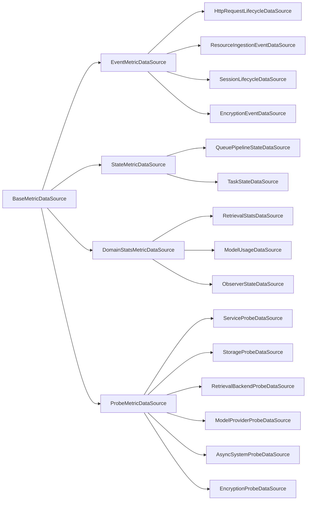
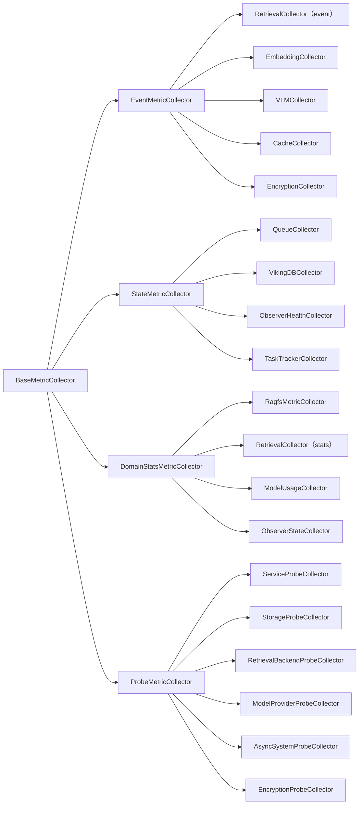
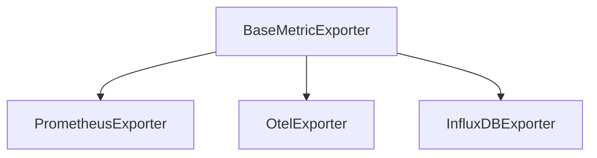
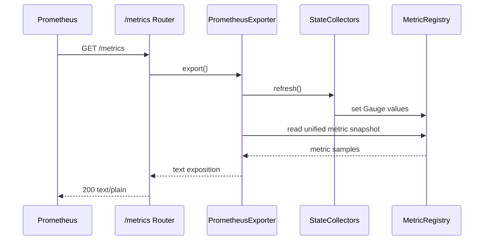

# Business Data Platform 指標體系設計方案

## 背景

本方案討論的是 Business Data Platform 的“指標體系（metrics）”，目標是把 `/metrics` 做成一個可持續抓取的 Prometheus 匯出端點，並與 `/api/v1/observer/*`（瞬時狀態）和 `/api/v1/stats/*`（分析統計）形成清晰邊界。

### 現狀入口與實現特徵

Business Data Platform 當前已經存在三類與“觀測”相關的入口：

| 入口 | 當前定位 | 當前實現特徵 |
| --- | --- | --- |
| `/api/v1/observer/*` | 元件瞬時狀態查詢 | `ObserverService` 組裝 queue/vikingdb/models/lock/retrieval 狀態 |
| `/api/v1/stats/*` | 業務統計與內容質量分析 | `StatsAggregator` 動態查詢 memory 分類、熱度、陳舊度、session extraction 等 |
| `/metrics` | Prometheus 指標匯出 | 當前依賴 `PrometheusObserver.render_metrics()` 輸出文本 |

結合程式碼現狀可以歸納出關鍵事實：

| 模組 | 位置 | 當前職責 | 問題摘要 |
| --- | --- | --- | --- |
| `BaseObserver` | `openviking/storage/observers/base_observer.py` | `get_status_table/is_healthy/has_errors` | 瞬時狀態語義清晰 |
| `PrometheusObserver` | `openviking/storage/observers/prometheus_observer.py` | 程序記憶體儲 Counter/Histogram + 渲染 `/metrics` | 與 Observer 體系職責不一致，屬於“異類” |
| 業務埋點（retrieval/embedding/vlm 等） | 多處 | 直接回調 observer 寫指標 | 採集層與匯出層強耦合，難擴充/難測試 |
| `/metrics` 路由 | `openviking/server/routers/metrics.py` | 直接取 `app.state.prometheus_observer` | 路由層繫結具體實現物件，而非 exporter 抽象 |

當前 `/metrics` 已打通的指標主要集中在 retrieval/embedding/vlm/cache 的少量 counter/histogram 指標族，覆蓋面偏窄。

### 關鍵問題

- `PrometheusObserver` 破壞 Observer 一致性：它本質是“註冊中心 + 匯出器”混合體，而非瞬時狀態讀取器。
- 採集與匯出強耦合：業務程式碼需要感知 Prometheus 是否啟用，未來接入其他 exporter 會反向侵入業務埋點。
- 指標型別與語義不完整：缺 gauge/health、缺統一命名與標籤邊界，難擴充到 queue/task/lock/vikingdb 等執行態。
- 多租戶可觀測性不足但風險高：缺 `account_id` 切片能力，同時必須防止演化為高基數（user/session/resource 等維度嚴禁進入 `/metrics`）。
- `/metrics` 與 `/api/v1/stats` 易混淆：分析型統計不應遷入高頻抓取的 Prometheus 模型。

### 設計目標與非目標

設計目標：

1. 讓 `Observer` 迴歸“瞬時狀態觀測”本位。
2. 建立獨立 metrics 核心層：採集（DataSource）/語義分流（Collector）/儲存（Registry）/匯出（Exporter）解耦。
3. 把零散埋點統一接入同一套事件與狀態契約（Event/State/DomainStats/Probe）。
4. 為 `/metrics` 提供系統化的 Gauge / Counter / Histogram，並明確失敗語義（best-effort、valid/stale）。
5. 明確 `/metrics` 與 `/api/v1/stats` 邊界，避免抓取放大成本。

非目標：

- 不重寫現有 operation telemetry 響應結構。
- 不要求把所有業務統計都變為 Prometheus 指標。
- 不引入分散式聚合層，也不解決跨程序彙總問題。
- 首版不強制落地 OTel exporter。

## 1. 架構概覽

### 1.1 核心原則

本節明確指標體系設計中需要持續成立的幾項基礎原則。這些原則用於約束後續的抽象分層、模組邊界、Telemetry 關係以及對外觀測介面的職責劃分。

#### 原則 A：先抽象職責，再落實現型別

概覽層保留以下四個核心抽象：

- `MetricDataSource`
- `BaseMetricCollector`
- `MetricRegistry`
- `BaseMetricExporter`

#### 原則 B：資料來源與指標體系解耦

現有 Observer、Telemetry、TaskTracker、業務事件埋點，本質上都屬於“資料來源”，但不等同於指標系統本身。

因此：

- 資料來源負責提供原始狀態或原始事件；
- Collector 負責把這些原始語義轉換為指標；
- Registry 負責儲存指標；
- Exporter 負責把指標轉換為外部協議。

這種拆分可以避免 retrieval、embedding、vlm 等業務程式碼直接耦合某一個 exporter。

#### 原則 C：Registry 是唯一真實指標儲存

`MetricRegistry` 作為程序內指標的唯一真實來源，負責承接統一的讀寫與約束。

職責範圍如下：

- 指標定義註冊；
- 標籤規範校驗；
- 當前值讀寫；
- 併發安全；
- 向 exporter 提供可讀取的當前檢視。

注意：這裡的“當前檢視”僅指讀取時獲取 registry 內部狀態，不引入獨立的 Snapshot 架構層。

#### 原則 D：Exporter 只負責協議匯出

Exporter 只負責協議匯出，不負責指標語義生成。

Exporter 不負責：

- 業務埋點；
- 狀態採集；
- 指標語義轉換。

Exporter 只負責：

- 讀取 registry；
- 根據目標協議格式化；
- 輸出給 `/metrics` 或其他監控後端。

這意味著 Prometheus 只是首個落地實現，而不是整個 metrics 架構的中心。

#### 原則 E：保留三類觀測入口的職責邊界

`/metrics`、`/api/v1/observer/*`、`/api/v1/stats/*` 三類入口繼續並存，但必須保持清晰分工。

- `/metrics` 面向機器抓取，強調低基數、低成本、可持續聚合；
- `/api/v1/observer/*` 面向人工診斷，強調瞬時狀態可讀性；
- `/api/v1/stats/*` 面向業務分析，允許更重的查詢與統計邏輯。

這三個入口共享部分資料來源，但不共享同一種輸出模型。

### 1.2 抽象分層設計

本節給出指標體系的抽象主鏈路，只保留最小且穩定的四類角色，不提前展開任何具體實現類。

抽象主鏈路如下：


四類抽象角色的職責如下：

| 抽象角色 | 作用 | 只負責什麼 | 不負責什麼 |
| --- | --- | --- | --- |
| `MetricDataSource` | 提供原始狀態或原始事件 | 產生可觀測輸入 | 不直接生成 Prometheus 文本 |
| `BaseMetricCollector` | 將輸入轉為統一指標語義 | 採集、歸一化、寫 registry | 不直接暴露 HTTP |
| `MetricRegistry` | 統一儲存程序內指標 | 註冊、校驗、讀寫、併發控制 | 不關心資料來源來自哪裡 |
| `BaseMetricExporter` | 按協議匯出指標 | 格式化與匯出 | 不直接理解業務鏈路語義 |

抽象主鏈路對應的資料流順序如下：

1. `MetricDataSource` 提供瞬時狀態、請求結束摘要或執行時事件；
2. `BaseMetricCollector` 將這些輸入對映為 Counter / Gauge / Histogram 等統一指標；
3. `MetricRegistry` 儲存當前程序內全部指標狀態；
4. `BaseMetricExporter` 在需要時讀取 registry 並輸出給外部系統。

### 1.3 設計邊界

抽象分層確定之後，還需要從設計邊界上進一步保證：

* 指標體系可以觀測業務主鏈路，但不成為業務主鏈路的組成部分；
* 指標鏈路可以缺失或降級，但不能反向改變 retrieval、embedding、VLM、resource、session、task 與 observer 等核心功能的行為語義。

因此，需要對相應角色施加明確約束：

* **DataSource**：業務接觸面收斂到 DataSource。業務物件、業務狀態、業務事件、已有統計快照與探針執行結果，只允許由 `MetricDataSource` 接觸和讀取。`Collector`、`MetricRegistry`、`Exporter` 不再直接訪問業務服務、業務儲存或業務上下文。
* **Collector**：Collector 禁止重新參與業務流程。Collector 的職責僅為把標準化輸入對映為指標語義，並寫入 `MetricRegistry`，不擁有業務真實狀態。
  * 事件類（如 HTTP API 呼叫）鏈路由業務事件發生點觸發，DataSource 到 Collector 之間只傳遞輕量事件；
  * 狀態類（如系統狀態）鏈路由採集時機觸發，例如 `/metrics` 抓取前重新整理，對應讀取只能是輕量快照、已有聚合結果或輕量探針結果。

### 1.4 目錄與模組邊界

在邊界約束成立之後，模組劃分也需要與之保持一致，避免目錄結構重新把已經劃清的職責邊界混回同一層。為避免新指標體系繼續與 `storage/observers/` 的職責混雜，集中放入 `openviking/metrics/`，並按“註冊中心 / 採集器 / 匯出器 / 規則 / 啟動裝配”進行分組。

邏輯分組如下：

| 模組分組 | 職責 |
| --- | --- |
| `registry` | 指標儲存、指標定義、標籤校驗 |
| `collectors` | retrieval / embedding / vlm / queue / task / observer / telemetry 等採集器 |
| `exporters` | Prometheus / 未來 OTel / InfluxDB |
| `naming` | 指標命名規則、label 規則、bucket 約定 |
| `bootstrap` | app 啟動時初始化 registry / exporters / collector manager |

### 1.5 與現有 telemetry 的關係

operation telemetry 與 metrics 並不是兩套彼此替代的系統。前者繼續作為請求級結構化摘要存在，服務於單次呼叫的解釋與排障；後者則只對白名單欄位做低基數抽取，用於持續抓取、聚合與告警。

operation telemetry 已經擁有很多有價值的資料欄位，如：

- `duration_ms`
- `tokens.*`
- `vector.*`
- `queue.*`
- `semantic_nodes.*`
- `memory.extract.*`
- `errors.*`

但並非所有欄位都適合直接進入 `/metrics`，因此這裡只對白名單欄位進行指標化抽取：

| telemetry 分組 | 是否指標化 | 原因 |
| --- | --- | --- |
| `duration_ms` | 是 | 低基數、高通用性 |
| `tokens.total / llm / embedding` | 是 | 有明確容量與成本價值 |
| `vector.searches / scored / returned` | 是 | 檢索鏈路核心執行指標 |
| `queue.*` | 是 | 適合形成任務吞吐與錯誤指標 |
| `semantic_nodes.*` | 有條件 | 更適合資源匯入鏈路，不應無限擴散標籤 |
| `memory.extract.*` | 部分保留在 stats / telemetry | 更偏業務分析，首版不全面指標化 |
| `errors.message` | 否 | 高基數、可能洩漏上下文 |

### 1.6 `/metrics`、`/api/v1/observer`、`/api/v1/stats` 的職責邊界

三類對外觀測介面共享部分資料來源，但並不共享同一種輸出模型，也不應追求由同一套介面承擔全部觀測需求。明確這一邊界，是為了避免後續設計在機器抓取、人工診斷與業務分析之間發生職責漂移。

| 介面 | 定位 | 資料特徵 | 輸出風格 |
| --- | --- | --- | --- |
| `/metrics` | 機器消費型監控介面 | 低基數、可持續抓取、可聚合 | Prometheus exposition |
| `/api/v1/observer/*` | 人工診斷型瞬時狀態介面 | 元件當前狀態、表格或結構化描述 | JSON + 可讀狀態文本 |
| `/api/v1/stats/*` | 業務分析型介面 | 可能昂貴、可掃描、可聚合但非高頻 | JSON 統計結果 |

## 2. 核心設計細節

### 2.1 `MetricDataSource` 設計

在實現層，抽象角色 `MetricDataSource` 統一落為基類 `BaseMetricDataSource`，並在其下進一步劃分 `EventMetricDataSource`、`StateMetricDataSource`、`DomainStatsMetricDataSource`、`ProbeMetricDataSource` 四類中間抽象。這四類中間抽象並非單純的邏輯標籤，而是分別對應不同的資料訪問契約與重新整理方式，因此在架構層被明確區分。

這些輸入可能是：

- 某個元件的瞬時狀態；
- 某個執行時事件；
- 某個領域內部維護的累計統計；
- 某個探針執行結果。

在 Business Data Platform 中，`MetricDataSource` 採用“統一基類 + 中間契約層 + 具體實現類”的三層結構。具體繼承關係如下：



這四類中間抽象對應的資料訪問契約如下：

| 中間抽象 | 契約語義 | 典型讀取方式 | 典型指標型別 |
| --- | --- | --- | --- |
| `EventMetricDataSource` | 提供增量事件流或生命週期事件 | 讀取事件批次、消費新事件、按游標增量拉取 | Counter、Histogram |
| `StateMetricDataSource` | 提供當前狀態快照 | 按需讀取當前狀態、重複讀取返回最新值 | Gauge |
| `DomainStatsMetricDataSource` | 提供領域內部已經維護好的累計統計 | 讀取累計計數、彙總結果、統計快照 | Counter、Gauge、部分 Histogram 輸入 |
| `ProbeMetricDataSource` | 提供探針執行結果或健康檢查結果 | 執行探測、讀取最近一次探測結果 | Gauge、Health |

各類具體資料來源的職責如下：

| 實現 | 分類 | 主要對接物件 | 輸出形態 | 適用場景 |
| --- | --- | --- | --- | --- |
| `HttpRequestLifecycleDataSource` | `EventMetricDataSource` | FastAPI middleware、路由響應 | 請求生命週期事件 | request total、duration、status code、in-flight |
| `ResourceIngestionEventDataSource` | `EventMetricDataSource` | ResourceProcessor、ResourceService、watch / wait 流程 | 資源處理事件與階段摘要 | parse / finalize / summarize / wait / watch duration |
| `SessionLifecycleDataSource` | `EventMetricDataSource` | session create / commit / archive | 會話生命週期狀態與事件 | commit 生命週期、archive 狀態 |
| `EncryptionEventDataSource` | `EventMetricDataSource` | Encryptor、API Key 驗證路徑、KDF / Key Loader | 加密操作事件與金鑰處理事件 | encrypt / decrypt / verify count、duration、bytes、kdf / key_load 耗時、auth_failed |
| `QueuePipelineStateDataSource` | `StateMetricDataSource` | `QueueManager`、Semantic tree、request queue stats | 佇列與流水線狀態 | pending、in_progress、processed、error_count、semantic_nodes |
| `TaskStateDataSource` | `StateMetricDataSource` | `TaskTracker` | 當前任務狀態 | pending、running、completed、failed 數量 |
| `RetrievalStatsDataSource` | `DomainStatsMetricDataSource` | `RetrievalStatsCollector` | 檢索累計統計 | query count、zero result、latency、rerank 情況 |
| `ModelUsageDataSource` | `DomainStatsMetricDataSource` | VLM / Embedding / Rerank token tracker | 模型使用統計 | 呼叫次數、耗時、token 消耗 |
| `ObserverStateDataSource` | `DomainStatsMetricDataSource` | `ObserverService`、`LockManager`、`VikingDBManager` | 診斷聚合檢視 | component health、lock、vikingdb、models、retrieval |
| `ServiceProbeDataSource` | `ProbeMetricDataSource` | 服務初始化、元件裝配狀態 | 服務探針結果 | startup completion、service readiness |
| `StorageProbeDataSource` | `ProbeMetricDataSource` | AGFS / VikingFS、系統表訪問檢查 | 儲存探針結果 | storage readability、storage writability、system table readiness |
| `RetrievalBackendProbeDataSource` | `ProbeMetricDataSource` | VikingDB、檢索後端最小能力檢查 | 檢索後端探針結果 | backend readiness、collection availability |
| `ModelProviderProbeDataSource` | `ProbeMetricDataSource` | VLM / Embedding / Rerank provider 可用性檢查 | 模型依賴探針結果 | provider readiness、credential availability |
| `AsyncSystemProbeDataSource` | `ProbeMetricDataSource` | Queue、預設 asyncio executor monitor | 非同步系統探針與 executor 指標 | queue readiness、executor threads / tasks |
| `EncryptionProbeDataSource` | `ProbeMetricDataSource` | Root Key、KMS / Vault Provider、加密元件檢查 | 加密探針結果 | root key readiness、kms availability、encryption component health |

設計邊界如下：

- 同一個業務模組可以暴露多個 DataSource，例如 session 相關能力既可以貢獻 `SessionLifecycleDataSource`，也可能間接貢獻 `TaskStateDataSource`。
- 加密相關監控優先建模為 `EncryptionEventDataSource`；涉及 Root Key readiness、KMS / Vault Provider 可用性、加密元件健康度時，則由 `EncryptionProbeDataSource` 承接。
- `SessionLifecycleDataSource` 只支援聚合級監控，不支援 `session_id` 級細粒度監控，也不允許把 `session_id` 作為指標標籤。
- `ObserverStateDataSource` 屬於診斷檢視適配結果，適合承接當前 Observer 體系的聚合輸出，但不應繼續向更高層堆疊新的 summary。
- `operation telemetry` 屬於請求級鏈路彙總能力，不作為一級 `MetricDataSource` 建模；如需複用其結果，應通過 collector 或相容適配層接入。
- memory health、category、staleness 等分析型統計繼續通過 `/api/v1/stats` 暴露，不在本節中抽象為獨立 DataSource。
- `ProbeMetricDataSource` 採用方案 B：不再設定總的 `SystemProbeDataSource` 聚合父類，而是直接按依賴型別細分為 Service / Storage / Retrieval Backend / Model Provider / Async System / Encryption 六類 probe 子類。

Observer、Telemetry、TaskTracker、HTTP Router 與各類業務服務繼續保持原有職責；指標系統只把它們視為資料來源，而不將其改造成 exporter 或 collector。

### 2.2 `BaseMetricCollector` 設計

Collector 位於指標體系中的語義轉換層，負責接收不同型別的可觀測輸入，並將其穩定對映為對 `MetricRegistry` 的統一寫入操作。隨著 `MetricDataSource` 被進一步劃分為 Event、State、DomainStats 與 Probe 四類，Collector 側採用對應的分層組織，而不再停留在僅區分 Event / State 的簡化模型。

在這一設計下，Collector 不再只是“埋點寫入器”，而是承擔統一收口職責：一方面遮蔽上游資料來源在訪問方式與更新節奏上的差異，另一方面對下游 registry 暴露一致的寫入語義。這樣可以保證新增指標鏈路時，擴充點仍然集中在 Collector 層，而不會把 source-specific 邏輯擴散到 registry 或 exporter。

Collector 採用“基類 + 四類子抽象 + 多個具體實現”的組織方式：



抽象層次的分工如下：

| 抽象層次 | 職責 | 典型觸發方式 |
| --- | --- | --- |
| `BaseMetricCollector` | 定義 collector 統一行為與 registry 寫入約束 | 所有 collector 共用 |
| `EventMetricCollector` | 處理“事件發生一次，就寫一次”的場景 | HTTP 請求完成、資源處理完成、VLM 呼叫完成、加密操作完成 |
| `StateMetricCollector` | 處理“讀取當前狀態並重新整理 gauge”的場景 | `/metrics` 抓取前重新整理 |
| `DomainStatsMetricCollector` | 處理“讀取已有累計統計並寫入 registry”的場景 | 檢索統計、模型使用統計、Observer 聚合檢視重新整理 |
| `ProbeMetricCollector` | 處理“執行探針並對映為健康類指標”的場景 | readiness / dependency probe 重新整理 |

Collector 與 DataSource 的主對映關係如下：

| DataSource 分類 | 優先對應的 Collector 分類 | 說明 |
| --- | --- | --- |
| `EventMetricDataSource` | `EventMetricCollector` | 事件型輸入天然適合 Counter / Histogram |
| `StateMetricDataSource` | `StateMetricCollector` | 當前狀態快照天然適合 Gauge |
| `DomainStatsMetricDataSource` | `DomainStatsMetricCollector` | 已聚合統計應直接橋接到 registry |
| `ProbeMetricDataSource` | `ProbeMetricCollector` | 健康檢查結果應統一對映為 readiness / health 指標 |

具體 collector 分工如下：

| Collector | 分類 | 資料輸入 | 寫入指標 |
| --- | --- | --- | --- |
| `RetrievalCollector` | `EventMetricCollector` | retrieval 完成事件 | 請求數、零結果數、結果數、耗時、rerank 使用情況 |
| `EmbeddingCollector` | `EventMetricCollector` | embedding 完成事件 | 請求數、耗時、錯誤數 |
| `VLMCollector` | `EventMetricCollector` | token / duration 事件 | 呼叫數、耗時、token 統計 |
| `CacheCollector` | `EventMetricCollector` | cache 命中或未命中事件 | hit / miss |
| `EncryptionCollector` | `EventMetricCollector` | encrypt / decrypt / verify / kdf / key_load 事件 | 加密次數、認證失敗、耗時、位元組量、金鑰處理統計 |
| `QueueCollector` | `StateMetricCollector` | QueueManager / tree 當前狀態 | pending、in_progress、processed、errors |
| `RagfsMetricCollector` | `DomainStatsMetricCollector` | `RagfsMetricDataSource`，一次 RAGFS `metrics()` 呼叫 | 檔案操作、Cache、multi-backend、Lock |
| `VikingDBCollector` | `StateMetricCollector` | VikingDB collection 當前狀態 | health、vectors、collections |
| `ObserverHealthCollector` | `StateMetricCollector` | ObserverService 結果 | component health、component errors |
| `TaskTrackerCollector` | `StateMetricCollector` | TaskTracker 當前狀態 | pending、running、completed、failed |
| `RetrievalCollector` | `DomainStatsMetricCollector` | RetrievalStatsDataSource | 檢索累計統計橋接 |
| `ModelUsageCollector` | `DomainStatsMetricCollector` | ModelUsageDataSource | 模型使用累計統計橋接 |
| `ObserverStateCollector` | `DomainStatsMetricCollector` | ObserverStateDataSource | 診斷聚合檢視橋接 |
| `ServiceProbeCollector` | `ProbeMetricCollector` | ServiceProbeDataSource | service readiness、startup completion |
| `StorageProbeCollector` | `ProbeMetricCollector` | StorageProbeDataSource | storage readiness、system table availability |
| `RetrievalBackendProbeCollector` | `ProbeMetricCollector` | RetrievalBackendProbeDataSource | backend readiness、collection availability |
| `ModelProviderProbeCollector` | `ProbeMetricCollector` | ModelProviderProbeDataSource | provider readiness、credential availability |
| `AsyncSystemProbeCollector` | `ProbeMetricCollector` | AsyncSystemProbeDataSource | queue readiness、預設 executor 執行緒與任務指標 |
| `EncryptionProbeCollector` | `ProbeMetricCollector` | EncryptionProbeDataSource | root key readiness、kms availability、encryption component health |

設計理由：在引入四類 Collector 之後，整個體系的語義邊界更清晰：

- EventCollector 偏向增量寫入，天然適合 Counter / Histogram；
- StateCollector 偏向覆蓋寫入，天然適合 Gauge。
- DomainStatsCollector 偏向橋接已有累計統計，避免把已聚合結果重新拆回事件。
- ProbeCollector 偏向健康檢查與 readiness 對映，避免把探針邏輯塞進 StateCollector 或 EventCollector。

對於 retrieval 鏈路，統一保留 `RetrievalCollector` 命名：它既可以接收 retrieval 完成事件，也可以讀取 `RetrievalStatsDataSource` 的累計快照。兩類輸入在實現上可以走不同分支，但不再拆出單獨的 `RetrievalStatsCollectorAdapter` 名稱，以避免把“同一指標域的兩條輸入路徑”誤寫成兩套 collector。

### 2.3 `MetricRegistry` 設計

`MetricRegistry` 是整個體系的穩定中心，負責統一註冊、校驗、儲存和讀取指標，但不負責採集觸發，也不承擔協議匯出職責。它對外維持統一介面，不針對 Event / State / DomainStats / Probe 四類 Collector 再拆分多套寫入 API，語義分流應由 Collector 自身完成。

`MetricRegistry` 必須滿足以下能力：

| 能力 | 要求 |
| --- | --- |
| 統一註冊 | 每個指標在程序內只註冊一次，防止重複定義 |
| 型別約束 | 同名指標不能一會兒是 Counter、一會兒是 Gauge |
| 標籤約束 | 每個指標的 label key 集合固定，執行時只允許填充固定維度 |
| 併發安全 | 允許 FastAPI 協程、佇列執行緒、後臺清理執行緒同時讀寫 |
| 低開銷讀取 | `/metrics` 抓取不應持有長時間大鎖 |
| 可擴充性 | 不耦合 Prometheus 專屬概念，避免 registry 層直接出現 exposition 文本邏輯 |
| 統一寫入介面 | 對外維持統一的 counter / gauge / histogram 寫入介面，不按 source 型別暴露分裂 API |

Registry 只解決“如何統一儲存指標”，不解決：

- 資料從哪裡來；
- 誰來觸發採集；
- 以什麼協議匯出。

統一介面策略如下：

- EventCollector 決定何時呼叫 `inc_counter` 或 `observe_histogram`；
- StateCollector 決定何時呼叫 `set_gauge`；
- DomainStatsCollector 決定如何把已有累計統計對映到統一寫介面；RAGFS 使用絕對值覆蓋；
- ProbeCollector 決定如何把 probe 結果翻譯成 readiness / health gauge。

也就是說，Registry 不感知“當前寫入的是事件、狀態、統計還是探針”，它只感知“要寫入哪種指標型別、哪個指標名、哪些標籤和值”。

RAGFS 使用單一 `metrics()` 介面，返回扁平指標記錄，不暴露內部物件層級。
`RagfsMetricDataSource` 校驗整批記錄，`RagfsMetricCollector` 只按型別分發：

```text
Counter   -> value * scale -> set_counter()
Gauge     -> value         -> set_gauge()
Histogram -> bounds/sum * scale -> set_histogram()
```

耗時在 Rust 內部以整數納秒累計，通過 `scale=1e-9` 轉為小數秒。
Registry 的絕對值 setter 支援零值和計數重置，原有增量介面保持不變。
Collector 不儲存前值、不計算差分；只儲存序列標識，用於刪除消失的序列。
讀取或校驗失敗時保留舊資料；寫入失敗後由下一輪全量覆蓋恢復。
採集鎖覆蓋整輪讀取和寫入，避免超時執行緒與後續重新整理並行更新。

RAGFS 首期匯出 20 個指標族，不帶 `mount` 或 `account_id` 標籤。
`openviking_lock_active` 保留原名和 Gauge 型別，表示當前已釋出的鎖租約數。
`openviking_lock_stale` 保留原名和 Gauge 型別，表示累計已清理的過期鎖 token 數。
`get_stats()` 在 Binding 輸出層轉換回微秒，Python Observer 不變。

由此，registry 可以作為整個指標系統的穩定核心，而不隨 exporter 或 collector 的演化頻繁變動。

### 2.4 `BaseMetricExporter` 設計

Exporter 位於指標體系最下游，只負責把 registry 中的當前指標狀態轉換成外部協議。與 Registry 相同，Exporter 也遵循統一介面原則：它只依賴統一的讀介面，不感知指標來自 Event / State / DomainStats / Probe 中的哪一路。

Exporter 採用如下繼承關係：



各 exporter 的定位如下：

| Exporter | 定位 | 首版狀態 |
| --- | --- | --- |
| `PrometheusExporter` | 負責 `/metrics` exposition 輸出 | 首版必須落地 |
| `OtelExporter` | 對接未來 OTel 指標匯出 | 預留 |
| `InfluxDBExporter` | 對接未來 InfluxDB | 預留 |

統一讀取策略如下：

- Exporter 通過統一的 registry 讀取介面獲取當前樣本集合；
- Exporter 不關心某個樣本來自哪類 DataSource 或哪類 Collector；
- Exporter 只關心指標定義、標籤集合、當前值與目標協議的序列化方式；
- source/category 語義在 Collector 寫入 registry 前已經完成收斂，不應滲透到 exporter 層。

### 2.5 Prometheus 方式資料路徑

本節討論 `/metrics` 請求從進入服務到返回結果之間的完整執行時序，並明確匯出前重新整理策略的邊界。Prometheus 抓取 `/metrics` 時，先執行必要的 collector 重新整理，再統一讀取 registry 快照，最後由 exporter 完成協議序列化。

Prometheus 抓取 `/metrics` 時，執行以下流程：



設計理由：採用“匯出前重新整理 StateCollector”的原因是：

- 不需要額外後臺取樣協程；
- 指標與抓取時間點一致；
- 避免無人抓取時持續消耗資源；
- 與現有 Observer 的按需讀取模式一致。
- Exporter 保持協議層純度，不因 source/category 增長而擴充額外分支邏輯。

### 2.6 State / Probe 刷新控制策略

對於 Queue、Lock、VikingDB、Task、Observer health 以及各類 probe 而言，設計目標不應是“每次 `/metrics` 抓取都嚴格同步拿到瞬時最新值”，而應是“在保證抓取路徑穩定、延遲可控的前提下，提供足夠新的狀態檢視”。換句話說，`/metrics` 首先是一個可持續抓取的監控介面，其次才是狀態重新整理觸發點。

基於這一點，State / Probe 重新整理統一採用“預設 scrape-triggered refresh + 基於 TTL 的重新整理控制 + stale-while-revalidate” 組合策略：

- 預設情況下，State / Probe Collector 仍在 Prometheus 抓取 `/metrics` 時觸發重新整理；
- 對讀取成本高、依賴外部系統或容易抖動的 Collector，允許引入短 TTL 的重新整理控制視窗；
- 噹噹前時間仍處於 TTL 控制視窗內時，不重複觸發重新整理；
- 當 TTL 控制視窗結束後，允許先返回最近一次成功值，再觸發一次受控重新整理；
- 重新整理策略屬於 Collector 執行時能力，而不是 `MetricRegistry` 的職責。

這裡需要進一步明確兩類資訊的邊界：

- `MetricRegistry` 儲存的是對外可見的當前指標值，是 Exporter 讀取並序列化的唯一真實來源；
- State / Probe Collector 不儲存另一份對外指標結果，而只負責在合適的時機觸發重新整理。

因此，TTL、超時、是否允許返回舊值、是否觸發後臺重新整理等策略不下沉到 `MetricRegistry`。Registry 只負責統一儲存指標，不負責重新整理排程，也不在其讀取介面上附帶“讀取即觸發重新整理”的副作用。重新整理時機由 `/metrics` 匯出路徑中的執行層顯式控制，例如由 Exporter 或獨立的 CollectorManager 在匯出前呼叫 `refresh_if_needed()`，隨後再統一讀取 Registry。

對於返回舊值（stale value），本方案預設允許該行為，而不是把它當作異常分支。原因在於大多數狀態類與探針類指標本身就不是強瞬時一致性的觀測物件；相比“為了獲取最新值而阻塞整個 `/metrics` 抓取路徑”，繼續匯出 `MetricRegistry` 中最近一次成功寫入的指標值更符合監控系統的使用語義。

為了避免“舊值長期存在但不可見”，本方案採用更明確的可觀測語義：對於無法定義失敗預設值的狀態類指標，指標設定之初即包含一個最小的有效性標籤（如 `valid=1/0`），以便讓告警與看板顯式識別“當前值是否可用”。當重新整理失敗時，不強行覆蓋寫入預設值，而是將該 `valid` 標籤置為 `0`，並繼續匯出 `MetricRegistry` 中最近一次成功寫入值。

- 對啟用基於 TTL 的重新整理控制的 State / Probe 指標，指標定義中統一包含 `valid` 標籤；Collector 在重新整理成功時寫入 `valid=1`，重新整理失敗時寫入 `valid=0`；
- 對具有明確失敗語義的探針類指標（如 readiness / dependency probe），重新整理失敗時應顯式覆蓋寫入失敗值（例如 UP -> DOWN），而不依賴“值消失”或隱式過期；

在 Collector 分類上，以下物件優先視為“啟用基於 TTL 的重新整理控制”的候選：

- 需要訪問外部依賴的 Probe Collector，例如 retrieval backend、model provider、storage、encryption provider；
- 需要做聚合、掃描或多物件彙總的 State Collector，例如 collection 級狀態或複雜 observer 聚合檢視；
- 在執行中已觀測到重新整理耗時抖動明顯、超時機率較高的 Collector。

相對地，Queue、Task 等純記憶體態或低成本狀態讀取，仍應優先保持同步 scrape-triggered refresh，不必預設引入基於 TTL 的重新整理控制。

### 2.7 HTTP Metrics Middleware 語義

當前實現中，HTTP 請求指標並不只是“某個 EventMetricCollector 的普通上游事件源”，而是由一個專門的 middleware 負責把請求生命週期翻譯為低基數、best-effort 的 HTTP metrics 事件。其執行時語義如下：

#### 2.7.1 路由忽略與低基數路徑歸一化

- middleware 必須先按 **raw path** 忽略內部介面：
  - `/metrics`
  - `/health`
  - `/ready`
- 這樣可以保證即使當前請求尚未繫結 Starlette route template，也不會把內部健康介面錯誤納入業務 HTTP 指標。
- 對普通業務請求，優先使用 route template（例如 `/api/v1/sessions/{session_id}`）作為 `route` 標籤；
- 當 route template 不可用時，禁止回退到原始 URL path，而統一回落到固定低基數字串（例如 `"/__unmatched__"`），以避免把動態 ID、UUID、資源路徑直接帶入標籤，造成基數爆炸。

#### 2.7.2 inflight 語義是“程序內近似值”，不是強一致計數

- HTTP inflight 計數可以通過程序內字典按 `(route, account_id)` 維持；
- 該值的目標是為即時看板和排障提供“足夠合理的當前併發近似檢視”，而不是全域嚴格正確性機制；
- 為避免多執行緒執行時的讀改寫競態，應使用輕量鎖保護該近似計數的更新過程；
- 當 inflight 計數歸零後，應及時刪除對應鍵，避免零值鍵長期殘留並放大記憶體佔用。

#### 2.7.3 middleware 必須保持 best-effort

- HTTP metrics middleware 不能影響主請求鏈路；
- 任何指標寫入、inflight 調整、request 計時上報失敗，都只能影響 observability side-channel，而不能影響業務響應；
- 統一將此類異常收斂為 debug 級日誌，並在日誌中帶上 `route` 與 `account_id` 等上下文欄位；
- 預設不開啟高頻錯誤日誌，僅在 debug 診斷場景下用於排查 metrics 自身問題。

#### 2.7.4 請求鏈路中的 `account_id` 解析分兩階段完成

- middleware 進入請求時，可以先嚐試從 request state 或 header 提取一個 provisional account id，用於 inflight 早期打點；
- 請求結束後，應重新讀取最終的 request-scoped account identity，並在必要時對 inflight 指標做一次 rebalance；
- 這樣可兼顧：
  - 早期 inflight 可見性；
  - 認證完成後的最終租戶歸屬正確性。

## 3. 指標策略

### 3.1 指標對映總覽

在展開具體指標清單之前，先把“指標族 → DataSource → Collector → Metric Type”的關係收斂成統一檢視，可以避免後續列表只見指標名、不見來源鏈路。對於首版範圍內的所有指標，都應能夠映射回明確的 DataSource 與 Collector；如果某個指標無法說明其輸入來源或採集責任，就不應直接進入首版清單。

| 指標族 | 主要 DataSource | 主要 Collector | 主要指標型別 | 代表指標 |
| --- | --- | --- | --- | --- |
| HTTP 請求監控 | `HttpRequestLifecycleDataSource` | `HTTPCollector` | Counter、Histogram | request total、duration、status code |
| 檢索鏈路監控 | `RetrievalStatsDataSource`、retrieval 完成事件 | `RetrievalCollector` | Counter、Histogram | retrieval requests、zero result、latency |
| 模型鏈路監控 | `ModelUsageDataSource`、模型呼叫事件 | `VLMCollector`、`EmbeddingCollector`、`ModelUsageCollector` | Counter、Histogram | model calls、tokens、duration |
| 資源匯入監控 | `ResourceIngestionEventDataSource` | `ResourceIngestionCollector` | Counter、Histogram | parse / finalize / summarize / wait duration |
| Session 與非同步任務監控 | `SessionLifecycleDataSource`、`TaskStateDataSource`、`QueuePipelineStateDataSource` | `TaskTrackerCollector`、`QueueCollector` | Gauge、Counter | task pending、queue backlog、session lifecycle count |
| 診斷與狀態監控 | `ObserverStateDataSource`、`VikingDBStateDataSource` | `ObserverHealthCollector`、`VikingDBCollector` | Gauge | component health、collection health |
| RAGFS 監控 | `RagfsMetricDataSource` | `RagfsMetricCollector` | Counter、Histogram、Gauge | 檔案操作、Cache、multi-backend、Lock |
| 加密監控 | `EncryptionEventDataSource`、`EncryptionProbeDataSource` | `EncryptionCollector`、`EncryptionProbeCollector` | Counter、Histogram、Gauge | encrypt count、decrypt duration、root key readiness |
| 系統探針監控 | 各類 `*ProbeDataSource` | 各類 `*ProbeCollector` | Gauge、Health | service readiness、storage readiness、kms availability |
| Python executor 監控 | `AsyncSystemProbeDataSource` | `AsyncSystemProbeCollector` | Gauge、Counter | 預設 executor 執行緒數、任務數、提交/完成/失敗計數 |
| 操作級 Telemetry 指標化 | telemetry adapter / bridge | `TelemetryBridgeCollector` | Counter、Histogram、Gauge | operation requests、vector scanned、memory extracted |

### 3.2 指標物件模型

當前指標物件模型收斂為三類基礎指標：Counter、Gauge 與 Histogram。`Summary` 不納入當前範圍，以避免在聚合語義、實現複雜度與使用收益之間引入不必要的失衡。

當前統一支援三種指標型別：

| 型別 | 用途 | 典型場景 |
| --- | --- | --- |
| Counter | 單調遞增計數 | 請求量、錯誤數、cache 命中數、任務完成數 |
| Gauge | 當前值 | 佇列 backlog、執行中任務數、鎖持有數、健康狀態 |
| Histogram | 分佈統計 | 請求耗時、embedding 耗時、VLM 呼叫耗時、資源處理耗時 |

當前不支援 `Summary`，原因如下：

- 對 Prometheus 多例項聚合不友好；
- 與 Histogram 的職責邊界重疊；
- 會增加 registry 與 exporter 實現複雜度；
- 當前 Business Data Platform 真實缺的是 Gauge，不是 Summary。

### 3.3 標籤策略

標籤策略的核心，不在於“儘可能表達更多業務資訊”，而在於在可觀測性價值與高基數風險之間取得穩定平衡。為此，標籤設計必須遵守“低基數優先”原則，預設只允許有限、可列舉、可控的標籤集合。

#### 允許的常用標籤

| 標籤 | 說明 | 預設策略 |
| --- | --- | --- |
| `operation` | 操作名，如 `search.find`、`resources.add_resource` | 預設啟用 |
| `status` | `ok` / `error` | 預設啟用 |
| `queue` | `Embedding` / `Semantic` / 其他佇列名 | 預設啟用 |
| `level` | cache level，如 `L0` / `L1` / `L2` | 預設啟用 |
| `context_type` | retrieval context，如 `memory` / `resource` | 預設啟用 |
| `component` | queue / models / lock / retrieval / vikingdb | 預設啟用 |
| `task_type` | 如 `session_commit` | 預設啟用 |
| `account_id` | 租戶 ID | 條件啟用 |
| `provider` | 模型供應商，如 openai / volcengine | 條件啟用 |
| `model_name` | 模型名 | 謹慎啟用，需歸一化後有限列舉 |

#### 租戶標籤策略

`account_id` 僅用於：

- 請求量；
- 請求耗時；
- 任務堆積；
- 資源匯入吞吐。

執行時保護規則如下：

1. 預設關閉；
2. 僅對明確列入白名單的指標啟用；
3. 提供最大活躍租戶數保護，超出後回退到無標籤聚合。

#### `account_id` 執行時解析與回退語義

在當前實現中，`account_id` 已不再只是“是否在指標定義裡宣告一個標籤”的靜態設計問題，而是一個執行時解析過程。其落地語義如下：

1. **支持集（support set）比 allowlist 更窄**
   - 只有被明確標記為“支援多租戶維度”的指標族，才允許在執行時注入 `account_id`；
   - 即使配置上開啟了 `account_id`，不在支援集中的指標也不得攜帶該標籤；
   - allowlist 只用於在“支援集內部”進一步決定哪些指標真正啟用租戶維度。

2. **最終標籤值不是簡單的“真實租戶 ID 或空”**
   - 執行時解析結果允許出現三類穩定標籤值：
     - 真實租戶 ID；
     - `__unknown__`：當前請求/事件無法解析出可信租戶；
     - `__overflow__`：已啟用活躍租戶數上限保護，當前租戶超出上限，統一回落到溢位桶。

3. **解析路徑按“顯式值 > 請求上下文 > 所有權資訊”收斂**
   - 對事件類指標，優先使用事件呼叫方顯式傳入的 `account_id`；
   - 對 HTTP / 請求鏈路類指標，優先使用 request-scoped context 中已認證/已解析出的租戶身份；
   - 對資源、任務等存在 owner 語義的場景，可回退到 owner account 資訊；
   - 無法得到可信結果時統一落到 `__unknown__`，而不是直接省略標籤。

4. **執行時策略作為獨立配置物件**
   - 配置項至少應包含：
     - `enabled`
     - `metric_allowlist`
     - `max_active_accounts`
   - Collector 在寫指標時不自行實現租戶裁剪邏輯，而統一呼叫 account-dimension runtime helper 解析最終標籤值。

5. **文件層面應明確：`account_id` 是“有損但可控”的可觀測維度**
   - 其目標是為低基數、線上監控場景提供有限的租戶切片；
   - 它不是審計維度，也不保證所有租戶都能長期以真實 ID 形式保留在 `/metrics` 中。

#### 應避免的高基數標籤

- `user_id`
- `session_id`
- `resource_uri`
- 原始 `error_message`
- 原始 `query`
- 檔案路徑
- request id / telemetry id

### 3.4 命名規範

命名規範的目標，是讓同一類指標在不同 collector、不同鏈路中保持一致的表達方式，減少命名漂移與語義歧義。為此，指標命名統一採用 `openviking_<domain>_<metric>_<unit>` 模板，並對 Counter / Histogram / Health 指標施加額外約束。

指標命名統一採用：

`openviking_<domain>_<metric>_<unit>`

示例：

- `openviking_retrieval_requests_total`
- `openviking_queue_pending`
- `openviking_task_running`
- `openviking_operation_duration_seconds`

設計要求：

- Counter 以 `_total` 結尾；
- Histogram / duration 統一使用 `_seconds`；
- Gauge 不強制帶單位字尾，但應顯式表達；
- health 指標統一使用 `0/1` 數值。

### 3.5 明確不納入 `/metrics` 的指標

以下指標保留在 `/api/v1/stats` 或 telemetry JSON 中更合適：

| 資料項 | 原因 |
| --- | --- |
| memory category 分佈 | 需要掃描或查詢聚合，更接近業務分析 |
| hotness / staleness 分佈 | 不適合高頻抓取 |
| 單 session extraction 明細 | 高基數、偏診斷 |
| 原始錯誤文本 | 高基數且可能包含敏感資訊 |
| 任意 resource / URI 級統計 | 高基數 |

### 3.6 指標桶策略

所有耗時類 Histogram 統一使用秒級桶，便於跨模組比較：

| 桶值（秒） | 適用場景 |
| --- | --- |
| `0.005` / `0.01` / `0.025` | 極短本地操作 |
| `0.05` / `0.1` / `0.25` | retrieval / cache / 輕量 API |
| `0.5` / `1.0` / `2.5` | embedding / 中等資源操作 |
| `5.0` / `10.0` / `30.0` | VLM / wait 模式 / 重處理任務 |

如果某條鏈路需要獨立桶配置，應通過指標定義層配置，而不是在業務埋點中寫死。

### 3.7 Telemetry 指標化細則

對於 operation telemetry，只抽取“結束時就已具備、並且不會導致高基數”的欄位。結合 `docs/zh/guides/05-observability.md`、`docs/zh/guides/07-operation-telemetry.md` 與 `openviking/telemetry/operation.py` 的當前能力。

| telemetry 欄位 | 對映指標 |
| --- | --- |
| `summary.operation` + `summary.status` | `openviking_operation_requests_total` |
| `summary.duration_ms` | `openviking_operation_duration_seconds` |
| `summary.tokens.total` | 不直接落單獨指標；通過對 `openviking_operation_tokens_total` 的原子分量在查詢層聚合得到 |
| `summary.tokens.llm.input` | `openviking_operation_tokens_total{token_type="llm_input"}` |
| `summary.tokens.llm.output` | `openviking_operation_tokens_total{token_type="llm_output"}` |
| `summary.tokens.embedding.total` | `openviking_operation_tokens_total{token_type="embedding"}` |
| `summary.vector.searches` | `openviking_vector_searches_total` |
| `summary.vector.scored` | `openviking_vector_scored_total` |
| `summary.vector.passed` | `openviking_vector_passed_total` |
| `summary.vector.returned` | `openviking_vector_returned_total` |
| `summary.vector.scanned` | `openviking_vector_scanned_total` |
| `summary.semantic_nodes.{total|done|pending|running}` | `openviking_semantic_nodes_total{status=...}` |
| `summary.memory.extracted` | `openviking_memory_extracted_total{memory_type=...}` |

### 3.8 Python 預設 executor 指標

Python executor 指標用於觀察當前服務程序內 asyncio 預設 executor 的執行緒和任務狀態。
它只覆蓋 Python 預設 executor，不覆蓋 Rust / RAGFS 內部 Tokio runtime。

當前程式碼路徑：

| 檔案 | 符號 | 職責 |
| --- | --- | --- |
| `openviking/server/app.py` | `lifespan()` | 在 `_configure_default_executor(config)` 後安裝 monitor，在 shutdown metrics 後解除安裝 |
| `openviking/metrics/core/runtime.py` | `DefaultExecutorMonitor` | 儲存 event loop、原始 `run_in_executor`、計數器和鎖 |
| `openviking/metrics/core/runtime.py` | `install_executor_monitor()` / `uninstall_executor_monitor()` | 安裝和恢復當前 event loop 的預設 executor 入口 |
| `openviking/metrics/datasources/probes.py` | `AsyncSystemProbeDataSource.read_async_system_state()` | 合併 queue readiness 和 executor metrics |
| `openviking/metrics/collectors/async_system_probe.py` | `AsyncSystemProbeCollector` | 寫 `openviking_async_system_readiness` 和 `openviking_executor_*` |

採集鏈路：

```text
/metrics
-> CollectorManager.collect_all()
-> asyncio.to_thread(collector.collect, registry)
-> AsyncSystemProbeCollector.read_metric_input()
-> AsyncSystemProbeDataSource.read_async_system_state()
-> get_executor_monitor().read_metrics()
-> AsyncSystemProbeCollector.collect_hook()
-> MetricRegistry
```

統計範圍：

```text
統計：loop.run_in_executor(None, func, *args)
統計：asyncio.to_thread(func, *args, **kwargs)
不統計：loop.run_in_executor(custom_executor, func, *args)
不統計：concurrent.futures.ThreadPoolExecutor(...) 直接建立的 executor
不統計：Rust / RAGFS 內部 runtime 或執行緒
```

指標定義：

| 指標名 | 型別 | 標籤 | 說明 |
| --- | --- | --- | --- |
| `openviking_executor_max_workers` | Gauge | `pool,process_role,worker` | 預設 executor 最大 worker 數 |
| `openviking_executor_threads` | Gauge | `pool,process_role,worker` | 預設 executor 已建立執行緒數 |
| `openviking_executor_active_tasks` | Gauge | `pool,process_role,worker` | 當前正在執行的預設 executor 任務數 |
| `openviking_executor_pending_tasks` | Gauge | `pool,process_role,worker` | 當前等待執行的預設 executor 任務數 |
| `openviking_executor_submitted_total` | Counter | `pool,process_role,worker` | 累計提交到預設 executor 的任務數 |
| `openviking_executor_completed_total` | Counter | `pool,process_role,worker` | 累計執行結束的預設 executor 任務數，失敗也計入 |
| `openviking_executor_failed_total` | Counter | `pool,process_role,worker` | 預設 executor callable 拋異常的累計次數 |

固定標籤：

```text
pool="asyncio_default"
process_role="legacy_server"
worker=multiprocessing.current_process().name
```

`failed_total` 的語義：

- 該指標統計 worker callable 丟擲的 `Exception`。
- 如果異常被上層業務捕獲並作為正常分支處理，也會計入。
- 它不等同於業務請求失敗數。
- `/metrics` scrape 自身會通過 `asyncio.to_thread()` 重新整理 collector，因此也會計入 executor 指標。

執行觀測：

- monitor 在服務初始化前安裝，會統計啟動階段的預設 executor 呼叫。
- AGFS 初始化中的檔案不存在、目錄已存在等探測式異常會計入 `failed_total`。
- 當前執行時如果載入舊版 `ragfs_python` binding，`RagfsMetricCollector` 呼叫
  `service._agfs_client.metrics()` 會失敗。
- repo 當前原始碼 `crates/ragfs-python/src/lib.rs` 已定義 `metrics()`；若執行時物件沒有該方法，
  說明 `.venv` 裡的 native binding 產物與原始碼能力不一致。

### 3.9 多租戶支援範圍

當前程式碼中，只有進入 `ACCOUNT_DIMENSION_SUPPORTED_METRICS` 支援集的指標族允許注入 `account_id`。支援集如下：

| 指標域 | 當前支援 `account_id` 的指標 |
| --- | --- |
| HTTP | `openviking_http_requests_total`、`openviking_http_request_duration_seconds`、`openviking_http_inflight_requests` |
| Retrieval | `openviking_retrieval_requests_total`、`openviking_retrieval_results_total`、`openviking_retrieval_zero_result_total`、`openviking_retrieval_latency_seconds`、`openviking_retrieval_rerank_used_total`、`openviking_retrieval_rerank_fallback_total` |
| Resource | `openviking_resource_stage_total`、`openviking_resource_stage_duration_seconds`、`openviking_resource_wait_duration_seconds` |
| Session | `openviking_session_lifecycle_total`、`openviking_session_archive_total` |
| Operation Telemetry | `openviking_operation_requests_total`、`openviking_operation_duration_seconds`、`openviking_operation_tokens_total` |
| VLM | `openviking_vlm_calls_total`、`openviking_vlm_call_duration_seconds`、`openviking_vlm_tokens_input_total`、`openviking_vlm_tokens_output_total`、`openviking_vlm_tokens_total` |
| Embedding | `openviking_embedding_requests_total`、`openviking_embedding_latency_seconds`、`openviking_embedding_errors_total` |

除上述指標外，其他指標族即使在配置上開啟了 `account_id`，當前實現也不會為其注入租戶標籤。

## 5. 兼容性策略

Openviking 指標體系採用如下相容性策略:

- 保持現有 retrieval / embedding / vlm / cache 指標名儘量不變；
- `/metrics` 路由地址保持不變；
- `server.observability.metrics.enabled` 配置保持不變；
- `server.observability.metrics.exporters.*` 作為 exporter 擴充點：預設 Prometheus exporter 可繼續工作，OTLP exporter 可按需啟用；
- `/api/v1/observer/*` 與 `/api/v1/stats/*` 行為保持不變。

## 6. 風險與緩解

| 風險 | 描述 | 緩解策略 |
| --- | --- | --- |
| 指標高基數 | 租戶、模型、錯誤碼維度無限增長 | 嚴格標籤白名單 + 上限保護 |
| 抓取放大成本 | StateCollector / ProbeCollector 在 `/metrics` 時做重查詢 | 限制為輕量瞬時狀態源與輕量 probe，不掃描業務大表 |
| 遷移期間重複計數 | 老 PrometheusObserver 與新 registry 並存 | 引入過渡期開關，避免雙寫 |
| 併發鎖爭用 | 高頻寫入與高頻抓取互相影響 | registry 採用細粒度結構與最小持鎖時間 |
| 指標語義漂移 | 同一指標在不同 collector 中含義不一致 | 統一命名文件與 contract test |
| Probe 副作用 | 外部依賴 probe 超時或失敗拖慢 `/metrics` | 為 probe 設定超時、隔離失敗並限制 probe 數量 |
| Adapter 語義漂移 | telemetry bridge 或 domain stats bridge 與原始事件語義不一致 | 明確 bridge 邊界並增加 contract test |
| 雙路徑重複上報 | 一級事件鏈路與 bridge 鏈路同時寫入同類指標 | 以指標所有權清單約束單一寫入責任 |
