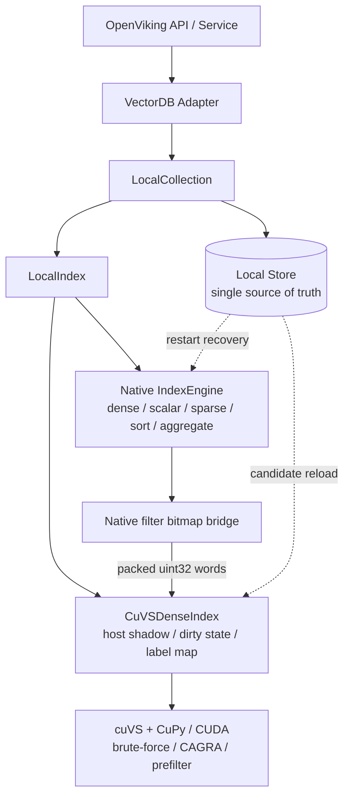
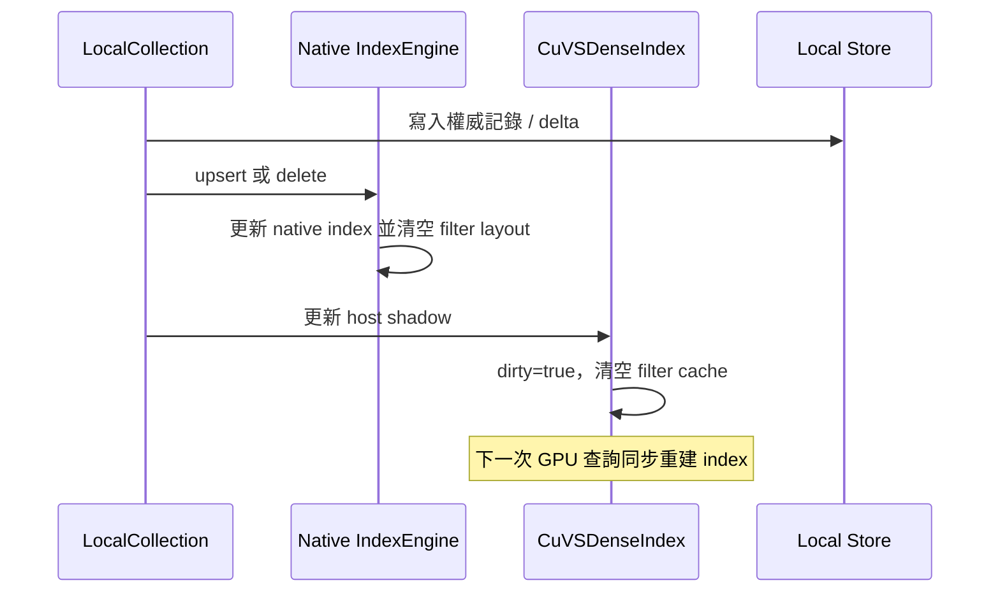
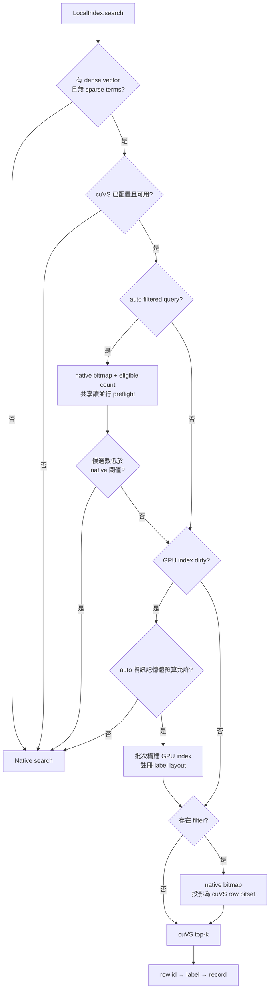

# OpenViking × cuVS 整合計劃

> 狀態：功能整合與第一輪向量索引驗證已完成，後續進入資料面效能化階段。
> 原則：cuVS 是可選的 dense-search sidecar，不改變 OpenViking 預設 CPU 行為。
> 相關文件：[benchmark 計劃](./openviking-cuvs-benchmark-plan.md)、[初步結果](../../benchmark/cuvs/PRELIMINARY_RESULTS.md)、[使用者指南（中文）](../zh/guides/16-cuvs.md)、[User guide (English)](../en/guides/16-cuvs.md)。

## 1. 目標

本整合只替換 OpenViking 本地 VectorDB 的 dense vector search 執行器，繼續複用現有的：

- 權威記錄儲存和持久化恢復；
- scalar/path index 與過濾 DSL；
- sparse/hybrid retrieval；
- sort、aggregate、label mapping 和結果回表；
- upsert、delete 和 collection 生命週期。

當前階段需要做到：

1. 通過顯式配置啟用 cuVS，不改變上層檢索 API 和預設 `local` 行為；
2. pure dense query 能進入 cuVS brute-force 或 CAGRA；
3. cosine、inner product 和 L2 的返回分數保持現有介面語義；
4. scalar、URI/path 和組合過濾複用 native 語義，並作為 cuVS 前置過濾；
5. upsert、delete、重啟恢復後結果正確；
6. 視訊記憶體不足或 GPU 不可用時，auto 模式安全保留 native 路徑；
7. 用可復現 benchmark 量化適用規模、過濾選擇性、視訊記憶體和 lifecycle 成本。

## 2. 非目標

本階段不做以下擴充：

- 不把 cuVS 變成獨立的完整資料庫後端；
- 不移除或改寫 OpenViking 原生 dense index；
- 不改變 native CPU index 的預設 int8 量化；
- 不把 cuVS 序列化檔案作為權威持久化格式；
- 不實現多 GPU、跨機分片或共享 GPU 資源池；
- 不在功能版中承諾寫密集 workload 的低延遲；
- 不用未過濾 top-k 後置過濾代替正確的 prefilter；
- 不把 CAGRA 的 ANN 結果描述為精確檢索。

## 3. 核心決策

| 決策 | 選擇 | 原因 |
| --- | --- | --- |
| 整合位置 | `LocalIndex.search()` 的 pure dense 分支 | 邊界小，可複用 Store、恢復、過濾和回表 |
| 權威狀態 | Local Store | GPU index 可隨時由當前記錄重建 |
| 預設演算法 | cuVS brute-force | 適合功能對齊和 exact ground truth |
| ANN 演算法 | CAGRA，顯式開啟 | 必須結合 Recall@K、延遲、build time 和視訊記憶體評估 |
| mutation | host shadow 標髒，下一次查詢全量重建 | 首先保證 upsert/delete 語義正確 |
| 過濾 | native bitmap 投影為 cuVS row bitset | 複用既有 DSL 和 scalar/path index，不重複實現語義 |
| 持久化 | 不持久化 cuVS index | 避免繫結 GPU、CUDA/cuVS 版本和序列化相容性 |
| 預設 CPU dtype | 保持現有 per-vector-scale int8 | cuVS opt-in 不能改變未啟用使用者的行為 |
| GPU dtype | device dataset/query 預設 float32，可顯式配置 float16 | host shadow 儲存預處理後的 Python 浮點值；僅 device dataset/query 在建立時 cast 為配置 dtype；低精度按獨立能力報告 Recall@K 和視訊記憶體 |

## 4. 總體架構



一句話概括：OpenViking 管資料、生命週期和查詢語義，cuVS 管 GPU dense top-k；兩者通過 label layout 和 native filter bitmap 對接。

### 4.1 元件職責

| 元件 | 職責 | 當前狀態 |
| --- | --- | --- |
| `VectorDBBackendConfig` / `CuVSConfig` | backend、演算法、視訊記憶體預算、路由閾值和 CAGRA 引數校驗 | 已實現 |
| `CuVSCollectionAdapter` | 複用 local adapter，注入 cuVS dense-search 配置 | 已實現 |
| `LocalCollection` | schema、Store、delta、恢復和結果回表 | 複用原生 |
| `LocalIndex` | pure dense 路由、跨後端 mutation 一致性和 native fallback | 已擴充 |
| `CuVSDenseIndex` | host shadow、dirty lifecycle、label map、bitset cache 和 GPU index | 已實現 |
| `_CuVSRuntime` | 延遲匯入 CuPy/cuVS，呼叫 brute-force/CAGRA build/search | 已實現 |
| Native `IndexEngine` | 完整 native 能力和 filter bitmap 生成 | 已擴充 bitmap bridge |
| ABI3 backend | 暴露 filter layout 註冊與 bitmap projection | 已實現 |
| `StoreManager` | 權威記錄、向量和欄位儲存 | 複用原生 |

### 4.2 資料所有權

| 狀態 | 是否權威 | 生命週期 |
| --- | --- | --- |
| Local Store | 是 | 持久化，恢復從這裡開始 |
| Native index | 否 | 由 snapshot + delta 維護，承擔完整本地能力 |
| cuVS host shadow | 否 | 按 label 儲存 dense vector 和重建所需記錄 |
| cuVS GPU index | 否 | 首次查詢或 dirty 後構建，程序退出即丟棄 |
| Device filter cache | 否 | LRU 快取，mutation 時清空 |

OpenViking 主鍵按現有規則對映為 `uint64 label`。cuVS 返回 dataset row id，`CuVSDenseIndex` 再通過構建時的 label 陣列映射回 OpenViking label，最後由 Collection 回表得到完整記錄。

## 5. 核心鏈路

### 5.1 Upsert / delete



`LocalIndex` 使用跨後端讀寫鎖覆蓋 native mutation 和 cuVS shadow mutation，避免查詢獲得新 native bitmap 卻使用舊 GPU row layout。warmed query 持有共享讀鎖併發搜尋，mutation 和同步 rebuild 持有寫鎖。當前 mutation 後不增量修改 CAGRA，而是標髒並在下一次 dense 查詢全量重建。

### 5.2 Dense query



顯式 `backend=cuvs` 對支援的 pure dense query 固定使用 GPU，並在初始化或執行錯誤時 fail-fast。`auto_cuvs` 才執行視訊記憶體准入和候選數路由。

### 5.3 Filter bitmap bridge

過濾路徑不再掃描全部 Python records：

1. GPU rebuild 後呼叫 `set_filter_layout(ordered_labels)`；
2. native engine 將每個 cuVS row 預對映到 native logical offset；
3. 查詢時 native filter parser 與 scalar/path index 計算原生 bitmap；
4. `evaluate_filter(dsl)` 按已註冊 layout 投影，返回 packed `uint32` words 和 eligible count；
5. 寬過濾把 preflight words 直接交給 cuVS，通過 `filters.from_bitset()` 構造 prefilter，不重複計算 native bitmap；
6. 窄過濾由 native engine 返回一個有界、短生命週期的 bitmap token，CPU recall 直接複用；token miss 時安全回退到普通 search；
7. 相同 filter 複用 device bitset；mutation 同時使 layout、device cache 和 native token 失效。

auto 模式會在進入 cuVS search 前完成候選數 preflight。native engine 對
`evaluate_filter` 使用共享讀鎖，因此不同的首次過濾條件可以平行計算；layout 註冊和
mutation 使用寫鎖。cuVS shadow 的 generation 校驗會丟棄跨 mutation 得到的舊路由結果。

該 bridge 繼承 native 對以下能力的處理：

- `and`、`or`；
- `must`、`must_not`；
- `contains`；
- `range`、`range_out`；
- URI/path prefix 和 depth；
- `date_time`、`geo_point` 等 native 欄位轉換語義。

bitmap 在 CPU 上生成是有意選擇。native scalar/path index 已經維護了對應結構；把 URI DSL 解析、Trie 遍歷和 bitmap union 搬到 GPU 會引入額外索引副本、同步和 kernel launch，而當前主要收益來自 GPU distance/top-k。只有 profiling 表明 bitmap 生成成為主要瓶頸時，才評估 GPU 化。

### 5.4 Restart recovery

1. 讀取 collection 和 index metadata；
2. 恢復 native snapshot 並 replay delta；
3. 從 Store 讀取當前 candidates；
4. 恢復 cuVS host shadow，但不立即構建 GPU index；
5. 第一次 pure dense query 按配置執行視訊記憶體准入和 lazy build。

cuVS index 檔案未來可以作為帶嚴格版本約束的 cache，但不能成為事實來源。

## 6. 查詢路由策略

### 6.1 能力路由

| 查詢型別 | 執行路徑 |
| --- | --- |
| pure dense，無 filter | cuVS 或 auto/native |
| pure dense + scalar/path filter | native bitmap → cuVS prefilter，或 auto 路由 native recall |
| sparse / hybrid | native |
| scalar sort / aggregate | native |
| 空資料集 / filter 無候選 | 返回空結果 |

不採用 post-filter。先取未過濾 top-k 再過濾，無法保證高選擇性過濾後的結果數量和真實 top-k；無限 over-fetch 也不能提供穩定正確性。

### 6.2 Auto mode

auto 模式包含兩層決策：

1. **Build admission**：根據空閒視訊記憶體和保守峰值估算決定是否構建 GPU index；
2. **Per-query routing**：根據 native bitmap 返回的 eligible count 決定 filtered query 走 CPU 還是 GPU。

當前預設閾值：

| 配置 | 預設值 | 含義 |
| --- | ---: | --- |
| `auto_filter_native_threshold` | 2000 | 普通過濾候選數不超過該值時走 native recall |
| `auto_path_filter_native_threshold` | 200 | URI/path 過濾使用的更保守閾值 |

URI/path 使用更低閾值，是因為寬路徑需要 native Trie traversal 和 subtree bitmap union；這個成本會先於 GPU search 發生。閾值設為 `0` 可關閉對應 native 路由。閾值是當前測量得到的預設值，不是跨硬體、維度和 workload 的常數。

候選數 preflight 和 native fallback 使用跨後端共享讀鎖，既保留 native engine
原有的讀併發，也避免與 mutation 交錯；相同 filter 的路由決策由 LRU 直接複用。

## 7. Dtype 與數值語義

### 7.1 當前邊界

- native collection 預設保持 per-vector-scale int8；
- cuVS host shadow 儲存預處理後的 Python 浮點值，不隨 `dtype` 改寫；
- 僅 cuVS device dataset/query 在建立時 cast 為配置的 `dtype`，預設是 float32，
  可顯式配置為 float16；
- 啟用 cuVS 不遷移、不重寫 native index metadata；
- native fallback 始終使用原有 CPU representation；
- auto 模式可能按 query 在兩種 representation 間路由。

因此：

- index-only exact benchmark 可顯式使用 FP32 CPU / FP32 GPU 隔離 kernel；
- collection/service benchmark 必須說明是 native int8 / cuVS 配置的 float32 或 float16；
- 結果必須同時報告 Recall@K、視訊記憶體和 host memory，不能聲稱 equal-dtype 或 equal-memory；
- 要求固定 numerical representation 的應用應選擇顯式 backend，或關閉 native 候選路由。

### 7.2 低精度路線

低精度 GPU 儲存作為顯式新能力實現，不做隱式 cast：

1. 先支持可配置的 float16 dataset/query；
2. 以 float32 brute-force 為 ground truth，測 Recall@K、延遲、吞吐和視訊記憶體；
3. 再評估 CAGRA int8 或 VPQ；
4. native scaled-int8 若要求數值相容，需要 scale-aware distance/top-k 或候選 rerank，不能直接 cast 成普通 int8。

## 8. 視訊記憶體准入

當前保守估算包含：

- device vector payload 跟隨配置的 dtype：float32 為 `N * dimension * 4`，
  float16 為 `N * dimension * 2`；
- CAGRA retained graph：約 `N * graph_degree * 4`；
- CAGRA build intermediate graph：約 `N * intermediate_graph_degree * 4`；
- device filter cache：每個 bitset 約 `N / 8`；
- 預設 `2.0` safety factor；
- 預設保留 1 GiB 空閒視訊記憶體。

若預算不足，auto 模式本次查詢走 native，並保留 dirty 狀態供後續查詢重試。顯式 `backend=cuvs` 不經過該 gate。估算不是硬保證，allocator、build algorithm、batch 和併發 workload 都可能改變實際 peak；已准入後的 allocation failure 仍會在 auto 模式回退 native。

## 9. 配置

### 9.1 顯式 cuVS backend

```json
{
  "storage": {
    "vectordb": {
      "backend": "cuvs",
      "distance_metric": "cosine",
      "cuvs": {
        "algorithm": "brute_force",
        "dtype": "float32",
        "max_concurrent_gpu_searches": 1,
        "fallback_to_native": true
      }
    }
  }
}
```

### 9.2 CAGRA

```json
{
  "storage": {
    "vectordb": {
      "backend": "cuvs",
      "cuvs": {
        "algorithm": "cagra",
        "build_params": {
          "graph_degree": 64,
          "intermediate_graph_degree": 128,
          "build_algo": "nn_descent"
        },
        "search_params": {
          "itopk_size": 64,
          "search_width": 1
        },
        "fallback_to_native": true
      }
    }
  }
}
```

### 9.3 保留 local 預設並自動啟用

```json
{
  "storage": {
    "vectordb": {
      "backend": "local",
      "cuvs": {
        "auto_enable": true,
        "algorithm": "brute_force",
        "auto_memory_reserve_mb": 1024,
        "auto_memory_safety_factor": 2.0,
        "auto_filter_native_threshold": 2000,
        "auto_path_filter_native_threshold": 200,
        "filter_cache_size": 16,
        "auto_background_rebuild": true,
        "auto_rebuild_debounce_ms": 500
      }
    }
  }
}
```

### 9.4 配置語義

| 配置 | 預設值 | 說明 |
| --- | --- | --- |
| `algorithm` | `brute_force` | `brute_force` exact 或 `cagra` ANN |
| `dtype` | `float32` | GPU dataset/query dtype；可顯式設為 `float16`，不改變 native CPU dtype |
| `max_concurrent_gpu_searches` | `1` | 單 index 同時進入 GPU search 的上限；host preflight/filter 仍可並行 |
| `micro_batching_enabled` | `false` | 可選地合併相容的併發單 query 請求；僅支援 `brute_force`，且要求 `max_concurrent_gpu_searches=1` |
| `micro_batching_max_batch_size` | `8` | 單次 matrix-query 的最大行數，範圍 1 到 8 |
| `micro_batching_max_wait_ms` | `1.0` | 等待相容請求的 collection window，範圍 0 到 100 ms；0 表示不主動等待、僅 opportunistic batching |
| `build_params` | `{}` | 傳給 CAGRA `IndexParams` |
| `search_params` | `{}` | 傳給 CAGRA `SearchParams` |
| `fallback_to_native` | `true` | sparse/hybrid 等非 cuVS dense top-k 能力使用 native |
| `auto_enable` | `false` | 在 `backend=local` 下按空閒視訊記憶體自動啟用 |
| `auto_memory_reserve_mb` | `1024` | auto admission 後保留的視訊記憶體 |
| `auto_memory_safety_factor` | `2.0` | 已知 allocation 的峰值安全係數 |
| `auto_filter_native_threshold` | `2000` | auto 普通過濾 native 路由閾值 |
| `auto_path_filter_native_threshold` | `200` | auto URI/path native 路由閾值 |
| `filter_cache_size` | `16` | device bitset 或 native 路由決策的 LRU 大小 |
| `auto_background_rebuild` | `false` | auto 模式合併 mutation 並在後臺構建新 snapshot；dirty 期間查詢走 native |
| `auto_rebuild_debounce_ms` | `500` | 後臺 rebuild 前用於合併連續 mutation 的靜默視窗 |

依賴安裝方式和 CUDA 12/13 wheel 選擇見中英文使用者指南，不在本計劃中複製易過期的版本命令。

## 10. 一致性、併發與錯誤策略

### 10.1 當前保證

- 順序 upsert/delete 返回後，下一次 GPU dense query 會先重建，提供 read-after-write；
- native mutation 與 cuVS shadow mutation 由跨後端讀寫鎖協調；filter layout 和 bitmap
  preflight 由 native engine 讀寫鎖及 cuVS generation 校驗保證一致性；
- GPU index、dataset ownership、label mapping 和 generation 組成 immutable snapshot；
- 預設非 micro-batch 路徑可使用複用的 cuVS resources/CUDA stream；啟用 micro-batching 後，
  compatible warm query 可在不獲取 caller 側 device gate 的情況下入隊，micro-batch worker
  是唯一在持有 device-search gate 時執行 matrix search 的元件；
- dirty/cold snapshot、device filter cache miss 和 rebuild 仍在同一 gate 內完成 GPU preparation，
  caller 入隊後立即釋放 gate，不會持 gate 等待 worker；
- mutation 不會破壞已被查詢持有的 snapshot；同步 rebuild 仍由寫鎖合併為一次；
- 同一 GPU 上不同 collection 的 admission/build 由程序級 coordinator 序列，避免併發超賣視訊記憶體；
- native fallback 不持有 GPU 鎖，可以繼續併發讀取；
- 邊界明確的多呼叫 bulk ingest 可顯式延遲 derived GPU maintenance；native/store 仍逐批
  可見，最外層 scope 退出後只調度一次 rebuild，該 scope 不提供事務或原子性；
- background worker 在 debounce 到期、candidate build 後和 commit 前都校驗 generation；
  index 替換會先繼承 bulk suspension、停止舊 maintenance worker，再啟動新 worker；
- Store 是最終事實來源，重啟後派生狀態會重新收斂。

### 10.2 錯誤矩陣

| 場景 | 顯式 `backend=cuvs` | Auto mode |
| --- | --- | --- |
| cuVS/CuPy 缺失或無 CUDA device | 初始化失敗 | 保留 native |
| 向量維度錯誤 | 顯式報錯 | 顯式報錯 |
| 視訊記憶體預算不足 | 不適用預算 gate | 本次查詢 native，後續重試 |
| GPU allocation failure | 異常上拋 | 釋放資源並回退 native |
| GPU build/search 其他異常 | 異常上拋 | 異常上拋 |
| sparse/hybrid | `fallback_to_native=true` 時 native | native |
| 空資料集 / filter 無候選 | 空結果 | 空結果 |

### 10.3 已知事務視窗

寫鏈路仍跨 Store、native index 和 cuVS shadow。若程序在中間退出，重啟會從 Store 收斂；若程序不退出且 shadow mutation 拋錯，記憶體派生狀態可能暫時分叉。後續可用統一 mutation journal、失敗後強制 reload，或構建新 snapshot 後原子交換封閉視窗。

## 11. 當前限制

| 限制 | 影響 | 後續方向 |
| --- | --- | --- |
| 每次 mutation 後整體重建 | 寫後首查和 build 為 O(N) | base + delta、閾值重建、後臺 build、原子切換 |
| host shadow 儲存完整 dense vectors | Store/native/GPU 之外增加 host memory | 連續 buffer、共享記憶體、減少 Python object |
| 高併發小 query | 已有 opt-in micro-batching，但仍有每次 dispatch 的 device allocation、host sync 和單 worker 上限 | persistent buffers、allocator reuse、CAGRA batching 或多個並行 batch dispatch |
| Python/CuPy 資料面 | 物件構造、複製和同步有固定開銷 | 先 profiling，再決定是否下沉 C++ cuVS C API |
| 重啟後 lazy rebuild | 大 collection 的首次查詢延遲高 | 後臺預熱、版本化派生 cache |
| native dense 與 GPU shadow 並存 | CPU 記憶體和寫放大 | 覆蓋率和回退策略穩定後再評估裁剪 |
| CPU int8 / GPU float32 或 float16 | 數值和記憶體語義不同 | 明確報告 dtype、Recall@K 和兩側 memory |
| auto admission 是估算 | 實際 peak 隨 allocator 和 workload 波動 | telemetry、校準 safety factor、OOM fallback |
| 路由閾值來自當前 workload | 不能直接泛化 | 按規模、維度、filter type 做自適應或離線調參 |

## 12. 實施階段

### Phase 0：功能集成 — 已完成

- cuVS backend 與 local adapter 複用；
- brute-force / CAGRA；
- host shadow 與 lazy dirty rebuild；
- native bitmap bridge 與 cuVS prefilter；
- memory-aware auto admission；
- filtered-query candidate routing；
- mutation、delete、restart 和錯誤路徑測試；
- 中英文使用者文件和 smoke example。

### Phase 1：向量索引與 collection benchmark — 進行中

- 公共 ANN dataset 的 FP32 exact 和 CAGRA recall frontier；
- 100K/1M、768D/1024D exact scaling；
- collection-level filter selectivity；
- first filter、cached filter 和 URI subtree 成本；
- retained VRAM、build、restart 和 mutation rebuild。

完整矩陣與已有資料分別記錄在 benchmark 計劃和初步結果文件中。

### Phase 2：資料面併發與 lifecycle 最佳化

優先順序順序：

1. 已將可搜尋 GPU index 變成 immutable snapshot；
2. 已保證 in-flight query 在 rebuild 期間安全持有舊 snapshot；後臺 build 期間的新請求路由仍待實現；
3. 已實現完成後原子交換，並延遲到最後一個持有者退出再回收舊資源；
4. 已實現可選的連續 mutation 合併與後臺 rebuild；預設關閉以保留現有 auto 行為；
5. 已實現可複用 cuVS resources/CUDA stream，以及預設關閉的 brute-force request
   micro-batching 和 warm admission fast path；persistent query/result buffers、allocator reuse、
   CAGRA batching 和多個並行 batch dispatch 待評估；
6. 已補充 build queue、fallback reason、eligible count 和分階段 latency telemetry；VRAM 指標待統一管理器。

### Phase 3：容量與低精度

- 已實現顯式 float16 brute-force/CAGRA 路徑；recall/latency/VRAM 矩陣待補齊；
- CAGRA int8 或 VPQ frontier；
- 大 collection 的 host shadow 記憶體最佳化；
- 根據 benchmark 決定 CAGRA 啟用規模和引數策略。

### Phase 4：更深層整合 — 按收益決定

只有 Python/CuPy 資料面被證明是主要瓶頸時，才評估：

- cuVS C API 接入 native C++ engine；
- 共享 CUDA resource、stream 和 memory pool；
- 多 GPU、分片和 collection 資源隔離；
- 受 GPU/CUDA/cuVS 版本約束的持久化派生 cache。

## 13. 驗收標準

### 13.1 功能正確性

- brute-force 和 CAGRA 在真實 GPU runtime 上可構建、查詢和重建；
- cosine/IP/L2 的 score mapping 符合 OpenViking 接口；
- scalar + URI 組合過濾結果不越權；
- arbitrary cuVS row order 能正確對映 native bitmap；
- upsert 後新值可檢索、delete 後舊值不可檢索；
- persistent collection reopen 後可以由 Store 恢復並重建；
- explicit/auto backend 的失敗策略符合錯誤矩陣；
- 預設 `backend=local` 和 native dtype 不受影響。

### 13.2 效能報告

每組結果至少包括：

- dataset、dimension、N、metric、K 和 query batch；
- native/GPU dtype 與 normalization；
- build time、cold first query、warm p50/p95/p99 和 QPS；
- Recall@K；
- host RSS、retained VRAM，能測量時增加 peak VRAM；
- filter 型別、selectivity、eligible count 和 route；
- mutation size、write latency 與 next-query rebuild latency；
- 硬體和公開軟體版本。

### 13.3 當前驗證狀態

- 目標 VectorDB 單元/整合測試通過；
- stable-ABI loader 測試通過；
- standalone C++ engine bitmap projection 測試通過；
- native bitmap token 複用、mutation 失效及舊 ABI fallback 測試通過；
- brute-force/CAGRA GPU smoke 覆蓋組合過濾、update、delete 和 rebuild；
- Python lint、C++ syntax 和 diff check 通過；
- 提交前掃描 staged/committed diff，不允許包含憑據、私鑰或非公開環境標識。

## 14. 程式碼對映

| 檔案 | 職責 |
| --- | --- |
| `openviking/storage/vectordb/index/cuvs_index.py` | runtime、host shadow、native bitmap 消費、cache、build/search 和 score mapping |
| `openviking/storage/vectordb/index/local_index.py` | dense 路由、跨後端 mutation lock、native fallback |
| `openviking/storage/vectordb/collection/local_collection.py` | 傳遞配置，恢復時注入當前 candidates |
| `openviking/storage/vectordb_adapters/local_adapter.py` | cuVS adapter 與 auto 配置 |
| `openviking/storage/vectordb_adapters/factory.py` | 註冊 `backend=cuvs` |
| `openviking_cli/utils/config/vectordb_config.py` | 強型別 cuVS 配置 |
| `src/index/detail/index_manager_impl.cpp` | label layout 與 native bitmap projection |
| `src/abi3_engine_backend.cpp` | filter bridge 的穩定 Python ABI |
| `examples/cuvs_smoke.py` | 真實 GPU 最小功能驗證 |
| `benchmark/cuvs/` | index、collection、service benchmark 與結果彙總 |
| `tests/vectordb/test_cuvs_index.py` | cuVS index、filter cache、路由和錯誤測試 |
| `tests/vectordb/test_cuvs_collection.py` | collection、auto mode、mutation 和恢復整合測試 |
| `tests/engine/test_index_engine.cpp` | native bitmap 的外部 row-order projection 測試 |

## 15. 待評審問題

1. 目標 workload 的向量維度、單 collection 規模、collection 數量和更新比例是什麼？
2. tenant/URI filter 的真實選擇性分佈和重複率是什麼？
3. 生產目標更重視單請求 P95，還是多請求 aggregate throughput？
4. CAGRA 可以接受的 Recall@K、build time 和最低啟用規模是什麼？
5. 寫後查詢是否允許讀取舊 GPU snapshot，還是必須同步等待最新 snapshot？
6. 多 collection 是否共享 CUDA stream/memory pool，如何設定隔離與視訊記憶體限額？
7. native dense 副本需要永久保留，還是在 cuVS 覆蓋率穩定後允許按配置裁剪？

## 16. 參考資料

- [OpenViking](https://github.com/volcengine/OpenViking)
- [NVIDIA RAPIDS cuVS](https://github.com/rapidsai/cuvs)
- [cuVS Getting Started](https://docs.rapids.ai/api/cuvs/stable/getting_started/)
- [cuVS brute-force Python API](https://docs.rapids.ai/api/cuvs/stable/python_api/neighbors_brute_force/)
- [cuVS CAGRA Python API](https://docs.rapids.ai/api/cuvs/stable/python_api/neighbors_cagra/)
- [cuVS filtering](https://docs.rapids.ai/api/cuvs/stable/filtering/)
