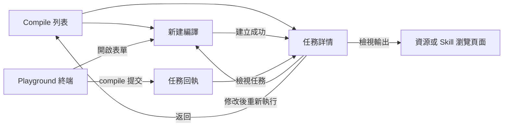

# Web Studio Compile 互動與實現設計

| 專案 | 內容 |
| --- | --- |
| 狀態 | 待實現設計 |
| 更新日期 | 2026-09-16 |
| 適用範圍 | Web Studio Compile 獨立導航頁、Playground 終端、通用任務聯動 |
| 核心流程 | 選擇 Skill → 選擇素材 → 設定輸出 → 提交 → 檢視執行 → 開啟產物 |

## 1. 目標與邊界

Compile 使用一個指定 Skill，加工一個或多個 OpenViking 素材目錄，並將結果寫入目標目錄。使用者應能理解“用什麼方法、處理什麼內容、結果放在哪裡”，無需先學習 API 或 Runtime 配置。

提供兩個平等入口：

1. **Compile 獨立 Tab**：在 Studio 左側工作區導航中增加 Compile，緊鄰 Skills。提供任務列表、新建頁、詳情頁。
2. **Playground 終端**：支援 compile 和 task 命令，適合熟悉 CLI 的使用者；提交後可進入同一詳情頁。

本文的 Tab 指獨立導航模組，不是 Playground 內部新面板。資源頁、Skills 頁第一版不增加額外建立入口。

第一版包含完整的建立、查詢、取消、引數回填、再次執行和結果檢視閉環，並補齊服務端分頁。暫不包含定時執行、批次取消、任務刪除、任務重新命名、產物差異比較、執行中修改引數及通用 Skill 參數列單生成。

## 2. 當前能力與設計依賴

以下現狀以本地原始碼為依據，不代表部署環境已驗證。

| 能力 | 當前實現 | 本方案處理 |
| --- | --- | --- |
| 建立 | `POST /api/v1/compile`，202，返回 TaskRecord | 複用 |
| 必填引數 | `from`、`to`、`skill` | 對映三個表單區塊 |
| 可選引數 | `instruction`、`args` | 補充要求、摺疊進階引數 |
| 查詢詳情 | `GET /api/v1/tasks/{task_id}` | 複用，攜帶 `include_events=true` |
| 查詢列表 | `GET /api/v1/tasks`，預設 50、最多 200，無游標 | 增加相容的分頁模式 |
| 取消 | `POST /api/v1/tasks/{task_id}/cancel`，ROOT 禁止取消 | 複用並明確許可權和狀態 |
| 原始輸入 | `meta.request` 儲存公開請求欄位 | 用於詳情及回填；敏感引數不回顯 |
| 執行事件 | 詳情可返回 `execution_events` | 複用已有事件展示，缺失時不偽造 |
| 執行後端 | 外部 `compile_api` 或 `--with-bot` 本地執行服務 | 新增能力狀態用於入口反饋 |
| Studio 終端 | 自有命令直譯器，不是作業系統 Shell | 增加命令解析與 API 呼叫 |
| 原生 CLI | 已支援 `ov compile` 和 `ov task status/cancel/list` | Studio 對齊對應語法 |

`docs/design/ov-compile-design.md` 保留了歷史 Bot 直連方案。本文以現行 OpenViking 託管任務的介面為準；瀏覽器不直接呼叫 Runtime 或舊 Bot compile 介面。

## 3. 頁面和路由

| 頁面 | 路由 | 主要動作 |
| --- | --- | --- |
| 編譯列表 | `/compile` | 篩選、載入更多、新建、點選任務 |
| 新建編譯 | `/compile/new` | 選擇 Skill/素材/輸出、提交、儲存草稿 |
| 編譯詳情 | `/compile/tasks/$taskId` | 檢視執行、取消、開啟結果、再次執行 |
| 基於任務新建 | `/compile/new?fromTask=$taskId` | 獲取公開配置後回填，不立即提交 |
| 終端 | 現有 Playground terminal 面板 | 命令補全、提交、查詢、取消、跳轉詳情 |

列表篩選放入 URL，例如 `?status=running&q=wiki`。草稿、指令、args 不放入 URL。詳情頁面的任務 ID 只定位任務，許可權仍由服務端驗證。

導航規則：

- 點選左側 Compile 預設進入列表；不自動跳到上次任務。
- 點選列表行進入完整詳情頁，不用抽屜承載主要流程。
- 返回列表恢復篩選、已載入頁面及滾動位置；重新整理詳情可直接重新獲取任務。
- 外部直接進入詳情時，“返回列表”落到預設列表。
- 列表行支援鍵盤 Enter、連結新標籤開啟；行內複製按鈕不觸發行跳轉。
- 通用 Tasks 頁面保留 compile 記錄，並提供進入 Compile 詳情的連結。



## 4. 頁面一：Compile 列表

### 4.1 佈局

```text
Compile                                           [新建編譯]
使用 Skill 將素材整理為新的內容

[搜尋 Skill、路徑或任務 ID…]  [全部狀態 ▾]  [重新整理]

任務 / Skill             素材              狀態       建立時間
monthly_wiki → 團隊知識庫  週報 等 2 個目錄    執行中     今天 14:20
guide_builder → 操作指南  產品文件            已完成     今天 13:10
monthly_wiki → 月報       週報                失敗       昨天 18:00

                        [載入更多]
```

### 4.2 列表欄位與操作

| 欄位 | 展示規則 |
| --- | --- |
| 任務標題 | 從請求派生“Skill 名稱 → 輸出目錄名”；無請求資訊時顯示任務 ID |
| Skill | 顯示名稱；完整 URI 可通過詳情檢視，不依賴 Skill 當前仍存在 |
| 素材 | 第一個目錄名及“等 N 個目錄”；詳情展示完整集合 |
| 狀態 | 圖示與文字共同表達，不只使用顏色 |
| 建立時間 | 本地時區，相對日期；懸停顯示完整時間和時區 |
| 任務 ID | 行次要資訊，支援複製 |

排序固定為 `created_at DESC, task_id DESC`。同一素材或同一目標的多次執行分別保留，不應用通用 Tasks 頁面按資源去重的邏輯。

行點選只負責開啟詳情。第一版不在行內堆疊取消、重跑和輸出等按鈕，這些操作集中在詳情。

### 4.3 篩選與分頁

- 狀態選項：全部、排隊中、執行中、取消中、已完成、失敗、已取消。
- 搜尋覆蓋當前使用者可見的全部歷史任務，範圍為任務 ID、公開請求中的 Skill URI、來源 URI、目標 URI；不搜尋 instruction 和 args。
- 搜尋輸入防抖 300 ms；更改篩選時回到第一頁，清除舊遊標並取消過時請求。
- 每頁 30 條，“載入更多”追加結果；失敗在按鈕位置重試，不清空已載入內容。
- 無下一頁時顯示“已顯示全部可用記錄”，不顯示未經計算的任務總數。
- 初次查詢失敗顯示錯誤和重試，不能顯示為“暫無任務”。
- 新任務提示為“有新任務，點選重新整理”；瀏覽歷史時不自動插入並推動列表。
- 列表可見時每 10 秒重新整理第一頁；僅更新已顯示 ID 的狀態，新 ID 先顯示提示。詳情頁擁有更及時的單任務重新整理。
- 分頁是即時記錄瀏覽，不是嚴格快照。狀態篩選期間任務可能移入或移出集合；重新整理後重新建立游標鏈，不承諾固定總數。

### 4.4 空狀態與服務狀態

| 場景 | 文案與操作 |
| --- | --- |
| 無歷史任務 | “使用 Skill，把已有素材整理成新的內容。”＋“新建編譯” |
| 篩選無結果 | “沒有符合條件的任務。”＋“清除篩選” |
| 載入失敗 | “任務列表載入失敗。”＋“重試” |
| 執行服務未配置 | 頂部說明“當前連線尚未啟用編譯服務”；歷史記錄仍可檢視，建立入口停用並提供原因 |
| 能力狀態獲取失敗 | 顯示“暫時無法確認編譯服務狀態”及重試；不誤報為未配置，可進入表單並由提交介面最終判定 |

## 5. 頁面二：新建編譯

### 5.1 表單佈局

採用單頁分組表單，不使用多步彈窗。Skill 在最前面，幫助使用者先理解加工方式，再選擇輸入和輸出。

```text
[返回列表]  新建編譯                           草稿已儲存

1  使用哪個 Skill？ *
   [搜尋並選擇 Skill                              ▾]
   按月彙總週報，生成主題知識頁         [檢視 Skill]

2  處理哪些素材？ *
   [選擇目錄]  [貼上 URI]
   週報        viking://resources/weekly          [移除]
   專案記錄    viking://resources/projects        [移除]

3  將結果儲存到哪裡？ *
   [viking://resources/team-wiki             ] [瀏覽]
   目標目錄尚不存在，執行時按後端能力建立

補充要求
[例如：按主題整理，保留引用來源，優先使用最近一個月的材料]

▸ 進階引數（可選）

使用 monthly_wiki，處理 2 個目錄，輸出到 team-wiki
[複製命令]                               [取消] [開始編譯]
```

底部操作區在長表單中保持可見，但不遮擋欄位錯誤或螢幕鍵盤。窄屏取消橫向摘要，將完整路徑換行顯示。

### 5.2 Skill 選擇

點選後開啟可搜尋選擇面板。每項顯示名稱、簡短描述、所屬範圍和 URI；同名 Skill 依靠範圍、URI 區分。

- 只列當前身份可見的 Skill，不通過 URI 文本推斷許可權。
- 搜尋結果缺少描述時顯示 URI，不生成未經驗證的用途說明。
- 首次開啟不自動選中任意 Skill；只有草稿或複製任務時預選。
- “檢視 Skill”開啟側邊預覽，顯示實際 `SKILL.md`，保留主表單上下文。
- 預覽讀取失敗不丟失選擇，提供重試；提交時仍由後端驗證其有效性。
- 無 Skill 時顯示“還沒有可用的 Skill”，提供“前往 Skills”；離開前儲存公開草稿。
- 切換 Skill 保留素材、輸出和指令。args 非空時提示“已更換 Skill，請檢查進階引數”；不靜默刪除引數。
- 不假設 Skill 描述能可靠推導輸出型別或引數 schema，第一版不自動生成專屬表單。

### 5.3 素材目錄選擇

“選擇目錄”開啟帶麵包屑的目錄選擇器，支援進入目錄、多選目錄及跨目錄保留選擇。

- 檔案可見時置灰並解釋“請選擇所在目錄”；禁止直接選檔案作為 from。
- 已選項以完整 URI 去重，保留選擇順序；後端最終 canonicalize。
- 手動貼上支援每行一個 URI，逐條校驗並展示錯誤；無效項可編輯，不清空其它內容。
- 選擇父目錄後再選擇其子目錄時提示可能存在重疊，不靜默刪除使用者選擇。
- 目錄不存在、不可讀、連線失敗使用不同文案；檢查中顯示區域性 loading。
- 不遞迴掃描所有內容來估算 token、價格或執行時間。

### 5.4 輸出位置

複用目錄瀏覽互動，支援直接輸入新路徑。欄位下持續顯示完整 URI，避免同名目錄混淆。

- 支援後端允許的 resource、memory 和 skills 目標；具體合法位置以後端校驗為準。
- 技能產物目標必須符合支援的 skills 名稱空間，不能按普通目錄規則任意巢狀。
- 來源和目標重疊時提示“結果將寫入素材範圍，後續執行可能讀取這些結果”，不強制替使用者更改路徑。
- 已有目標提示“此目錄已有內容，執行可能更新其中內容”。不展示尚未支援的“只新增”“自動覆蓋”等策略選項。
- 新目錄提示僅表示路徑未存在，不在填寫表單時提前建立遠端目錄。
- 目標為檔案、無寫許可權或名稱空間根不合法時就地報錯。
- 可做輕量存在性檢查；寫許可權和業務合法性必須由建立介面最終確認，不將 stat 成功當作可寫證明。

### 5.5 補充要求與進階引數

instruction 可留空，空字串歸一化為未設定。輸入框示例不作為預設提交值。

args 使用摺疊的 JSON 編輯區，預設空；支援格式化、錯誤定位，只接受 JSON 物件。解析失敗時停用提交併將錯誤定位到編輯器。

第一版進階引數僅保留於當前頁面記憶體，不寫入本地草稿或終端持久歷史。複製命令預設省略 args，並明確提示；使用者顯式選擇“包含進階引數”後才納入剪貼簿。服務端公開請求可能脫敏，不能將脫敏佔位值作為真實引數再次提交。

### 5.6 草稿、離開與恢復

- 一個身份範圍儲存一份公開草稿：Skill、from、to、instruction；鍵包含連線、帳號、使用者，禁止跨身份複用。
- 欄位變更後防抖儲存，顯示“草稿已儲存”；儲存失敗顯示“草稿未儲存”，不阻斷編輯。
- 再次進入新建頁提示“已恢復上次草稿”，提供“清空”。
- 返回列表或點選取消保留公開草稿；“取消”不建立任務。
- 有未儲存輸入或記憶體中的 args 時，離開彈出“繼續編輯 / 離開並丟棄未儲存內容”。正常已儲存草稿不反覆確認。
- 成功提交後清除本次草稿；提交失敗保留全部輸入。
- `fromTask` 回填前若已有草稿，提供“繼續現有草稿 / 使用任務配置”；不得靜默覆蓋。
- 頁面重新整理無法恢復 args，在進階引數附近明確提示其不自動儲存。

### 5.7 提交交互

1. 點選“開始編譯”，檢查必填項、URI 基本格式和 args；聚焦首個錯誤欄位。
2. 校驗通過後生成本次提交標識，按鈕改為“正在提交”，禁止重複提交；保留可見摘要。
3. 建立成功後跳轉任務詳情，提示“任務已建立，離開頁面不會中斷執行”。
4. 請求引數、許可權或配置錯誤就地展示；有可定位欄位時關聯欄位，否則顯示錶單頂部錯誤。
5. 請求超時或斷連時提示“尚未確認是否建立成功”，不宣稱建立失敗，不直接發起全新任務。
6. 在服務端冪等能力支援下，“重試確認”複用同一提交標識；引數改變則必須先解決原請求狀態或明確新建另一任務。

正常提交不增加確認彈窗。取消正在提交的頁面導航只停止前端等待，不承諾撤銷服務端建立。

## 6. 頁面三：任務詳情

### 6.1 佈局

```text
[返回列表]  monthly_wiki → 團隊知識庫       [修改後重新執行]
cmp_... [複製]    執行中    已執行 2 分 18 秒       [取消任務]
當前階段：後端報告的階段名稱     最後更新：14:22:18
可以離開頁面，任務會繼續執行

[概覽]  [執行記錄]  [結果]

概覽
Skill       monthly_wiki                    [查看 Skill]
素材        週報、專案記錄                   [展開路徑]
輸出        viking://resources/team-wiki     [開啟目錄]
補充要求    按主題整理，保留來源
建立時間 / 更新時間 / 完成時間（有可靠資料時）
▸ 進階引數（僅公開、脫敏後的內容）
```

頂部生命週期狀態由 `status` 決定，`stage` 只補充當前階段，不用字串猜測覆蓋 status。未知狀態顯示“未知狀態”及原始值，不自動當作完成。

### 6.2 概覽

- 全量展示本次請求的公開配置；超長來源列表預設顯示前三項，可展開全部。
- Skill 連結讀取的是當前版本，標註“檢視當前 Skill”；後端無快照資訊時不聲稱這是執行時版本。
- “開啟目錄”可以檢視執行中的已有內容，但標註“執行中，內容可能繼續變化”。目標不存在時顯示“輸出尚未生成”，不當作任務失敗。
- 沒有可靠完成時間時不將任意 `updated_at` 標為完成時間；結束耗時僅在後端提供可確認時間時展示。
- 舊任務缺少 `meta.request` 時顯示“該任務未記錄完整建立引數”，不從 resource_id 拼湊可執行請求。

### 6.3 執行記錄

- 按後端事件順序展示時間、事件名稱、說明及可展開詳情；複用現有事件元件。
- 沒有事件時顯示“暫未提供執行記錄”，仍顯示任務狀態和 stage。
- 不展示模擬日誌、虛構的階段完成勾選或百分比。
- 使用者停留底部時自動跟隨；向上滾動後暫停跟隨，顯示“有新記錄 / 回到底部”。
- 原始結構化資訊預設摺疊，敏感欄位應在服務端脫敏，前端不負責恢復。
- 若事件歷史被截斷，展示後端提供的截斷提示；沒有事件分頁能力時不承諾完整日誌。

### 6.4 結果

| 狀態 | 結果區 |
| --- | --- |
| 未結束 | “任務完成後將在此展示結果”；可檢視已有目標目錄 |
| 已完成且有標準產物 | 結果摘要、產物連結、主要按鈕“開啟輸出目錄” |
| 已完成但 result 為空或格式未知 | “任務已完成”，提供輸出目錄；未知結構放入“原始結果” |
| 失敗 | 錯誤原因、可展開技術資訊、“修改後重新執行”；可能存在部分產物時允許檢視目標 |
| 已取消 | “任務已停止；已寫入的內容可能保留”，可檢視目標和基於引數新建 |

產物連結必須來自明確 URI，不能僅憑 result 中任意字串生成跳轉。resource、memory、skills 使用對應瀏覽能力；暫不能直接定位的 URI 提供複製及可用的目錄瀏覽入口。

第一版不假設存在統一的 created/updated 檔案列表，不顯示未經後端確認的檔案數量、覆蓋差異或“全部成功寫入”結論。

### 6.5 取消與再次執行

取消按鈕僅在後端可取消狀態及身份下啟用。ROOT 顯示停用原因“當前 ROOT 身份不能取消任務”，不能僅隱藏後使使用者誤認為不支援。

點選取消開啟輕量確認框：“停止此任務？已經寫入的內容可能保留。”按鈕為“繼續執行 / 停止任務”。請求成功後依據返回狀態顯示取消中或實際終態，不立即偽造 cancelled。

- 請求失敗保留真實狀態並允許重試。
- 取消期間任務已經完成時，展示最終完成狀態並說明結果已更新。
- “修改後重新執行”只打開預填表單，不隱式建立任務；原任務不受影響。
- 缺少敏感引數或公開引數被脫敏時提示需要重新填寫，不提交脫敏佔位符。
- 當前 Skill 已刪除或許可權變化時回填 URI 並標為待重新選擇；不阻止使用者檢視舊任務。

### 6.6 重新整理、恢復與通知

- 活躍任務詳情可見時每 5 秒查詢；瀏覽器隱藏時暫停，重新聚焦立即重新整理。
- 終態停止自動輪詢，保留手動重新整理；未知狀態使用低頻重新整理並允許重試。
- 後端 provider 可能以更長間隔重新整理狀態，前端查詢頻率不等於執行進度更新頻率。
- 連續請求失敗採用有上限的退避；顯示“暫時無法更新，以下為最近狀態”，不將任務改為 failed。
- 返回列表、重新整理瀏覽器、關閉終端都不取消任務；恢復後重新查詢服務端。
- 當前頁面觀察到完成時顯示一次帶“檢視結果”的通知，不主動切換使用者正在檢視的子頁。
- 不承諾瀏覽器關閉後的系統通知；第一版不請求瀏覽器通知許可權。
- 404 統一顯示“任務不存在、已過期或當前身份不可訪問”，提供返回列表；不洩露其他使用者任務。

## 7. Playground 終端互動

### 7.1 命令集

```bash
compile --from viking://resources/weekly --to viking://resources/wiki --skill viking://agent/skills/monthly_wiki --instruction "按主題整理，保留來源"
task status cmp_example
task list --task-type compile --status running
task cancel cmp_example
```

同時接受可選的 `ov` 字首。from 支援重複引數和逗號分隔，與原生 CLI 對齊。compile 成功後立即返回回執，不阻塞使用者輸入下一條命令。

這是 Studio 命令語法，不能執行 Shell 的管道、重定向、命令替換或環境變數展開。明確拒絕不支援的語法，不傳給系統 Shell。

### 7.2 提示與補全

- 輸入 `compile` 顯示用途、必填引數、一個可執行結構的示例及“開啟視覺化表單”。單獨回車顯示幫助，不建立空任務。
- 引數補全區分 `--from` 的可讀目錄、`--skill` 的 Skill 和 `--to` 的目標路徑。
- 缺參時展示準確欄位，如“缺少 --skill”，並允許將已解析值帶入表單。
- 無效 JSON 指出 `--args` 必須是物件，不輸出完整可能含憑證的輸入。
- 支援單引號、雙引號、轉義及 JSON 字串；共享專門的解析模組，不繼續使用空格 split。
- 終端到表單通過身份隔離的記憶體交接儲存引數，位址列不攜帶引數；不能恢復的進階引數明確提示。

### 7.3 提交回執與後續操作

```text
任務已建立
任務：cmp_example
狀態：排隊中
輸出：viking://resources/wiki
[檢視任務]  [複製任務 ID]
```

回執卡片可在可見時重新整理狀態，複用同一任務查詢快取；不為歷史每張卡片分別長期輪詢。點選“檢視任務”進入 Compile 詳情。

task status 展示狀態、階段、錯誤或結果摘要及詳情連結。task list 展示分頁結果及“載入更多”，明確範圍是當前連線與身份。task cancel 屬於使用者明確取消指令，不再彈二次確認，返回“正在取消”或真實終態，並說明已有寫入可能保留。

歷史只持久化經過處理的命令摘要及任務 ID，args 不落盤；含進階引數的原始命令不得進入現有命令歷史、entry title 或錯誤文本。重用歷史時提示補齊引數。

表單“複製命令”採用統一轉義生成器，並與解析器做往返驗證。正常公開欄位可複製，預設省略 args；複製內容必須與當前表單實際值一致。

## 8. 介面補充設計

本節均為擬新增契約，不能當作當前介面已支援。

### 8.1 建立及公開請求

現有請求保持相容：

```json
{
  "from": ["viking://resources/weekly"],
  "to": "viking://resources/wiki",
  "skill": "viking://agent/skills/monthly_wiki",
  "instruction": "按主題整理，保留來源"
}
```

前端通過適配層讀取 `meta.request`，不要讓頁面散落依賴任意 meta 欄位。無引數快照時停用自動回填並解釋原因。

### 8.2 建立冪等

為 `POST /api/v1/compile` 增加可選 `Idempotency-Key`。冪等範圍為連線對應服務內的 account、user、操作型別及 key。

- 同 key、同規範化請求返回同一 task_id；同 key、不同請求返回明確衝突。
- 請求校驗失敗不產生任務；校驗通過後的冪等登記與任務建立必須具備原子保證。
- 併發請求和服務重啟不能產生重複任務，需持久化冪等關聯。
- 建議冪等對映至少保留 24 小時，並在契約中說明保留期；超出保留期不自動重發。
- 瀏覽器僅儲存 key 與確認狀態，不持久化 args。頁面恢復後可通過下述 lookup 找回已建立任務。
- 擬增加 `GET /api/v1/compile/submissions/{key}`：在相同身份下返回已關聯任務或明確的未找到；不得返回私有請求。
- lookup 未找到但原請求可能仍在途時，同 key 重試仍由原子冪等處理，不能改用新 key。

現有 provider 的內部冪等 key 以已生成的 OV task_id 為基礎，不能替代瀏覽器重複建立請求的冪等保護。

### 8.3 任務分頁與搜尋

為通用列表增加顯式分頁模式，避免破壞當前陣列返回值：

```http
GET /api/v1/tasks?pagination=cursor&task_type=compile&limit=30&status=running&q=wiki
GET /api/v1/tasks?pagination=cursor&task_type=compile&limit=30&status=running&q=wiki&cursor=opaque-token
```

```json
{
  "status": "ok",
  "result": {
    "items": [],
    "next_cursor": null,
    "has_more": false
  }
}
```

- 未傳 `pagination=cursor` 時保持現有陣列返回，現有 CLI 和 Tasks 呼叫不受影響。
- 服務端使用 `created_at DESC, task_id DESC` 的鍵集分頁，過濾先於分頁；讀取 `limit + 1` 判斷 has_more。
- cursor 是服務端生成的不可隨意篡改標識，繫結排序版本、過濾條件和身份範圍。過期或條件不匹配返回明確錯誤，前端提示重新載入。
- `q` 只對明確的公開欄位搜尋，不讀取私有 args；新 Compile 頁固定 `task_type=compile`。
- 從持久化儲存層實現分頁，不能延續“全部讀入記憶體再擷取”的做法來聲稱完成服務端分頁。
- ROOT 的可見範圍、系統任務及普通身份隔離沿用現有許可權規則；分頁、搜尋不得擴大可見範圍。
- 列表按 task_id 去重；狀態變化導致篩選集合變化時，以重新整理重新建立列表為準。
- total 暫不返回，避免額外計數和不穩定總數產生誤導。

### 8.4 能力查詢

擬增加 `GET /api/v1/compile/capabilities`，用於當前身份的入口提示，至少返回：

```json
{
  "status": "ok",
  "result": {
    "configured": true,
    "can_create": true,
    "reason_code": null
  }
}
```

configured 僅表示已配置執行後端，不承諾 Runtime 此刻健康。can_create 表示靜態配置與身份允許嘗試建立，不替代 URI 許可權檢查。不得返回 gateway token、API Key 或內部地址。網路故障作為查詢失敗處理，不能返回 configured=false。

取消能力依舊按角色、任務狀態和後端響應判斷。若後續統一任務介面提供 allowed_actions，前端再遷移使用，第一版不依賴尚不存在欄位。

## 9. 狀態、資料隔離與元件複用

所有 Query key、草稿和記憶體交接包含當前連線及 identityScopeKey；切換身份時中止舊請求、清空可見舊資料。每個任務 ID 在同一身份下共享快取，避免終端、詳情和列表互相顯示過期狀態。

建議模組邊界：

| 模組 | 職責 |
| --- | --- |
| Compile API 適配層 | 建立、能力、冪等恢復、分頁、詳情、取消 |
| Compile 列表頁 | 篩選、分頁、列表狀態及導航 |
| Compile 新建頁 | 草稿、欄位編排、提交狀態 |
| Compile 詳情頁 | 狀態、配置、執行記錄、結果、操作 |
| Skill 選擇器 | 搜尋、選擇和當前內容預覽 |
| Viking 目錄選擇器 | 瀏覽、單選/多選、貼上 URI、區域性錯誤 |
| Compile 表單模型 | 引數歸一化、校驗、公開回填、命令生成 |
| 終端命令模組 | tokenize、compile/task 解析、回執、歷史脫敏 |

複用 Studio 的按鈕、表單、目錄瀏覽、任務狀態和事件元件，不復制一套任務生命週期實現。業務檔案保持職責單一，單檔案不超過 800 行。

## 10. 視覺、可訪問性與文案

- 沿用現有 Studio 主題、排版、間距和 Lucide 圖示，不為 Compile 引入另一套設計語言。
- 每頁只有一個突出主動作：列表“新建編譯”、表單“開始編譯”、完成詳情“開啟輸出目錄”。
- loading、空資料、錯誤和無許可權必須是可區分狀態。
- 欄位有真實 label、必填標識和關聯錯誤；目錄選擇器支援鍵盤操作，彈層關閉後焦點返回觸發按鈕。
- 狀態變化採用適度的 aria-live 提示，不每次輪詢朗讀整頁。
- URI 可複製、可換行；截斷只用於列表，詳情始終可檢視完整值。
- 所有文案通過中英文 i18n 管理；錯誤原文保留在技術詳情中。
- 移動端表格退化為緊湊列表，表單保持單列；主要按鈕滿足可觸達尺寸。

## 11. 關鍵流程驗收

| 場景 | 驗收標準 |
| --- | --- |
| 首次建立 | 空列表 → 新建 → 選 Skill、兩個素材目錄、輸出 → 提交 → 詳情，可開啟結果 |
| 檢視歷史 | 進入列表、篩選、載入更多、點選詳情、返回，篩選和位置不丟失 |
| 超過 200 條 | 能通過服務端游標訪問更早記錄，不侷限於記憶體中的 200 條 |
| Skill 不可用 | 清楚顯示缺失或許可權問題，保留其它表單值，可替換 Skill |
| 引數錯誤 | 定位具體欄位；非法 JSON 不傳送請求；含空格指令完整保留 |
| 雙擊與網路超時 | 雙擊只產生一個任務；超時使用相同 key 恢復到同一個 task_id |
| 重新整理頁面 | 詳情恢復服務端狀態；公開草稿恢復；args 不洩露或靜默回填佔位值 |
| 取消競爭 | 執行中取消、取消請求失敗、同時完成等情況均顯示服務端最終狀態 |
| 再次執行 | 回填公開引數，可修改；原任務保留，新提交產生新 task_id |
| 執行失敗 | 顯示可讀錯誤和技術詳情，可調整引數再次提交，可檢視已有目標 |
| 狀態斷連 | 保留最後狀態並提示更新時間，不將網路錯誤對映為任務失敗 |
| 終端互通 | 帶引號、重複 from、JSON args 正確解析，提交回執可開啟同一詳情 |
| 身份切換 | 列表、詳情快取和草稿不串號；舊請求不能覆蓋新身份頁面 |
| 結果不完整 | result 為空、未知結構、無事件時頁面仍可操作，不顯示虛構統計 |
| 歷史與敏感引數 | 終端命令歷史、草稿、URL、錯誤提示不儲存原始 args |
| 可訪問性 | 鍵盤完成建立與檢視，錯誤可聚焦，狀態不只依賴顏色 |

驗證分三層：引數解析和狀態模型的單元驗證；真實 API 契約與分頁/冪等/許可權驗證；瀏覽器端到端驗證。構建或型別檢查通過不能替代真實建立、取消和結果瀏覽的驗證。

## 12. 實施順序與完成條件

1. **後端契約**：完成分頁與公開欄位搜尋、建立冪等及恢復、能力查詢；保持舊任務列表返回相容，更新 OpenAPI。
2. **基礎模組**：同步 Studio SDK，完成 API 適配層、目錄/Skill 選擇器、表單模型和身份隔離。
3. **獨立頁面**：交付列表、新建、詳情三頁及公開草稿、狀態重新整理、結果入口。
4. **終端接入**：完成語法解析、補全、回執、task 操作、命令複製及持久歷史處理。
5. **聯動與驗收**：通用 Tasks 新增 compile 型別和詳情連結，跑通上述關鍵流程。

完成標準是兩個入口使用相同任務模型，使用者能夠建立、追蹤、取消、恢復、再次執行並找到結果，歷史瀏覽具備真實分頁。介面增強未完成時可開發頁面，但不能把模擬資料或本地分頁作為完整交付。

## 13. 原始碼依據

- `openviking/server/routers/compile.py`：建立路由。
- `openviking/service/compile_service.py`：請求模型、URI 校驗、執行後端配置、結果快照。
- `openviking/service/external_task_service.py`：公開請求儲存、外部執行任務生命週期。
- `openviking/server/routers/tasks.py`：任務詳情、列表和取消。
- `openviking/service/task_tracker.py`：TaskRecord 與現有列表讀取邏輯。
- `web-studio/src/components/app-shell.tsx`：導航結構。
- `web-studio/src/routes/tasks/route.tsx`：現有通用任務頁。
- `web-studio/src/routes/tasks/-components/task-detail-sheet.tsx`：任務查詢、事件展示與重新整理基礎。
- `web-studio/src/routes/playground/-components/terminal-panel.tsx`：現有終端解析、歷史和回執。
- `crates/ov_cli/src/commands/compile.rs`、`crates/ov_cli/src/main.rs`：原生 CLI 引數和 task 命令。

## 14. 本分支實現說明（2026-09-16）

`feat/studio-compile` 實現獨立列表、新建與詳情頁面，以及 Playground 終端的 `compile` / `task` 命令。支援 Skill 查詢與內容預覽、目錄瀏覽與多來源輸入、公開草稿、引數回填、取消、結果目錄跳轉、中英文文案和終端到表單的記憶體引數交接。

服務端增加可選游標分頁、公開欄位搜尋、Compile 能力查詢、`Idempotency-Key` 建立去重及提交結果查詢；未啟用游標模式的任務列表保持陣列返回。

實現邊界：

- AGFS 當前沒有任務索引查詢，分頁逐條掃描持久化記錄，通過有界堆保留當前頁，不把所有任務載入 TaskTracker。記錄物件記憶體受頁大小約束，目錄列舉和讀取成本仍隨歷史記錄數量增長；不是索引級查詢。
- 游標包含身份、角色和篩選範圍，並使用當前服務程序的金鑰簽名。服務重啟後舊遊標失效，重新整理列表可恢復。多例項部署需要共享游標簽名配置。
- 冪等標識派生為穩定任務 ID，引數摘要儲存在任務記錄中但不通過公共 API 回顯；同標識的併發建立與恢復在當前例項內序列。已建立請求先按身份及規範化請求摘要恢復，不重新依賴素材、Skill 或執行後端仍然可用；新請求仍執行完整資源與許可權校驗。保障建立在現有單 TaskTracker 寫入者模型上，多寫入者部署仍需儲存級 CAS。
- 冪等恢復與任務記錄共用保留週期。當前 tracker 對完成/取消任務保留 24 小時，對失敗任務保留 7 天；此功能不新增永久歷史。頁面對超過 24 小時的持久提交標識停止自動重發。分頁掃描會清理當前身份目錄中的過期記錄，清理前在任務鎖內複查狀態；不將全量歷史載入快取。
- 公開進階引數可從歷史任務回填，但不儲存到瀏覽器草稿。複製命令預設不包含進階引數；沒有“一鍵複製私有引數”的入口。
- 結果頁面提供輸出目錄入口及後端原始結果；不假設不同 Runtime 已統一產物清單、進度百分比和完成時間欄位。
- 本地驗證包含後端 HTTP/持久化測試、前端單元測試及瀏覽器可控 API 場景。真實執行服務與模型產物需要部署環境聯調驗證。
